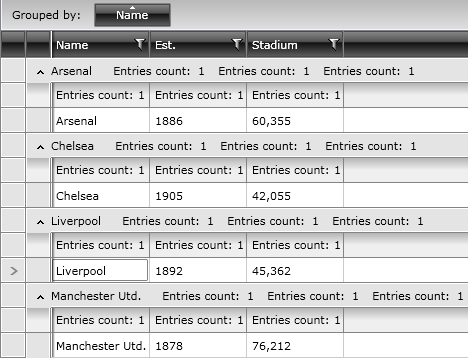
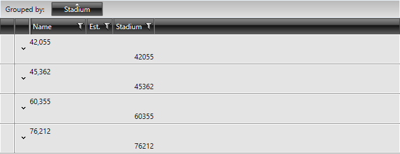

# Group Aggregates

This article will discuss the following topics:

* [Aggregate Functions](#aggregate-functions)

* [Align Group Header Aggregates](#align-header-aggregates)

* [Align Column Header Aggregates in GroupHeaderRow](#align-column-header-aggregates-in-groupheaderrow)

#### Figure 1: RadGridView With Group Aggregates

## Aggregate Functions

When you are using [programmatic grouping](), you can add aggregate functions to the group rows. These functions allow you to display information about the data in the group such as first item, last item, count of items etc. 

The available functions are:

* __AverageFunction__ – returns the average of the values in a group. 

* __CountFunction__ – returns the number of all items in a group. 

* __FirstFunction__ – returns first element from a group according to the current sorting. 

* __LastFunction__ – returns last element from a group according to the current sorting. 

* __MaxFunction__ – returns the Max of the values in a group. 

* __MinFunction__ – returns the Min of the values in a group. 

* __SumFunction__ – returns the Sum of all values for the group.

>tipYou can also create your own custom functions similar to these by inheriting __Telerik.Windows.Data.EnumerableAggregateFunction__ class. An example can be found [here](https://demos.telerik.com/silverlight/#GridView/CustomAggregates ).

Each aggregate function has a caption and a result, which are displayed next to the group title. 

To use the aggregate functions you have to declare them and add them to the __AggregateFunctions__ collection of the __GroupDescriptor__.

An alternative way of manipulating the group descriptors of RadGridView is the new (added in Q3 2010) __ColumnGroupDescriptor__ class. You can directly define __ColumnGroupDescriptor__ and add the AggregateFunctions for the respective column. Please note ColumnGroupDescriptor is associated with a specific column and that is why there is not a need for it to also expose the option do define AggregateFunctions as GroupDescriptor. 

#### __[XAML] Example 1: Defining a GroupDescriptor with AggregateFunction__

{{region gridview-grouping-aggregates_0}}

	<telerik:RadGridView x:Name="radGridView"
	                         AutoGenerateColumns="False">
	    <telerik:RadGridView.GroupDescriptors>
	        <telerik:GroupDescriptor Member="Country"
	                                     SortDirection="Ascending">
	            <telerik:GroupDescriptor.AggregateFunctions>
	                <telerik:CountFunction Caption="Entries count: " />
	            </telerik:GroupDescriptor.AggregateFunctions>
	        </telerik:GroupDescriptor>
	    </telerik:RadGridView.GroupDescriptors>
	    ...
	</telerik:RadGridView>
{{endregion}}

#### __[C#] Example 2: Defining a GroupDescriptor with AggregateFunction programmatically__

{{region gridview-grouping-aggregates_1}}

	CountFunction f = new CountFunction();
	f.Caption = "Entries Count: ";
	GroupDescriptor countryDescriptor = new GroupDescriptor();
	countryDescriptor.Member = "Country";
	countryDescriptor.SortDirection = ListSortDirection.Ascending;
	countryDescriptor.AggregateFunctions.Add( f );
	this.radGridView.GroupDescriptors.Add( countryDescriptor );
{{endregion}}

#### __[VB.NET] Example 2: Defining a GroupDescriptor with AggregateFunction programmatically__

{{region gridview-grouping-aggregates_2}}

	Dim f As New CountFunction()
	f.Caption = "Entries Count: "
	Dim countryDescriptor As New GroupDescriptor()
	countryDescriptor.Member = "Country"
	countryDescriptor.SortDirection = ListSortDirection.Ascending
	countryDescriptor.AggregateFunctions.Add(f)
	Me.radGridView.GroupDescriptors.Add(countryDescriptor)
{{endregion}}

You can add more than one aggregate function to __AggregateFunctions__ collection and it will be visualized after the first one.

>The __FirstFunction__ will display the value returned by overriding __ToString()__ method of your business object.

#### __[XAML] Example 3: Defining a GroupDescriptor with multiple AggregateFunctions__

{{region gridview-grouping-aggregates_3}}

	<telerik:RadGridView x:Name="radGridView"
	                         AutoGenerateColumns="False">
	    <telerik:RadGridView.GroupDescriptors>
	        <telerik:GroupDescriptor Member="Country"
	                                     SortDirection="Ascending">
	            <telerik:GroupDescriptor.AggregateFunctions>
	                <telerik:CountFunction Caption="Entries count: " />
	                <telerik:FirstFunction Caption="First entry: " />            
	            </telerik:GroupDescriptor.AggregateFunctions>
	        </telerik:GroupDescriptor>
	    </telerik:RadGridView.GroupDescriptors>
	    ...
	</telerik:RadGridView>
{{endregion}}

#### __[C#] Example 4: Defining a GroupDescriptor with multiple AggregateFunctions programmatically__

{{region gridview-grouping-aggregates_4}}

	CountFunction f = new CountFunction();
	f.Caption = "Entries Count: ";
	FirstFunction f1 = new FirstFunction();
	f.Caption = "FirstEntry: ";
	GroupDescriptor countryDescriptor = new GroupDescriptor();
	countryDescriptor.Member = "Country";
	countryDescriptor.SortDirection = ListSortDirection.Ascending;
	countryDescriptor.AggregateFunctions.Add( f );
	countryDescriptor.AggregateFunctions.Add( f1 );
	this.radGridView.GroupDescriptors.Add( countryDescriptor );
{{endregion}}

#### __[VB.NET] Example 4: Defining a GroupDescriptor with multiple AggregateFunctions programmatically__

{{region gridview-grouping-aggregates_5}}

	Dim f As New CountFunction()
	f.Caption = "Entries Count: "
	Dim f1 As New FirstFunction()
	f.Caption = "FirstEntry: "
	Dim countryDescriptor As New GroupDescriptor()
	countryDescriptor.Member = "Country"
	countryDescriptor.SortDirection = ListSortDirection.Ascending
	countryDescriptor.AggregateFunctions.Add(f)
	countryDescriptor.AggregateFunctions.Add(f1)
	Me.radGridView.GroupDescriptors.Add(countryDescriptor)
{{endregion}}

The final result can be seen on the snapshot below:

#### __Figure 1: RadGridView with GroupDescriptor and AggregateFunctions defined__

With __Q3 2012__ we added built-in feature for __aligning header aggregates__ with corresponding columns.
        
## Align Header Aggregates

#### __Figure 2: Aligning the Aggregates__

This feature can be controlled with applying a __Style__. The Style should be targeting at the GroupHeaderRow visual element having the __GroupRenderMode of the RadGridView set to Flat__.
Here is an example of the style definition:
        
#### __[XAML] Example 5: Settng the ShowGroupHeaderColumnAggregates property of GroupHeaderRow__

{{region gridview-grouping-aggregates_6}}

	
{{endregion}}

When using this feature, most probably you don't need the group row aggregates to be shown any more. You can hide them extending the above style as follows:
        
#### __[XAML] Example 6: Setting the ShowHeaderAggregates property of GroupHeaderRow to False__

{{region gridview-grouping-aggregates_7}}

	
{{endregion}}

>tip As of __Q3 2012__ we have introduced a new rendering mode of RadGridView - Flat. The default GroupRenderMode is Nested, and the new one is __Flat__. When you set the Flat mode, the GridView will render rows one below the other. This leads to a very good perfromance when the grid is grouped on several levels and has a lot of data. You can also refer to the [Grouping Modes]() article.

Setting the "ShowHeaderAggregates" to false will hide the default header aggregates.

#### __Figure 3: RadGridView with ShowHeaderAggregates set to False__

For more details you can check our [Aggregates](https://demos.telerik.com/silverlight/#GridView/Aggregates) demo.

>tipYou can download a __runnable project__ on how to sort a group by aggregate from our online SDK repository [here](https://github.com/telerik/xaml-sdk/), the example is listed as __GridView/SortGroupByAggregate__  .

>You can also check the [SDK Samples Browser]() that provides a more convenient approach in exploring and executing the examples in the Telerik XAML SDK repository.         

## Align Column Header Aggregates in GroupHeaderRow

When using the __ShowGroupHeaderColumnAggregates__ property of __GroupHeaderRow__, the aggregates will be aligned in the __GroupFooterRow__ element. If aligning them in the __GroupHeaderRow__ is required, you need to use the __ColumnAggregatesAlignment__ property of __RadGridView__ instead. It is an enumeration and provides three values:

* __BelowGroupKey__

* __NextToGroupKey__

* __NoAlignment__

#### __Figure 4: RadGridView with ColumnAggregatesAlignment set to BelowGroupKey__

#### __Figure 5: RadGridView with ColumnAggregatesAlignment set to NextToGroupKey__

#### __Figure 6: RadGridView with ColumnAggregatesAlignment set to NextToGroupKey__

## See Also

 * [Aggregate Functions]()

 * [Basic Grouping]()

 * [Programmatic Grouping]()

 * [Group Footers]()
