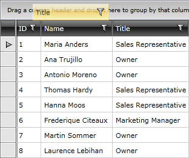
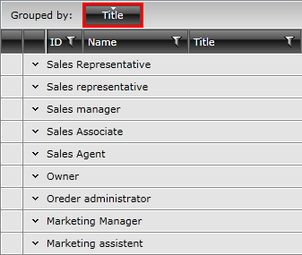
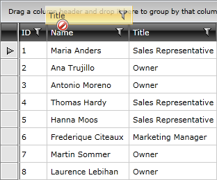

# Basic Grouping

The __RadGridView__ provides you with a built-in grouping functionality, which allows the user to easily group the data by one or more columns. To do so the user has to just drag the desired column to the __GridViewGroupPanel__ located at the top of the __RadGridView__. If the __RadGridView__ is not grouped, the __GridViewGroupPanel__ shows a hint.

After dropping the selected header in the grouping area, the text message will be replaced with a rectangle that represents the selected header and the data in the __RadGridView__ will be properly grouped.

To remove the grouping just click the close button of the rectangle or drag it out of the grouping area.

The __RadGridView__ also provides the user with a way to sort the groups of data. To do that the user just has to click on the rectangle that represents the grouping column. By default, when the data is grouped, the groups are sorted ascending. When the sort direction of the rectangle is none the groups are sorted depending on the data they contain.

>tipThe data can be grouped by more than one column. To do that just drag another column into the grouping area and the data will be grouped against these two criteria. To learn more about the multi-column grouping take a look at the [Multi-Column Grouping]() topic.
        

>tipGridViewColumn exposes a property __ShowColumnWhenGrouped__. It indicates whether the column should be visible or not when RadGridView is grouped by this same column. By default its value is True and the column will remain visible.

## GroupMemberPath

Each GridViewColumn has a property called GroupMemberPath. This property can be used to specify the column to group on a property different from the bound one. 

For example, you can configure the column to be grouped on the Name property although the bound property is Title:

#### __XAML__

{{region gridview-grouping-basics_3}}

	<telerik:GridViewDataColumn DataMemberBinding="{Binding Title}"
	                            GroupMemberPath="Name" />
{{endregion}}

## Grouping Modes

As of __Q3 2012__ we have introduced a new property of the RadGridView __GroupRenderMode__. It has two options:
        
__Nested Mode__: It is the default one and it will nest GridViewGroupRows into one another when you have grouping on many levels. This may lead to a poor performance when the grid is grouped on several levels and has a lot of data. The visual element representing the grouped row is GridViewGroupRow.
        
__Flat Mode__: This mode simply renders rows one below the other. This leads to a very good perfromance when the grid is grouped on several levels and has a lot of data. The visual element representing the grouped row is GroupHeaderRow.
        
>Please note that when you use the __Flat Mode__, you should work with __GroupHeaderRow, not GridViewGroupRow__.
          
## Disabling Grouping

There are two ways to disable the built-in grouping of the __RadGridView__. The first one is at the __RadGridView__ level via the __ShowGroupPanel__ property. By setting it to __False__ the grouping area gets hidden and the column headers have nowhere to be dropped. The default value is __True__.

#### __XAML__

{{region gridview-grouping-basics_0}}

	<telerik:RadGridView x:Name="radGridView" ShowGroupPanel="False"/>
{{endregion}}

The second way is to disable it on column level via __IsGroupable__ property. When set to __False__ the column is not allowed to be dropped in the grouping area.

#### __XAML__

{{region gridview-grouping-basics_1}}

	<telerik:GridViewDataColumn DataMemberBinding="{Binding Title}"
                                Header="Title"
                                UniqueName="Title"
                                IsGroupable="False" />
{{endregion}}

#### __C#__

{{region gridview-grouping-basics_2}}

	this.radGridView.Columns[ "Title" ].IsGroupable = false;
{{endregion}}

#### __VB.NET__

{{region gridview-grouping-basics_3}}

	Me.radGridView.Columns("Title").IsGroupable = False
{{endregion}}

## Events

There are two events that are raised, when the data in the __RadGridView__ is grouped. The first one is the __Grouping__ event and is raised before the data is grouped. The second one is the __Grouped__ event and is raised when the data has been already grouped. You can find more information about them [here]().

## Styling and Appearance

The __RadGridView__ provides you with several ways to style the default look and appearance of the built-in grouping functionality. You can manipulate the grouping area at the top of the __RadGridView.__ To learn how to do this take a look at the [Modifying the Grouping Panel]() topic.

You can easily change the appearance of the group row by just setting the __GroupRowStyle__ property. To learn how to use it take a look at the [Styling the Group Row]() topic.

You can also manipulate the visual appearance of the group footers. Just set the __GroupFooterCellStyle__ property of the __GridViewColumn__ to an appropriate style. To learn more about the group footers take a look at the [Group Footers]() topic. To learn how to style them take a look at the [Styling the Group Footers]() topic.

# See Also

 * [Grouping events]()

 * [Programmatic Grouping]()

 * [Multiple-column Grouping]()

 * [Group Aggregates]()

 * [Group Footers]()

 * [Modifying the Group Panel]()

 * [Reevaluation of data operations]()
