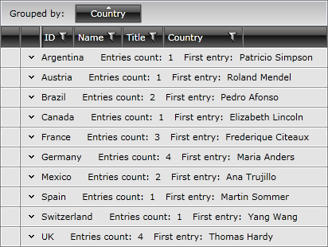

# Group Aggregates

## 

When you are using [programmatic grouping](), you can add aggregate functions to the group rows. These functions allow you to display information about the data in the group such as first item, last item, count of items etc. 

The available functions are:

* __AverageFunction__ – returns the average of the values in a group. 

* __CountFunction__ – returns the number of all items in a group. 

* __FirstFunction__ – returns first element from a group according to the current sorting. 

* __LastFunction__ – returns last element from a group according to the current sorting. 

* __MaxFunction__ – returns the Max of the values in a group. 

* __MinFunction__ – returns the Min of the values in a group. 

* __SumFunction__ – returns the Sum of all values for the group.

>tipYou can also create your own custom functions similar to these by inheriting the __Telerik.Windows.Data.EnumerableAggregateFunction__class. An example can be found [here](http://demos.telerik.com/silverlight/#GridView/CustomAggregates ).

Each aggregate function has a caption and a result, which are displayed next to the group title. 

To use the aggregate functions you have to declare them and add them to the __AggregateFunctions__ collection of the __GroupDescriptor__.

#### __XAML__

{{region gridview-grouping-aggregates_0}}
	<telerik:RadGridView x:Name="radGridView"
	                         AutoGenerateColumns="False">
	    <telerik:RadGridView.GroupDescriptors>
	        <telerik:GroupDescriptor Member="Country"
	                                     SortDirection="Ascending">
	            <telerik:GroupDescriptor.AggregateFunctions>
	                <telerik:CountFunction Caption="Entries count: " />
	            </telerik:GroupDescriptor.AggregateFunctions>
	        </telerik:GroupDescriptor>
	    </telerik:RadGridView.GroupDescriptors>
	    ...
	</telerik:RadGridView>
	{{endregion}}

#### __C#__

{{region gridview-grouping-aggregates_1}}
	CountFunction f = new CountFunction();
	f.Caption = "Entries Count: ";
	GroupDescriptor countryDescriptor = new GroupDescriptor();
	countryDescriptor.Member = "Country";
	countryDescriptor.SortDirection = ListSortDirection.Ascending;
	countryDescriptor.AggregateFunctions.Add( f );
	this.radGridView.GroupDescriptors.Add( countryDescriptor );
	{{endregion}}

#### __VB.NET__

{{region gridview-grouping-aggregates_2}}
	Dim f As New CountFunction()
	f.Caption = "Entries Count: "
	Dim countryDescriptor As New GroupDescriptor()
	countryDescriptor.Member = "Country"
	countryDescriptor.SortDirection = ListSortDirection.Ascending
	countryDescriptor.AggregateFunctions.Add(f)
	Me.radGridView.GroupDescriptors.Add(countryDescriptor)
	{{endregion}}

You can add more than one aggregate function to the __AggregateFunctions__ collection and it will be visualized after the first one.

>The __FirstFunction__ will display the value returned by the __ToString()__ method of your business object.

#### __XAML__

{{region gridview-grouping-aggregates_3}}
	<telerik:RadGridView x:Name="radGridView"
	                         AutoGenerateColumns="False">
	    <telerik:RadGridView.GroupDescriptors>
	        <telerik:GroupDescriptor Member="Country"
	                                     SortDirection="Ascending">
	            <telerik:GroupDescriptor.AggregateFunctions>
	                <telerik:CountFunction Caption="Entries count: " />
	                <telerik:FirstFunction Caption="First entry: " />            
	            </telerik:GroupDescriptor.AggregateFunctions>
	        </telerik:GroupDescriptor>
	    </telerik:RadGridView.GroupDescriptors>
	    ...
	</telerik:RadGridView>
	{{endregion}}

#### __C#__

{{region gridview-grouping-aggregates_4}}
	CountFunction f = new CountFunction();
	f.Caption = "Entries Count: ";
	FirstFunction f1 = new FirstFunction();
	f.Caption = "FirstEntry: ";
	GroupDescriptor countryDescriptor = new GroupDescriptor();
	countryDescriptor.Member = "Country";
	countryDescriptor.SortDirection = ListSortDirection.Ascending;
	countryDescriptor.AggregateFunctions.Add( f );
	countryDescriptor.AggregateFunctions.Add( f1 );
	this.radGridView.GroupDescriptors.Add( countryDescriptor );
	{{endregion}}

#### __VB.NET__

{{region gridview-grouping-aggregates_5}}
	Dim f As New CountFunction()
	f.Caption = "Entries Count: "
	Dim f1 As New FirstFunction()
	f.Caption = "FirstEntry: "
	Dim countryDescriptor As New GroupDescriptor()
	countryDescriptor.Member = "Country"
	countryDescriptor.SortDirection = ListSortDirection.Ascending
	countryDescriptor.AggregateFunctions.Add(f)
	countryDescriptor.AggregateFunctions.Add(f1)
	Me.radGridView.GroupDescriptors.Add(countryDescriptor)
	{{endregion}}

The final result can be seen on the snapshot below:

With __Q3 2012__ we added built-in feature for __aligning header aggregates__ with corresponding columns.
        

## Align Header Aggregates

This feature can be controlled with applying a __Style__. The Style should be targeting at the GroupHeaderRow visual element having the __GroupRenderMode of the RadGridView set to Flat__.
          Here is an example of the style definition:
        

#### __XAML__

{{region gridview-grouping-aggregates_6}}
	     
	{{endregion}}

When using this feature, most probably you don't need the group row aggregates to be shown any more. You can hide them extending the above style as follows:
        

#### __XAML__

{{region gridview-grouping-aggregates_7}}
	     
	{{endregion}}

Setting the "ShowHeaderAggregates" to false will hide the default header aggregates.

For more details you can check our
          [Aggregates](http://demos.telerik.com/silverlight/#GridView/Aggregates) demo.
        

# See Also

 * [Basic Grouping]()

 * [Programmatic Grouping]()

 * [Multiple-column Grouping]()

 * [Group Footers]()

 * [Modifying the Group Panel]()
