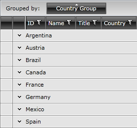

# Programmatic Grouping

Besides the built-in grouping functionality you are able to use a programmatic approach to group the data in __RadGridView__. This is achieved via the control's __GroupDescriptors__ collection. This collection of __IGroupDescriptor__ objects allows you to use descriptors (__GroupDescriptor__ or __ColumnGroupDescriptor__) to define grouping criteria and group's sorting direction for the bound data. 

>The **GroupDescriptorsCollection** is an **ObservableItemCollection** which means you can not only add, but also remove descriptors from it as well as clear the collection.

This article will describe two implementations of the IGroupDescriptor interface.

* [GroupDescriptor](#groupdescriptor)
* [ColumnGroupDescriptor](#columngroupdescriptor)
* [Expanding and collapsing a group](#expanding-and-collapsing-a-group)
* [Check if a group is expanded](#check-if-a-group-is-expanded)

## GroupDescriptor

When you add a new descriptor to the collection, RadGridView's data is automatically grouped according it. **Example 1** demonstrates how to create and configure group descriptors.

#### __[C#] Example 1: Initiate and configure group descriptors__

{{region cs-gridview-programmatic-grouping_0}}
	GroupDescriptor descriptor = new GroupDescriptor();
	descriptor.Member = "Country";
	descriptor.SortDirection = ListSortDirection.Ascending;
{{endregion}}

#### __[VB.NET] Example 1: Initiate and configure group descriptors__

{{region vb-gridview-programmatic-grouping_1}}
	Dim descriptor As New GroupDescriptor()
	descriptor.Member = "Country"
	descriptor.SortDirection = ListSortDirection.Ascending
{{endregion}}

The __Member__ property defines the property, by which the data will be grouped, and the __SortDirection__ property allows you to define the direction in which the groups will be sorted.

**Example 2** illustrates how to create the group descriptor in XAML.

#### __[XAML] Example 2: Define group descriptors in XAML__

{{region xaml-gridview-programmatic-grouping_2}}
	<telerik:GroupDescriptor Member="Country"
	             SortDirection="Ascending" />
{{endregion}}

To use the created descriptor to group the data in the __RadGridView__ you have to add it to the __GroupDescriptors__ collection.

#### __[XAML] Example 3: Add descriptor to GroupDescriptors collection__

{{region xaml-gridview-programmatic-grouping_3}}
	<telerik:RadGridView x:Name="radGridView"
	                 AutoGenerateColumns="False">
	    <telerik:RadGridView.GroupDescriptors>
	        <telerik:GroupDescriptor Member="Country"
	                             SortDirection="Ascending" />
	    </telerik:RadGridView.GroupDescriptors>
	    <!--...-->
	</telerik:RadGridView>
{{endregion}}

#### __[C#] Example 3: Add descriptor to GroupDescriptors collection__

{{region cs-gridview-programmatic-grouping_4}}
	this.radGridView.GroupDescriptors.Add(descriptor);
{{endregion}}

#### __[VB.NET] Example 3: Add descriptor to GroupDescriptors collection__

{{region vb-gridview-programmatic-grouping_5}}
	Me.radGridView.GroupDescriptors.Add(descriptor)
{{endregion}}

After the descriptor is defined, the data will be grouped by the __Country__ property and will look as if you have dragged and dropped the __Country__ column header into the grouping area.

Except __Member__ and __SortDirection__ properties, the __GroupDescriptor__ exposes a __DisplayContent__ property which allows you to change the content of the rectangle representing the group in the grouping area.

#### __[XAML] Example 4: Set the DisplayContent property__

{{region xaml-gridview-programmatic-grouping_6}}
	<telerik:GroupDescriptor Member="Country"
	             SortDirection="Ascending"
	             DisplayContent="Country Group" />
{{endregion}}

#### __[C#] Example 4: Set the DisplayContent property__

{{region cs-gridview-programmatic-grouping_7}}
	GroupDescriptor descriptor2 = new GroupDescriptor();
	descriptor2.Member = "Country";
	descriptor2.SortDirection = ListSortDirection.Ascending;
	descriptor2.DisplayContent = "Country Group";
{{endregion}}

#### __[VB.NET] Example 4: Set the DisplayContent property__

{{region vb-gridview-programmatic-grouping_8}}
	Dim descriptor2 As New GroupDescriptor()
	descriptor2.Member = "Country"
	descriptor2.SortDirection = ListSortDirection.Ascending
	descriptor2.DisplayContent = "Country Group"
{{endregion}}

#### Figure 1: The box displayed in the group panel after the DisplayContent is set

>tip In the group rows you are able to display aggregate functions, which display information about the data contained in the group. To learn more about how to add aggregate functions to the group rows take a look at the [Group Aggregates]() topic.

## ColumnGroupDescriptor

An alternative way of manipulating the group descriptors of RadGridView is the new (added in Q3 2010) __ColumnGroupDescriptor__ class. It has three important properties:

* __Column__: The column that will be grouped.
            
* __DisplayContent__: Allows you to change the content of the rectangle representing the group that appears in the grouping area.
            
* __SortDirection__: Allows you to define the direction in which the groups will be sorted.

As you see the last two properties are similar to the same properties of the GroupDescriptor class. 

> As of __Q3 2011__ you can add a __ColumnGroupDescriptor__ both in __code behind and XAML__. With all the prior versions you can only set it in code behind.

**Example 5** shows how to add a ColumnGroupDescriptor to RadGridView which groups by the Name column in descending order.

#### __[XAML] Example 5: Add ColumnGroupDescriptor to RadGridView__

{{region xaml-gridview-programmatic-grouping_11}}
	<telerik:ColumnGroupDescriptor Column="{Binding Columns[\Name\], ElementName=clubsGrid}"
	             SortDirection="Descending"  />
{{endregion}}

#### __[C#] Example 5: Add ColumnGroupDescriptor to RadGridView__

{{region cs-gridview-programmatic-grouping_9}}
	this.radGridView.GroupDescriptors.Add(new ColumnGroupDescriptor()
	{
	    Column = this.radGridView.Columns["Name"],
	    SortDirection = ListSortDirection.Descending
	});
{{endregion}}

#### __[VB.NET] Example 5: Add ColumnGroupDescriptor to RadGridView__

{{region vb-gridview-programmatic-grouping_10}}
	Me.radGridView.GroupDescriptors.Add(New ColumnGroupDescriptor() With {
	 .Column = Me.radGridView.Columns("Name"),
	 .SortDirection = ListSortDirection.Descending
	})
{{endregion}}

## Expanding and Collapsing a Group

The groups of the control can be programmatically expanded and collapsed through the __ExpandGroup__ and __CollapseGroup__ methods of the control. Passing a group to them can be achieved by type casting a given group to the [IGroup](https://docs.telerik.com/devtools/wpf/api/telerik.windows.data.igroup) interface. The following example demonstrates how the __ExpandGroup__ method can be called. The __CollapseGroup__ one can be used in the same manner.

#### __[C#] Example 6: Call the ExpandGroup method of RadGridView__

{{region cs-gridview-programmatic-grouping_11}}
	 var group = this.clubsGrid.Items.Groups[1] as IGroup;
     this.clubsGrid.ExpandGroup(group);
{{endregion}}

#### __[VB.NET] Example 6: Call the ExpandGroup method of RadGridView__

{{region vb-gridview-programmatic-grouping_11}}
    Dim group = TryCast(Me.clubsGrid.Items.Groups(1), IGroup)
    Me.clubsGrid.ExpandGroup(group)
{{endregion}}

## Check if a group is expanded

>The __IsExpanded__ method can also be used to check whether a hierarchy item is expanded. More information can be found in the [Basic Hierarchies]() topic.

When checking whether a given group is expanded, the __IsExpanded__ method of __RadGridView__ comes in handy. When a group is passed as a parameter to it, it will return a boolean value determining whether the group is expanded or not.

#### __[C#] Example 7: Call the IsExpanded method of RadGridView__

{{region cs-gridview-programmatic-grouping_12}}
	bool isExpanded = this.clubsGrid.IsExpanded(this.clubsGrid.Items.Groups[1]);
{{endregion}}

#### __[VB.NET] Example 7: Call the IsExpanded method of RadGridView__

{{region vb-gridview-programmatic-grouping_12}}
	Dim isExpanded As Boolean = Me.clubsGrid.IsExpanded(Me.clubsGrid.Items.Groups(1))
{{endregion}}

## See Also

 * [Basic Grouping]()
 * [Grouping Modes]()
 * [Grouping events]()
 * [Multiple-column Grouping]()
 * [Group Aggregates]()
 * [Group Footers]()
 * [Modifying the Group Panel]()
