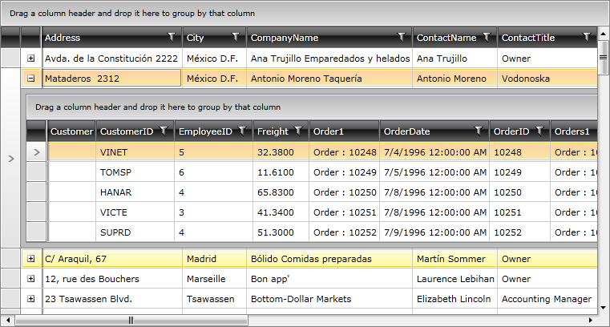

# How to: Load data in a hierarchical grid with RIA Services

## 

Generally, there are a couple of options for filling up a hierarchical RadGridView when using RIA Services and domain data source. In the examples below we will use the Telerik RadDomainDataSource, but the approaches are the same when working with the DomainDataSource as well.

* __Using ElementName binding__

In this case each of the controls is defined in the main Grid and the ElementName binding is used. However, the declaration of the RadDomainDataSource should be in the same level as the one of the corresponding RadGridView;

#### __XAML__

{{region gridview-how-to-create-hierarchical-grid-with-ria_0}}
	<Grid x:Name="LayoutRoot" Background="White">
	 <telerik:RadDomainDataSource x:Name="customersDomainDataSource" QueryName="GetCustomers" AutoLoad="True">
	  <telerik:RadDomainDataSource.DomainContext>
	   <local:CustomerDomainContext />
	  </telerik:RadDomainDataSource.DomainContext>
	 </telerik:RadDomainDataSource>
	 <telerik:RadGridView x:Name="customersGrid" ItemsSource="{Binding DataView, ElementName=customersDomainDataSource}">
	  <telerik:RadGridView.ChildTableDefinitions>
	   <telerik:GridViewTableDefinition />
	  </telerik:RadGridView.ChildTableDefinitions>
	  <telerik:RadGridView.HierarchyChildTemplate>
	   <DataTemplate>
	    <Grid>
	     <telerik:RadDomainDataSource x:Name="ordersDomainDataSource" QueryName="GetOrders" AutoLoad="True">
	      <telerik:RadDomainDataSource.DomainContext>
	       <local:CustomerDomainContext />
	      </telerik:RadDomainDataSource.DomainContext>
	     </telerik:RadDomainDataSource>
	     <telerik:RadGridView x:Name="ordersGrid" ItemsSource="{Binding DataView, ElementName=ordersDomainDataSource}" />
	    </Grid>      
	   </DataTemplate>
	  </telerik:RadGridView.HierarchyChildTemplate>
	 </telerik:RadGridView>
	</Grid>
	{{endregion}}

* __Using StaticResource__

Following this approach, you have to define the two RadDomainDataSource-s in the Resources section and use them as StaticResouce-s afterwards:

#### __XAML__

{{region gridview-how-to-create-hierarchical-grid-with-ria_1}}
	<UserControl x:Class="Hierarchy_RIA.MainPage">
	 <UserControl.Resources>
	  <telerik:RadDomainDataSource x:Name="customersDomainDataSource" QueryName="GetCustomers" AutoLoad="True">
	   <telerik:RadDomainDataSource.DomainContext>
	    <local:CustomerDomainContext />
	   </telerik:RadDomainDataSource.DomainContext>
	  </telerik:RadDomainDataSource>
	  <telerik:RadDomainDataSource x:Name="ordersDomainDataSource" QueryName="GetOrders" AutoLoad="True">
	   <telerik:RadDomainDataSource.DomainContext>
	    <local:CustomerDomainContext />
	   </telerik:RadDomainDataSource.DomainContext>
	  </telerik:RadDomainDataSource>
	 </UserControl.Resources>
	
	 <Grid x:Name="LayoutRoot" Background="White">
	  <telerik:RadGridView x:Name="customersGrid" ItemsSource="{Binding DataView, Source={StaticResource customersDomainDataSource}}">
	   <telerik:RadGridView.ChildTableDefinitions>
	    <telerik:GridViewTableDefinition />
	   </telerik:RadGridView.ChildTableDefinitions>
	   <telerik:RadGridView.HierarchyChildTemplate>
	    <DataTemplate>    
	     <telerik:RadGridView x:Name="ordersGrid" ItemsSource="{Binding DataView, Source={StaticResource ordersDomainDataSource}}" />         
	    </DataTemplate>
	   </telerik:RadGridView.HierarchyChildTemplate>
	  </telerik:RadGridView>
	 </Grid>
	</UserControl>
	{{endregion}}

In both cases the RadGridView will be visualized as follows:

As it can be seen, all objects of type Order are displayed in the child grid. If you want to visualize only the items that correspond to the parent item, you have to create a new query and pass the required parameter. This can be done as demonstrated below:

#### __C#__

{{region gridview-how-to-create-hierarchical-grid-with-ria_2}}
	public IQueryable<Order> GetOrdersByCustomerID(string customerID)
	  {
	   var orders = from o in ObjectContext.Orders where o.CustomerID.StartsWith(customerID)  select o;
	   return orders;
	  }
	{{endregion}}

#### __XAML__

{{region gridview-how-to-create-hierarchical-grid-with-ria_3}}
	<UserControl.Resources>
	 <telerik:RadDomainDataSource x:Key="customers" QueryName="GetCustomers" AutoLoad="True">
	  <telerik:RadDomainDataSource.DomainContext>
	   <local:CustomerDomainContext />
	  </telerik:RadDomainDataSource.DomainContext>
	 </telerik:RadDomainDataSource>  
	</UserControl.Resources>
	
	<Grid x:Name="LayoutRoot" Background="White">
	 <telerik:RadGridView x:Name="customersGrid" ItemsSource="{Binding DataView, Source={StaticResource customers}}">
	  <telerik:RadGridView.ChildTableDefinitions>
	   <telerik:GridViewTableDefinition />
	  </telerik:RadGridView.ChildTableDefinitions>
	  <telerik:RadGridView.HierarchyChildTemplate>
	   <DataTemplate>
	    <StackPanel>
	     <telerik:RadDomainDataSource x:Name="orders" QueryName="GetOrdersByCustomerID" AutoLoad="True">
	      <telerik:RadDomainDataSource.DomainContext>
	       <local:CustomerDomainContext />
	      </telerik:RadDomainDataSource.DomainContext>       
	      <telerik:RadDomainDataSource.QueryParameters>
	       <telerik:QueryParameter ParameterName="customerID" Value="{Binding CustomerID}" />
	      </telerik:RadDomainDataSource.QueryParameters>     
	     </telerik:RadDomainDataSource>     
	     <telerik:RadGridView x:Name="ordersGrid" ItemsSource="{Binding DataView, ElementName=orders}" />
	    </StackPanel>
	   </DataTemplate>
	  </telerik:RadGridView.HierarchyChildTemplate>
	         </telerik:RadGridView>
	</Grid>
	{{endregion}}

In this case the RadGridView will be visualized like follows:

