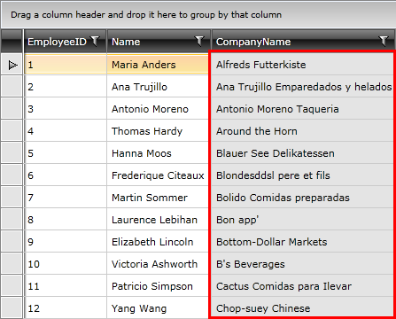

# Enable\Disable Grid Elements

__RadGridView__ is an advanced control, that allows you to enable/disable its different parts. You can set the boolean property __IsEnabled__ to each one of the following objects:

* __RadGridView__

* __GridViewRow__

* __GridViewCell__

Having this in mind, you can control the behavior and enable/disable different parts of your grid view according to some internal logic of yours. 

>important GridViewDataColumn.IsEnabled property cannot be actually used. It is a dependency property inherited from [ContentElement](http://msdn.microsoft.com/en-us/library/system.windows.contentelement.aspx).
          
You can __disable whole column__ by changing the __IsEnabled__ property of each one of __its cells__. This property gets or sets a value indicating whether this element is enabled in the user interface (UI). This is a dependency property inherited from [UIElement](http://msdn.microsoft.com/en-us/library/system.windows.uielement).

#### __XAML__

{{region xaml-gridview-enable-disable-grid-elements_0}}
	
{{endregion}}

#### __XAML__

{{region xaml-gridview-enable-disable-grid-elements_1}}
	<telerik:GridViewDataColumn DataMemberBinding="{Binding CompanyName}" CellStyle="{StaticResource disabledStyle}"/>
{{endregion}}

The screenshot below illustrates RadGridView control with a few disabled cells along with the "CompanyName" column.

To __disable all the rows__ you need to apply a Style targeting the __GridViewRow__ element.

#### __XAML__

{{region xaml-gridview-enable-disable-grid-elements_2}}
	
{{endregion}}

The defined Style is implicit and it will be applied to all elements of type GridViewRow.

To apply the disabled style to some rows only, you can consider [RowStyleSelector]().

## See Also

 * [Read Only Rows and Cells]()
 
 * [UI Virtualization]()
