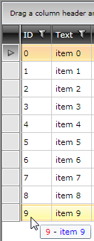

# Add ToolTip for columns and headers

This article demonstrates how to set the tooltip of the gridview's rows, columns and column headers.
      

First you should add a GridView to the user control and bind it to some data.

#### __XAML__

{{region gridview-how-to-create-row-tooltip_0}}
	<telerik:RadGridView Name="gridView" ItemsSource="{Binding}" />
	{{endregion}}

## 

__ToolTip for column's cells__

You can check the source code below on how to set a ToolTip for a specific column. The ToolTip will use a DataTemplate with TextBlocks and will show information from the currently hovered row. The final result should look like this:

To achive that you can define a ToolTipTemplate for the column:

#### __XAML__

{{region gridview-how-to-create-row-tooltip_1}}
	<telerik:GridViewDataColumn DataMemberBinding="{Binding ID}" >
	    <telerik:GridViewColumn.ToolTipTemplate>
	        <DataTemplate>
	            <StackPanel Orientation="Horizontal">
	                <TextBlock Text="{Binding ID}" Foreground="Red" />
	                <TextBlock Text=" - " />
	                <TextBlock Text="{Binding Text}" Foreground="Blue" />
	            </StackPanel>
	        </DataTemplate>
	    </telerik:GridViewColumn.ToolTipTemplate>
	</telerik:GridViewDataColumn>
	{{endregion}}

Here you can add any arbitrary controls if you want.

>tipYou can define the DataTemplate as a StaticResource and then directly assign the ToolTipTemplate property of the GridViewColumn.

## 

__ToolTip for a column's Header__

In this section it is shown how to set a ToolTip for the header of a column.

Two of the options to do so are:

1. Predefine the HeaderCellStyle for the column. For example:

#### __XAML__

{{region gridview-how-to-create-row-tooltip_2}}
	<telerik:GridViewDataColumn DataMemberBinding="{Binding Name}">
	    <telerik:GridViewDataColumn.HeaderCellStyle>
	        
	    </telerik:GridViewDataColumn.HeaderCellStyle>
	</telerik:GridViewDataColumn>
	{{endregion}}

>tipYou can define the DataTemplate as a StaticResource and then directly assign the HeaderCellStyle property of the GridViewColumn.

2. Predefine the Header for the column. The code will be similar to this one:

#### __XAML__

{{region gridview-how-to-create-row-tooltip_3}}
	<telerik:GridViewDataColumn DataMemberBinding="{Binding Name}">
	    <telerik:GridViewDataColumn.Header>
	        <TextBlock Text="Name" ToolTipService.ToolTip="My very long header"/>
	    </telerik:GridViewDataColumn.Header>
	</telerik:GridViewDataColumn>
	{{endregion}}

The final result should look like this:

## 

__ToolTip for a row__

In this section it is shown how to set a ToolTip for GridView's row.

You can define a ToolTip for the rows as follows:

#### __XAML__

{{region gridview-how-to-create-row-tooltip_4}}
	
	{{endregion}}

