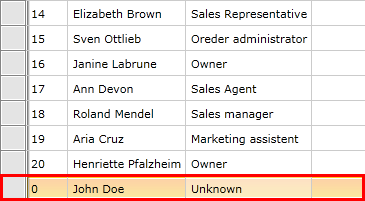

# Adding New Entries

RadGridView comes with out-of-the-box insert functionality. In this topic we will discuss:

* [Inserting New Entries](#inserting-new-entries)

* [Modifying New Entries](#modifying-new-entries)

* [Committing New Entries](#committing-new-entries)

## Inserting New Entries

There are two ways to insert a new row in RadGridView — by pressing the __Insert__ key or by calling the __BeginInsert()__ method.

#### __[C#] Example 1: Adding new rows with BeginInsert()__

	{{region cs-gridview-managing-data-add-new-entries_0}}
	this.radGridView.BeginInsert();
{{endregion}}

#### __[VB.NET] Example 1: Adding new rows with BeginInsert()__

	{{region vb-gridview-managing-data-add-new-entries_1}}
	Me.radGridView.BeginInsert()
{{endregion}}

When a user adds a new item, an empty row is created in which the user can input data.

#### __Figure 1: The newly created row__

>If the __IsReadOnly__ property of RadGridView is set to __True__ or the __CanUserInsertRows__ property is set to __False__, no row is added.

>important The underlying object should expose a default constructor for an empty row to be added.

## Modifying New Entries

The next step in implementing the adding functionality is to attach event handlers to the __AddingNewDataItem__ and the __RowEditEnded__ events.

#### __[XAML] Example 2: Add handlers for the AddingNewDataItem and RowEditEnded events__

	{{region xaml-gridview-managing-data-add-new-entries_5}}
	<telerik:RadGridView AddingNewDataItem="radGridView_AddingNewDataItem"
	                 RowEditEnded="radGridView_RowEditEnded" />
{{endregion}}

The __AddingNewDataItem__ event is raised before a new row is added to RadGridView. A typical use case would be when you have to set initial values for an initialized object. You can do this by passing an object to the __GridViewAddingNewEventArgs__'s **NewObject** property.

#### __[C#] Example 3: The AddingNewDataItem event handler__

	{{region cs-gridview-managing-data-add-new-entries_6}}
	private void radGridView_AddingNewDataItem(object sender, GridViewAddingNewEventArgs e)
	{
	    var employee = new Employee();
	    employee.FirstName = "John";
	    employee.LastName = "Doe";
	    e.NewObject = employee;
	}
{{endregion}}

#### __[VB.NET] Example 3: The AddingNewDataItem event handler__

	{{region vb-gridview-managing-data-add-new-entries_7}}
	Private Sub radGridView_AddingNewDataItem(ByVal sender As Object, ByVal e As GridViewAddingNewEventArgs)
	    Dim employee = New Employee()
	    employee.FirstName = "John"
	    employee.LastName = "Doe"
	    e.NewObject = employee
	End Sub
{{endregion}}

If the ItemsSource is a __DataTable.DefaultView__, you can initialize the newly inserted item as shown in **Example 4**:

#### __[C#] Example 4: Adding a new item to a DataTable__

	{{region cs-gridview-managing-data-add-new-entries_12}}
	private void radGridView_AddingNewDataItem2(object sender, GridViewAddingNewEventArgs e)
	{
	    e.Cancel = true;
	    var newRow = this.dataSource.DefaultView.AddNew();
	    newRow["FirstName"] = "John";
	    newRow["LastName"] = "Doe";
	    e.NewObject = newRow;
	}
{{endregion}}

#### __[VB.NET] Example 4: Adding a new item to a DataTable__

	{{region vb-gridview-managing-data-add-new-entries_13}}
		Private Sub radGridView_AddingNewDataItem2(sender As Object, e As GridViewAddingNewEventArgs)
		    e.Cancel = True
		    Dim newRow = Me.dataSource.DefaultView.AddNew()
		    newRow("FirstName") = "John"
		    newRow("LastName") = "Doe"
		    e.NewObject = newRow
		End Sub
	{{endregion}}

>tipVia the __OwnerGridViewItemsControl__ property of the __GridViewAddingNewEventArgs__ class you can access the __GridViewItemsControl__ for the __RadGridView__ that raised the event.

## Committing New Entries

The __RowEditEnded__ event is raised when new data is added to RadGridView. This can be done in any of the following ways: 

* When the user presses the __Enter__ key.

* When the __CommitEdit()__ method is called.

* When another row is selected.

* When the insert operation is cancelled by pressing the __Escape__ key or calling the __CancelEdit()__ method.

You can access __EditAction__ (__Commit__ or __Cancel__) and __GridViewEditOperationType__ (__Insert__ or __Edit__) using __GridViewRowEditEndedEventArgs__ of the RowEditEnded event. It also allows you to access the new data via the __NewData__ property.

#### __[C#] Example 5: Handling the RowEditEnded event__

	{{region cs-gridview-managing-data-add-new-entries_10}}
	private void radGridView_RowEditEnded(object sender, GridViewRowEditEndedEventArgs e)
	{
	    if (e.EditAction == GridViewEditAction.Cancel)
	    {
	        return;
	    }
	    if (e.EditOperationType == GridViewEditOperationType.Insert)
	    {
	        //Add the new entry to the data base.
	    }
	}
{{endregion}}

#### __[VB.NET] Example 5: Handling the RowEditEnded event__

	{{region vb-gridview-managing-data-add-new-entries_11}}
	Private Sub radGridView_RowEditEnded(ByVal sender As Object, ByVal e As GridViewRowEditEndedEventArgs)
	    If e.EditAction = GridViewEditAction.Cancel Then
	        Exit Sub
	    End If
	
	    If e.EditOperationType = GridViewEditOperationType.Insert Then
	        'Add the new entry to the data base.
	    End If
	End Sub
{{endregion}}

When the new item is committed, it is added to RadGridView's __Items__ collection.

#### __Figure 2: The new row__

## See Also

 * [Updating an Entry]()

 * [Deleting an Entry]()

 * [Validating]()

 * [Adding Rows]()
