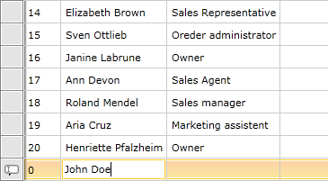

# Adding New Entries

## 

Using the __RadGridView__ you can add new items to your data. When adding a new item, an empty row of type __GridViewNewRow__ is shown, in which the user can input the desired data. This row has the same fields as the defined for the other rows in the __RadGridView__. This means that the user will be able to set only those values of the object bound to the row, which are displayed by the columns.

There are two ways to make the __GridViewNewRow__ appear - one on the user's side and one on the developer's side. The user can bring the __RadGridView__ in insert mode by focusing it and pressing the __Insert__ key. The developer can make the new row appear by calling the __BeginInsert__() method of the __RadGridView__.

#### __C#__

{{region gridview-managing-data-add-new-entries_0}}
	this.AddingNewRowsGrid.BeginInsert();
	{{endregion}}

#### __VB.NET__

{{region gridview-managing-data-add-new-entries_1}}
	Me.AddingNewRowsGrid.BeginInsert()
	{{endregion}}

For example, you can use a button to call this method.

#### __XAML__

{{region gridview-managing-data-add-new-entries_2}}
	<StackPanel x:Name="LayoutRoot">
	    <Button Content="Add"
	            Click="Button_Click" />
				<telerik:RadGridView x:Name="radGridView"
	                             AutoGenerateColumns="False">
	        ...
				</telerik:RadGridView>
	</StackPanel>
	{{endregion}}

And in the event handler call the method for the Click event.

#### __C#__

{{region gridview-managing-data-add-new-entries_3}}
	private void Button_Click( object sender, RoutedEventArgs e )
	{
	    this.radGridView.BeginInsert();
	}
	{{endregion}}

#### __VB.NET__

{{region gridview-managing-data-add-new-entries_4}}
	Private Sub Button_Click(ByVal sender As Object, ByVal e As RoutedEventArgs)
	    Me.radGridView.BeginInsert()
	End Sub
	{{endregion}}

>If the __IsReadOnly__ property of the __RadGridView__ is set to __True__ or the __CanUserInsertRows__ property is set to __False__, the new row won't appear!

The next step in implementing the adding functionality is to attach event handlers to the __AddingNewDataItem__ and the __RowEditEnded__ events.

#### __XAML__

{{region gridview-managing-data-add-new-entries_5}}
	<telerik:RadGridView x:Name="radGridView"
	                         AddingNewDataItem="radGridView_AddingNewDataItem"
	                         RowEditEnded="radGridView_RowEditEnded" />
	{{endregion}}

The __AddingNewDataItem__ is raised before the new row is displayed. In the event handler you initialize the object that has to be added and pass it to the __GridViewAddingNewEventArgs__.

#### __C#__

{{region gridview-managing-data-add-new-entries_6}}
	private void radGridView_AddingNewDataItem( object sender, GridViewAddingNewEventArgs e )
	{
	    e.NewObject = new Employee();
	}
	{{endregion}}

#### __VB.NET__

{{region gridview-managing-data-add-new-entries_7}}
	Private Sub radGridView_AddingNewDataItem(ByVal sender As Object, ByVal e As GridViewAddingNewEventArgs)
	    e.NewObject = New Employee()
	End Sub
	{{endregion}}

In case when the __ItemsSource is a DataTable.DefaultView__, you can initialize the newly inserted item similar to:
        

#### __C#__

{{region gridview-managing-data-add-new-entries_12}}
	radGridView_AddingNewDataItem(object sender, GridViewAddingNewEventArgs e)
	{
	    e.Cancel = true;
	    var newRow = this.dataSource.DefaultView.AddNew();
	    newRow["FirstName"] = "John";
	    newRow["LastName"] = "Doe";
	    e.NewObject = newRow;
	}
	{{endregion}}

#### __VB.NET__

{{region gridview-managing-data-add-new-entries_13}}
	    Private Sub New(sender As Object, e As GridViewAddingNewEventArgs)
	        e.Cancel = True
	        Dim newRow = Me.dataSource.DefaultView.AddNew()
	        newRow("FirstName") = "John"
	        newRow("LastName") = "Doe"
	        e.NewObject = newRow
	    End Sub
	    '#End Region
	End Class

>tipVia the __OwnerGridViewItemsControl__ property of the __GridViewAddingNewEventArgs__ class you can access the __GridViewItemsControl__ for the __RadGridView__ that raised the event.

There are several ways to commit the new data and both of them will raise the __RowEditEnded__ event. The first one occurs when the user presses __Enter__, the second when the __CommitEdit()__ method is called and the last when another row is selected. The adding operation can also be cancelled by pressing __Escape__ or calling the __CancelEdit()__ method. In this case the __RowEditEnded__ event will be raised again.

#### __C#__

{{region gridview-managing-data-add-new-entries_8}}
	private void radGridView_RowEditEnded( object sender, GridViewRowEditEndedEventArgs e )
	{
	}
	{{endregion}}

#### __VB.NET__

{{region gridview-managing-data-add-new-entries_9}}
	Private Sub radGridView_RowEditEnded(ByVal sender As Object, ByVal e As GridViewRowEditEndedEventArgs)
	End Sub
	{{endregion}}

Via the __GridViewRowEditEndedEventArgs__ class you can access the __EditAction__ (__Commit__ or __Cancel__) and the __GridViewEditOperationType__ (__Insert__ or __Edit__). The event arguments class also allows you to access the new data via the __NewData__ property. To be sure that the appropriate data will be submitted (as this handler will be used by the edit operations too) you have to assure that the action is __Commit__ and the operation type is __Insert__.

#### __C#__

{{region gridview-managing-data-add-new-entries_10}}
	private void radGridView_RowEditEnded( object sender, GridViewRowEditEndedEventArgs e )
	{
	    if ( e.EditAction == GridViewEditAction.Cancel )
	    {
	        return;
	    }
	    if ( e.EditOperationType == GridViewEditOperationType.Insert )
	    {
	        //Add the new entry to the data base.
	    }
	}
	{{endregion}}

#### __VB.NET__

{{region gridview-managing-data-add-new-entries_11}}
	Private Sub radGridView_RowEditEnded(ByVal sender As Object, ByVal e As GridViewRowEditEndedEventArgs)
	    If e.EditAction = GridViewEditAction.Cancel Then
	        Exit Sub
	    End If
	
	    If e.EditOperationType = GridViewEditOperationType.Insert Then
	        'Add the new entry to the data base.
	    End If
	End Sub
	{{endregion}}

When the new item is committed, it will be automatically added to the __RadGridView__'s __Items__ collection, so you don't have to worry about anything on the client-side. If you have to save it to a data base, use the event handler to call the appropriate method, as it is shown in the example above.

# See Also

 * [Updating an Entry]()

 * [Deleting an Entry]()

 * [Validating]()

 * [Adding Rows]()
