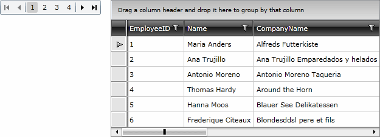

# Using Silverlight DataPager

__RadGridView__ supports a great integration with the standard Silverlight __DataPager__. The purpose of this tutorial is to show you how to connect the Toolkit's __DataPager__ with the __RadGridView__.

>__DataPager__ is part of the __System.Windows.Controls__ namespace in the __System.Windows.Controls.Data__ assembly.

For the purpose of this tutorial the following __RadGridView__ declaration will be used.

#### __XAML__

{{region xaml-gridview-paging-using-silverlight-datapager_0}}
	<Grid x:Name="LayoutRoot" Background="White">
	    <Grid.ColumnDefinitions>
	        <ColumnDefinition Width="Auto"/>
	        <ColumnDefinition Width="*" />
	    </Grid.ColumnDefinitions>
	
	    <telerik:RadGridView x:Name="radGridView"
	Grid.Column="1"/>
	
	</Grid>
{{endregion}}

As you can see the grid view is populated with some initial data.

>tipIn this example RadGridView__ is bound to a collection of objects. For more information about populating __RadGridView__ with __in-memory data__, read [here]().

In order to use the __DataPager__ with __RadGridView__, you need to perform the following steps:

* Add a __DataPager__ declaration to your XAML. Set its properties such as __DisplayMode__, __Source__, __IsTotalItemCountFixed__, __AutoEllipsis__, __PageSize__ etc.

#### __XAML__

{{region xaml-gridview-paging-using-silverlight-datapager_1}}
	<data:DataPager x:Name="dataPager" PageSize="6" DisplayMode="FirstLastPreviousNextNumeric"/>
{{endregion}}

* Initialize a new instance of the __Telerik.Windows.Data.QueryableCollectionView__ class. Set the source for the collection like in the code below:

#### __C#__

{{region cs-gridview-paging-using-silverlight-datapager_2}}
	QueryableCollectionView qcv = new QueryableCollectionView(RadGridViewSampleData.GetEmployees());
{{endregion}}

#### __VB.NET__

{{region vb-gridview-paging-using-silverlight-datapager_3}}
	Dim qcv As New QueryableCollectionView(RadGridViewSampleData.GetEmployees())
{{endregion}}

>The __QueryableCollectionView__ is located in the __Telerik.Windows.Data__ assembly.

>The __QueryableCollectionView__ implements __IPagedCollectionView__ interface like the __PagedCollectionView.__ However, the __QueryableCollectionView__ enables extended support for filtering in the grid.

* Set the newly created __QueryableCollectionView__ instance as an __ItemsSource\Source__ of __RadGridView__ and __RadDataPager__.

#### __C#__

{{region cs-gridview-paging-using-silverlight-datapager_4}}
	QueryableCollectionView qcv = new QueryableCollectionView(RadGridViewSampleData.GetEmployees());
	dataPager.Source = qcv;
	radGridView.ItemsSource = qcv;
{{endregion}}

#### __VB.NET__

{{region vb-gridview-paging-using-silverlight-datapager_5}}
	Dim qcv As New QueryableCollectionView(RadGridViewSampleData.GetEmployees())
	dataPager.Source = qcv
	radGridView.ItemsSource = qcv
{{endregion}}

The final result can be seen on the next figure.

## See Also

 * [Loading Data from XML]()

 * [Loading Data from WCF Services]()

 * [Multiple Selection]()
