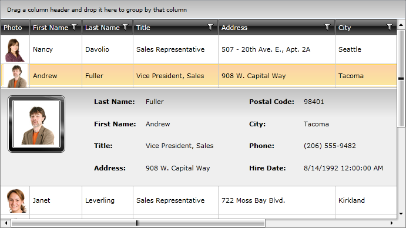

# Overview

Each __RadGridView__ row is capable of presenting additional information by means of a __Row Details__. The __Row Details__ is a __DataTemplate__ defined on the grid- or row-level and is used for displaying data without affecting the dimensions of the row and the cells within it.

One of the advantages of using a __Row Details__ template is that it can be displayed for the selected row only, thus providing a more compact layout. Another benefit of __Row Details__ is the option of placing the __Details Presenter__ outside the __RadGridView__, which provides more room for traditional rows without depriving the user of the additional information.

>tipTo easily expand / collapse the __Row Details__ you can use the [Toggle RowDetails Column]().
		

>tipThe row and the row details share the same data context, so you are free to bind the elements in your template to any of the properties of the data item. To learn more about the __Row Details template__ read [here]().
		

>tipIn order to not scroll the RowDetails when horizontally scrolling the parent RadGridView, you should set __AreRowDetailsFrozen="True"__ for it.
      

This chapter will make you familiar with the specifics around the __Row Details__. The following things will get explained:

* [Row Details Template]()

* [Row Details Visibility]()

* [Row Details TemplateSelector]()

* [Programming]()

* [External Row Details]()

* [Customizing the Row Details]()

## Related Resources

If you want to learn more about the __Row Details__ and how to implement them in more specific scenarios, please take a look at the list with related resources:

* [Display Hierarchical Data with Row Details](http://blogs.telerik.com/rossenhristov/posts/09-07-30/how-to-display-hierarchical-data-with-row-details-radgridview-for-silverlight.aspx)

* [Toggle Row Details one at a time](http://blogs.telerik.com/rossenhristov/posts/09-12-01/how-to-toggle-row-details-one-at-a-time-with-telerik-radgridview-for-silverlight.aspx)

* [Display RadGridView Row Details](http://blogs.telerik.com/rossenhristov/posts/09-12-11/how-to-display-radgridview-row-details-with-radwindow-for-silverlight.aspx)

* [Tooltip Row Details with RadGridView](http://blogs.telerik.com/rossenhristov/posts/09-12-19/how-to-tooltip-row-details-with-radgridview-for-silverlight.aspx)

* [Asynchronous Master-Details with RadGridView](http://blogs.telerik.com/rossenhristov/posts/10-01-07/asynchronous-master-details-with-radgridview-for-silverlight-and-wcf-ria-services.aspx)

* [Asynchronous Master-Details with RadGridView Part II](http://blogs.telerik.com/rossenhristov/posts/10-01-08/radgridview-for-silverlight-and-wcf-ria-services-part-ii-basic-editing-support.aspx)

# See Also

 * [Grid Rows Overview]()

 * [Grid Columns Overview]()

 * [Populating with Data Overview]()

 * [Toggle RowDetails Column]()
