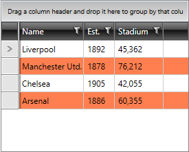

# Alternating Rows

__RadGridView__ allows you to have alternating rows. In order to define the pattern of alternation you have to set the __AlternationCount__ property. For example if you want to alternate each second row, you have to set its value to __2__. Setting it to __3__ makes each third row to be alternated.

#### __[XAML] Example 1: Setting the AlternationCount Property:__

{{region radgridview-rows-alternating-rows_0}}

	<telerik:RadGridView x:Name="radGridView"
	                         AlternationCount="2">
	    ...
	</telerik:RadGridView>
{{endregion}}

In order to style the alternating rows, you can specify the __AlternateRowStyle__ and/or the __AlternateRowBackground__ properties.

>tipTo learn more about styling the rows and the alternating rows you can read [here]().

Here is an example of __RadGridView__ with __AlternationCount__ set to __3__ and __AlternateRowBackground__ color set to __Coral__.

#### __[XAML] Example 2: Setting the AlternateRowBackground Property:__

{{region radgridview-rows-alternating-rows_1}}

	<telerik:RadGridView x:Name="radGridView"
	                         AlternationCount="2"
	                         AlternateRowBackground="Coral">
	    ...
	</telerik:RadGridView>
{{endregion}}

