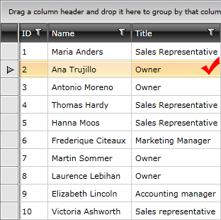
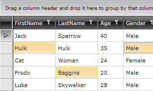

# Basic Selection

The __RadGridView__ provides you with a selection functionality, which allows the user to select one or more items from the data displayed by the control.

>tipThe selection mechanism can be controlled programmatically, too. For more information take a look at the [Programmatic Selection]() topic.

To select an item in the __RadGridView__ click somewhere on the desired row.

As of __Q2 2010__, you can also select a single cell or individual cells as opposed to selecting the full row:

To set the selection unit, use the __SelectionUnit__ enumeration property of the RadGridView. Setting it to __FullRow__ will enable the selection of rows (default), while setting it to __Cell__ will enable the cell selection.

## Selection Modes

The __RadGridView__ provides three selection modes, which allow you to manipulate the type of selection. This is controlled by the __SelectionMode__ enumeration property which have the following entries:

* __Single__ - only one item can be selected at a time. __(default value)__

* __Multiple__ - items are added to the selection when they get clicked and get removed when they get clicked again. 

* __Extended__ - items are added to the selection only by combining the mouse clicks with the __Ctrl__ or __Shift__ key. 

>tipTo learn more about the multiple selection (__Multiple__ and __Extended__ selection modes) take a look at the [Multiple Selection]() topic.

## Selection Units

The __RadGridView__ provides three selection units, which allow you to manipulate what units are selected when you interact with the grid. This is controlled by the __SelectionUnit__ enumeration property which have the following entries:

* __FullRow__ - this is the default value. Clicking within the cells will select the row    
* __Cell__ - the clicked cell is selected only. Depending on the value of the __SelectionModes__ property you can have more than one selected cell. 
* __Mixed__ - you can select any cell and you can as well select a full row if you click on a row, but not on a cell from it.
            
>The Mixed state is added with Q3 SP 2012 release

The __SelectionUnit__ property is added in Q2 2010 release.

## Selected items

__RadGridView__ provides several properties to get the data behind the selected items - __SelectedItem__, __SelectedItems__ and __SelectedCells__. 

* __SelectedItem__ - the business object that sits behind the selected row. You can use it when the __SelectionUnit__ is set to __FullRow__ (default), otherwise it is null.

* __SelectedItems__ - a collection of the business objects that sit behind the selected rows. You can use it when the __SelectionUnit__ is set to __FullRow__ (default), otherwise it is null. It will contain more than one item when the __SelectionMode__ is either __Multiple__ or __Extended__.

* __SelectedCells__ - a collection of __GridViewCellInfo__ objects which represent the business object and the column of the selected cell/cells. You can use it when the __SelectionUnit__ is set to __Cell__, otherwise it is null.

## Disabling Selection

To disable the selection functionality you can set the __CanUserSelect__ to false.

>This will only disable the selection. The user will still be able to change the current item.

>This will disable only the selection for the end-user. It still will be possible to manipulate the selection programmatically. To learn more take a look at the [Programmatic Selection]() topic. If you would like to bind the __SelectedItems__ collection of the RadGridView to a property in the ViewModel, then you could check this [forum thread](http://www.telerik.com/community/forums/wpf/gridview/multiple-selection-with-data-binding-in-radgridview.aspx).
          
#### __XAML__

{{region gridview-selection-basics_0}}

	<telerik:RadGridView x:Name="radGridView"
	                     CanUserSelect="False">
	</telerik:RadGridView>
{{endregion}}

#### __C#__

{{region gridview-selection-basics_1}}

	this.radGridView.CanUserSelect = false;
{{endregion}}

#### __VB.NET__

{{region gridview-selection-basics_2}}

	Me.radGridView.CanUserSelect = False
{{endregion}}

## Events

There are five events relevant to the selection in the RadGridView: __SelectionChanging, SelectionChanged,CurrentCellChanged, SelectedCellsChanging and SelectedCellChanged__. The sequence of the events depends on the __SelectionUnit__ property:

* __FullRow__ - the __SelectionChanged__ is fired first and after that the __CurrentCellChanged__ event fires. 

* __Cell__ - the __SelectedCellChanged__ is fired first and after that the __CurrentCellChanged__ event fires 

>Added with Q3 SP 2012 release __Mixed__ - you can select any cell and you can as well select a full row if you click on a row, but not on a cell.
          

To learn more about the selection events go to [this help topic]().

## Customizing Selection

To modify the selection color you have to modify the style of the __RadGridView__ rows. To learn more about how to do it take a look at the [Styling a Row]() topic.

# See Also

 * [Multiple Selection]()

 * [Programmatic Selection]()

 * [Basic Filtering]()

 * [Programmatic Filtering]()
