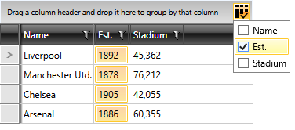

# Column Selection

As of **R3 2016** entire columns can be added to RadGridView's selection. This can be done in any of the following ways:

* [Through the UI](#select-columns-through-the-ui)

* [Via a column's IsSelected property](#select-columns-via-a-columns-isselected-property)

* [Using the SelectCellRegion method](#using-the-selectcellregion-method)

>importantColumn selection is only available when **SelectionMode** is either **Multiple** or **Extended** and **SelectionUnit** is either **Cell** or **Mixed**.

## Select Columns Through the UI

RadGridView's new **CanUserSelectColumns** property determines whether users can add a whole column to the current selection. The default value is **False**, but when set to **True**, a new [RadDropDownButton](#raddropdownbutton) appears in RadGridView's  top right corner. When clicked, a **ListBox** appears, whose **ItemsSource** is bound to RadGridView's **Columns** collection. The user can then check and uncheck columns in order to add and remove them from the current selection. 

>Column selection behaves differently depending on the **SelectionMode** - when dealing with **Extended** selection, if you want to select multiple columns, you need to hold down the **Ctrl** key.

#### __[C#] Example 1: Setting RadGridView's CanUserSelectColumns property__

{{region cs-gridview-column-selection_1}}

	this.radGridView.CanUserSelectColumns = true;
{{endregion}}

#### __[VB.NET] Example 1: Setting RadGridView's CanUserSelectColumns property__

{{region vb-gridview-column-selection_2}}

	Me.radGridView.CanUserSelectColumns = True
{{endregion}}

#### __Figure 1: Selecting columns through the UI__

>If you do not want to display the column selection button, you can use the new **ColumnsSelectionButtonVisibility** in order to hide it.

## Select Columns Via a Column's IsSelected Property

Columns can also be selected programmatically by setting their **IsSelected** property.

>Bear in mind that this will only work if **CanUserSelectColumns** is set to **True**. 

#### __[C#] Example 1: Setting a column's IsSelected property__

{{region cs-gridview-column-selection_3}}

	this.radGridView.Columns["Name"].IsSelected = true;
{{endregion}}

#### __[VB.NET] Example 1: Setting a column's IsSelected property__

{{region vb-gridview-column-selection_4}}

	Me.radGridView.Columns("Name").IsSelected = True
{{endregion}}

## Using the SelectCellRegion Method

Another way to programmatically select columns is by using the [SelectCellRegion method](#selecting-cell-regions):

#### __[C#] Example 1: Selecting a column with the SelectCellRegion method__

{{region cs-gridview-column-selection_5}}

	this.radGridView.SelectCellRegion(new CellRegion(this.radGridView.Columns["Name"].DisplayIndex, 0, 1, this.radGridView.Items.Count));
{{endregion}}

#### __[VB.NET] Example 1: Selecting a column with the SelectCellRegion method__

{{region vb-gridview-column-selection_6}}

	Me.radGridView.SelectCellRegion(New CellRegion(Me.radGridView.Columns("Name").DisplayIndex, 0, 1, Me.radGridView.Items.Count))
{{endregion}}

## See Also

 * [Basic Selection]()

 * [Programmatic Selection]()

 * [Basic Filtering]()

 * [Programmatic Filtering]()

 * [Multiple-column Sorting]()
