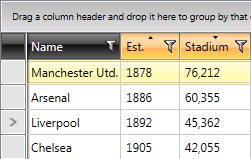

# Multiple-column Sorting

On the snapshot bellow the data in __RadGridView__ is sorted ascending by the Est. column and then sorted again by the Stadium column, without removing the previous sorting. This feature is called multi column sorting.
       

To learn how to implement progtammatic sorting in your __RadGridView__ read on this [topic]().

>tipRun-time you can sort by multiple columns by just holding the __Shift__ key pressed and click all column headers you wish to sort your data by. For more key combinations read the [Keyboard Support]() topic.

As of __Q2 2013__, the user can benefit from __Column Sort Sequence Indicator__. In order to have this feature enabled you need to set __ShowColumnSortIndexes__ property of RadGridView to __True__.

You can check how the column headers will look like after the user has sorted on multiple columns.

## See Also

 * [RadGridView Overview]()

 * [Basic Sorting]()

 * [Programmatic Sorting]()

 * [Custom Sorting]()
