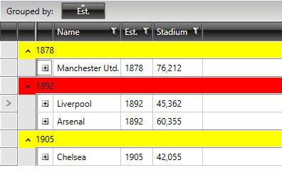

# GroupRowStyleSelector

You can use RadGridView's **GroupRowStyleSelector** property if you need to style group rows differently based on a specific condition.

>importantBear in mind that the [GroupRowStyle](#setting-radgridviews-grouprowstyle) takes precedence over the **GroupRowStyleSelector** and will overwrite it if both are defined simultaneously.

To achieve this, first create a new class that inherits from the **StyleSelector** class and override its **SelectStyle** method:

#### __[C#] Example 1: The GroupRowStyleSelector class__

	{{region cs-gridview-styling-group-row-4}}
	public class GroupRowStyleSelector : StyleSelector
	{
	    public override Style SelectStyle(object item, DependencyObject container)
	    {
	        var group = item as QueryableCollectionViewGroup;
	        if (group.ItemCount > 1)
	        {
	            return BigGroupStyle;
	        }
	        else
	        {
	            return SmallGroupStyle;
	        }
	    }
	
	    public Style BigGroupStyle { get; set; }
	    public Style SmallGroupStyle { get; set; }
	}
{{endregion}}

#### __[VB.NET] Example 1: The GroupRowStyleSelector class__
	
	{{region vb-gridview-styling-group-row-4}}
	Public Class GroupRowStyleSelector
	    Inherits StyleSelector
	    Public Overrides Function SelectStyle(item As Object, container As DependencyObject) As Style
	        Dim group = TryCast(item, CollectionViewGroup)
	
	        If group IsNot Nothing Then
	            If group.ItemCount > 1 Then
	                Return BigGroupStyle
	            Else
	                Return SmallGroupStyle
	            End If
	        End If
	
	        Return Nothing
	    End Function
	
	    Public Property BigGroupStyle() As Style
	        Get
	            Return m_BigGroupStyle
	        End Get
	        Set
	            m_BigGroupStyle = Value
	        End Set
	    End Property
	    Private m_BigGroupStyle As Style
	
	    Public Property SmallGroupStyle() As Style
	        Get
	            Return m_SmallGroupStyle
	        End Get
	        Set
	            m_SmallGroupStyle = Value
	        End Set
	    End Property
	    Private m_SmallGroupStyle As Style
	End Class
{{endregion}}

In the XAML file, define the style selector as a resource and set the properties of the **BigGroupStyle** and **SmallGroupStyle**:

#### __[XAML] Example 2: Setting the BigGroupStyle and SmallGroupStyle__

	{{region xaml-gridview-styling-group-row-5}}
	<Grid.Resources>
	    <my:GroupRowStyleSelector x:Key="GroupRowStyleSelector">
	        <my:GroupRowStyleSelector.BigGroupStyle>
	            
	        </my:GroupRowStyleSelector.BigGroupStyle>
	        <my:GroupRowStyleSelector.SmallGroupStyle>
	            
	        </my:GroupRowStyleSelector.SmallGroupStyle>
	    </my:GroupRowStyleSelector>
	</Grid.Resources>
{{endregion}}

>If you're using **GroupRenderMode="Nested"** the style should target the **GridViewGroupRow** element.

>The **"my:"** prefix before **GroupRowStyleSelector** specifies the mapping for the namespace of the project: **xmlns:my="..."**

Finally, set the **GroupRowStyleSelector** property:

#### __[XAML] Example 3: Setting the GroupRowStyleSelector property__

	{{region xaml-gridview-styling-group-row-6}}
	<telerik:RadGridView GroupRowStyleSelector="{StaticResource GroupRowStyleSelector}" />
{{endregion}}

And here is the final result:

#### __Figure 1: The group footer rows styled using the GroupRowStyleSelector property__

## See Also

* [Styling Group Row]()

* [CellStyleSelector]()