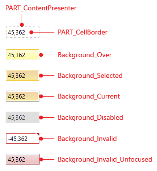
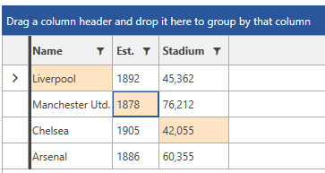
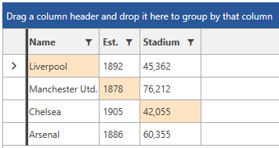

# Styling Cells

>tipBefore reading this topic, you might find it useful to get familiar with the [Template Structure of the GridViewCell](#gridviewcell).

In this article we will discuss the following topics:

* [Targeting the GridViewCell Element](#targeting-the-gridviewcell-element)

* [Setting a Column's CellStyle](#setting-a-columns-cellstyle)

* [Setting a Column's CellStyleSelector](#setting-a-columns-cellstyleselector)

* [Setting the SelectedBackground of the Cell](#setting-the-selectedbackground-of-the-cell)

* [Setting the BorderBrush of the CurrentCell](#setting-the-borderbrush-of-the-currentcell)

#### __Figure 1: GridViewCell template structure__

## Targeting the GridViewCell Element

In order to style all __RadGridView__ cells of an application, you should create an appropriate style targeting the __GridViewCell__ element.

You have two options:

* To create an empty style and set it up on your own.

* To copy the default style of the control and modify it.

>To learn how to modify the default GridViewCell style, please refer to the [Modifying Default Styles]() article.

#### __[XAML] Example 1: Styling all cells of an application__

{{region xaml-gridview-styling-cell_2}}
	
{{endregion}}

>If you're using [Implicit Styles](), you should base your style on the __GridViewCellStyle__.

#### __Figure 2: RadGridView with styled cells in the Office2016 theme__

## Setting a Column's CellStyle

__RadGridView Cells__ can also be styled by creating an appropriate __Style__ for the **GridViewCell** element and setting it as the __CellStyle__ property of the respective __GridView Column__. 

#### __[XAML] Example 2: Setting a column's CellStyle__
{{region xaml-gridview-styling-cell_1}}
	<telerik:GridViewDataColumn DataMemberBinding="{Binding Name}"
	                Header="Name"
	                CellStyle="{StaticResource GridViewCellStyle}" />
{{endregion}}

## Setting a Column's CellStyleSelector

You could also use a column's **CellStyleSelector** property to style cells differently based on a specific condition. More details about how this can be achieved can be found in the [CellStyleSelector article]().

## Setting the SelectedBackground of the Cell

As of __R3 2018 RadGridView__ supports setting the Background of the selected cell, by setting the **SelectedBackground** property of the GridViewCell.

#### __[XAML] Example 3: Setting the SelectedBackground of the GridViewCell__
{{region xaml-gridview-styling-cell_1}}
	
{{endregion}}

#### __Figure 3: Result from Example 3 in the Office2016 theme__

## Setting the BorderBrush of the CurrentCell

As of __R3 2018 RadGridView__ supports setting the BorderBrush of the current cell, by setting the **CurrentBorderBrush** property of the GridViewCell . 

**Example 4** demonstrates how you can set the borderbrush of the current cell to transparent. You can compare **Figure 3** and **Figure 4** to notice that the border of the current cell is not visible.

#### __[XAML] Example 4: Setting the CurrentBorderBrush of the GridViewCell__
{{region xaml-gridview-styling-cell_1}}
	
{{endregion}}

#### __Figure 4: Result from Example 4 in the Office2016 theme__

## See Also

 * [Styling the GridViewEditorPresenter]()

 * [Styling the Column Footers]()

 * [Styling the Column Headers]()

 * [Change Background for Disabled Grid Elements]()
