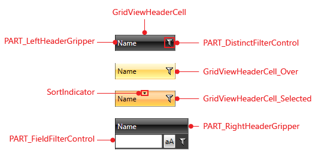
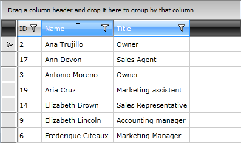

# Styling Column Headers

>tipBefore reading this topic, you might find useful to get familiar with the [Template Structure of the GridViewHeaderCell](#gridviewheadercell).

#### __Figure 1: GridViewHeaderCell template structure__

In this article we will discuss the following topics:

* [Targeting the GridViewHeaderCell element](#targeting-the-gridviewheadercell-element)

* [Setting a Column's HeaderCellStyle](#setting-a-columns-headercellstyle)

## Targeting the GridViewHeaderCell element

In order to style all RadGridView cells of an application, you should create an appropriate style targeting the __GridViewCell__ element.

You have two options:

* To create an empty style and set it up on your own.

* To copy the default style of the control and modify it.

>To learn how to modify the default GridViewHeaderCell style, please refer to the [Modifying Default Styles]() article.

#### __[XAML] Example 1: Styling all header cells of an application__

	{{region gridview-cells_1}}
	
	{{endregion}}

>If you're using [Implicit Styles](), you should base your style on the __GridViewHeaderCellStyle__.

#### __Figure 1: RadGridView with styled header cells__

## Setting a Column's HeaderCellStyle

RadGridView header cells can also be styled by creating an appropriate __Style__ for the **GridViewHeaderCell**  element and setting it as the __HeaderCellStyle__ property of the respective __GridView Column__. 

#### __[XAML] Example 2: Setting a column's HeaderCellStyle__

	{{region gridview-styling-headercell_1}}
	<telerik:GridViewDataColumn Header="ID"
	                            DataMemberBinding="{Binding EmployeeID}"
	                            HeaderCellStyle="{StaticResource GridViewHeaderCellStyle}" />
	{{endregion}}

To learn how to modify the default GridViewHeaderCell style, please refer to the [Modifying Default Styles]() article.

# See Also

 * [Styling a Cell]()

 * [Styling the Column Footers]()
