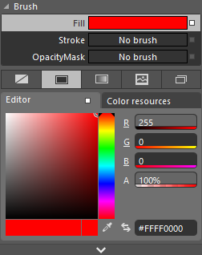

# Styling FilteringControl and FilteringDropDown

In this topic we will discuss:

* [Styling FilteringDropDown](#styling-filteringdropdown)

* [Styling FilteringFilteringControl](#styling-filteringcontrol)

>Both controls are located in the **Telerik.Windows.Controls.GridView** namespace of the **Telerik.Windows.Controls.GridView** assembly. When working in **Expression Blend**, the namespaces that are needed will be added automatically.

#### __Figure 1: The FilteringControl & FilteringDropDown template structure__

We will now style each of the controls by copying its default style and modifying it.

## Styling FilteringDropDown

#### __Figure 2: The default FilteringDropDown element__

The filtering dropdown icon can be styled by creating an appropriate style targeting the **FilteringDropDown** element.

To create the needed style we will first create a dummy control in Blend. To do so open the UserControl that hosts your RadGridView in Expression Blend and from the **Assets** tab select **Controls -> All -> FilteringDropDown**.

#### __Figure 3: Selecting the FilteringDropDown from the Assets tab__

Draw one dummy control of this type somewhere on the scene.

#### __Figure 4: The dummy FilteringDropDown__

Select it and from the menu choose **Object -> Edit Style -> Edit a Copy**. You will then be prompted for the name of the style and where to be placed within your application.

For this example, we will choose to apply this style to all FilteringDropDown controls and place it in our App.xaml file.

#### __Figure 5: The create style resource window__

After clicking OK, a style for your FilteringDropDown control will be created.

To change the visual appearance of the FilteringDropDown control you have to modify its template. To do that click on the palette-like breadcrumb icon and select **Edit Template -> Edit Current**.

#### __Figure 6: Edit current template__

To change the funneling icon's border, for example, you need to select the **Path** control responsible for the border of the FilteringDropDown from the **Objects and Timeline** pane.

#### __Figure 7: The FilteringDropDown template structure__

>tipPlease bear in mind that the control template may be different in the different themes. This example modifies the **Windows8** theme.

Next set **Fill** of the Path to **Red**.

#### __Figure 8: Changing the fill of the path__

Here is a snapshot of the final result.

#### __Figure 9: Our modified FilteringDropDown__

## Styling FilteringControl

#### __Figure 10: The default FilteringControl element__

      
__GridViewColumn__ exposes the __FilteringControlStyle__ property of type __Style__. It is applied to the __FilteringControl__ of the column.

You can modify it similarly to the FilteringDropDown style and set it as follows:

{{region gridview-styling-filteringdropdown_2}}
	<telerik:GridViewDataColumn FilteringControlStyle="{StaticResource FilteringControlStyle}" />
{{endregion}}

>You can find the Template Structure of the FilteringControl [here]().

You are also free to create your [Custom Filtering Control](%slug custom-filtering-controls) and craft it as you like.

# See Also

 * [Filter goes outside the window]()

 * [Styling the FilterRow]()
