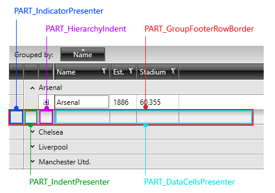
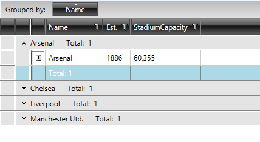
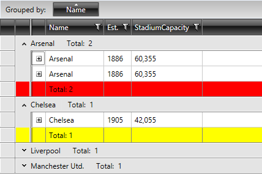

# Styling Group Footers

>tipBefore reading this topic, you might find useful to get familiar with the [GridViewGroupFooterCell and GridViewGroupFooterRow]().

In this article we will discuss the following topics:

* [Targeting the GridViewGroupFooterRow Element](#targeting-the-gridviewgroupfooterrow-element)

* [Setting RadGridView's GroupFooterRowStyle](#setting-radgridviews-groupfooterrowstyle)

* [Setting RadGridView's GroupFooterRowStyleSelector](#setting-radgridviews-groupfooterrowstyleselector)

* [Targeting the GridViewGroupFooterCell Element](#targeting-the-gridviewgroupfootercell-element)

* [Setting a Column's GroupFooterCellStyle](#setting-a-columns-groupfootercellstyle)

## Targeting the GridViewGroupFooterRow Element

If you want to style all group footer rows of your application, you should create an appropriate style targeting the __GridViewGroupFooterRow__ element.

#### __Figure 1: GridViewGroupFooterRow template structure__

You have two options:

* To create an empty style and set it up on your own.

* To copy the default style of the control and modify it.

>To learn how to modify the default GridViewFooterCell style, please refer to the [Modifying Default Styles]() article.

#### __[XAML] Example 1: Styling all group footer rows of an application__

	{{region gridview-styling-group-footers-1}}
	
	{{endregion}}

>If you're using [Implicit Styles](), you should base your style on the __GridViewGroupFooterRowStyle__.

## Setting RadGridView's GroupFooterRowStyle

RadGridView's footer rows can also be styled by creating an appropriate __Style__ for the **GridViewGroupFooterRow** element and setting it as RadGridView's __GroupFooterRowStyle__ property. 

#### __[XAML] Example 2: Setting RadGridView's GroupFooterRowStyle__

	{{region gridview-styling-group-footers-2}}
	<telerik:RadGridView GroupFooterRowStyle="{StaticResource GridViewFooterRowStyle}" />
	{{endregion}}

#### __Figure 2: RadGridView with styled group footer rows__

## Setting RadGridView's GroupFooterRowStyleSelector

You could also use RadGridView's **GroupFooterRowStyleSelector** property to style group footer rows differently based on a specific condition.

>importantBear in mind that the **GroupFooterRowStyle** takes precedence over the **GroupFooterRowStyleSelector** and will overwrite it if both are defined simultaneously.

To do so, first create a new class which inherits the **StyleSelector** class and override its **SelectStyle** method:

#### __[C#] Example 3: The GroupFooterRowStyleSelector class__

	{{region gridview-styling-group-footers-3}}
	public class GroupFooterRowStyleSelector : StyleSelector
    {
        public override Style SelectStyle(object item, DependencyObject container)
        {
            var group = item as CollectionViewGroup;

            if (group != null)
            {
                if (group.ItemCount > 1)
                {
                    return BigGroupStyle;
                }
                else
                {
                    return SmallGroupStyle;
                }
            }

            return null;
        }

        public Style BigGroupStyle { get; set; }
        public Style SmallGroupStyle { get; set; }
    }
	{{endregion}}

#### __[VB.NET] Example 3: The GroupFooterRowStyleSelector class__
	
	{{region gridview-styling-group-footers-4}}
	Public Class GroupFooterRowStyleSelector
	Inherits StyleSelector
		Public Overrides Function SelectStyle(item As Object, container As DependencyObject) As Style
			Dim group = TryCast(item, CollectionViewGroup)
	
			If group IsNot Nothing Then
				If group.ItemCount > 1 Then
					Return BigGroupStyle
				Else
					Return SmallGroupStyle
				End If
			End If
	
			Return Nothing
		End Function

		Public Property BigGroupStyle() As Style
			Get
				Return m_BigGroupStyle
			End Get
			Set
				m_BigGroupStyle = Value
			End Set
		End Property
		Private m_BigGroupStyle As Style

		Public Property SmallGroupStyle() As Style
			Get
				Return m_SmallGroupStyle
			End Get
			Set
				m_SmallGroupStyle = Value
			End Set
		End Property
		Private m_SmallGroupStyle As Style
	End Class
	{{endregion}}

In the XAML file, define the style selector as a resource and set the properties of the **BigGroupStyle** and **SmallGroupStyle**:

#### __[XAML] Example 4: Setting the BigGroupStyle and SmallGroupStyle__

	{{region gridview-styling-group-footers-6}}
	<Grid.Resources>
        <my:GroupFooterRowStyleSelector x:Key="StadiumCapacityStyleSelector">
            <my:GroupFooterRowStyleSelector.BigGroupStyle>
                
            </my:GroupFooterRowStyleSelector.BigGroupStyle>
            <my:GroupFooterRowStyleSelector.SmallGroupStyle>
                
            </my:GroupFooterRowStyleSelector.SmallGroupStyle>
        </my:GroupFooterRowStyleSelector>
	</Grid.Resources>
	{{endregion}}

>The **"my:"** prefix before **GroupFooterRowStyleSelector** specifies the mapping for the namespace of the project: **xmlns:my="..."**

Finally, set the **MergedCellsStyleSelector** property:

#### __[XAML] Example 5: Setting the GroupFooterRowStyleSelector property__

	{{region gridview-styling-group-footers-7}}
	<telerik:RadGridView GroupFooterRowStyleSelector="{StaticResource GroupFooterRowStyleSelector}" />
	{{endregion}}

And here is the final result:

#### __Figure 2: The group footer rows styled using the GroupFooterRowStyleSelector property__

## Targeting the GridViewGroupFooterCell Element

In order to style all RadGridView cells of an application, you should create an appropriate style targeting the __GridViewGroupFooterCell__ element.

#### __[XAML] Example 6: Styling all group footer cells of an application__

	{{region gridview-styling-group-footers-8}}
	
	{{endregion}}

>If you're using [Implicit Styles](), you should base your style on the __GridViewGroupFooterCellStyle__.

## Setting a Column's GroupFooterCellStyle

RadGridView's footer cells can also be styled by creating an appropriate __Style__ for the **GridViewGroupFooterCell** element and setting it as the __GroupFooterCellStyle__ property of the respective __GridViewColumn__. 

#### __[XAML] Example 7: Setting a column's GroupFooterCellStyle__

	{{region gridview-styling-group-footers-9}}
	<telerik:GridViewDataColumn DataMemberBinding="{Binding Name}"
                                Header="Name"
                                GroupFooterCellStyle="{StaticResource GridViewFooterCellStyle}" />
	{{endregion}}

#### __Figure 2: RadGridView with styled group footer cells__

# See Also

 * [Styling Group Row]()

 * [Styling the Column Footers]()

 * [Styling the Column Headers]()

 * [Styling a Cell]()
