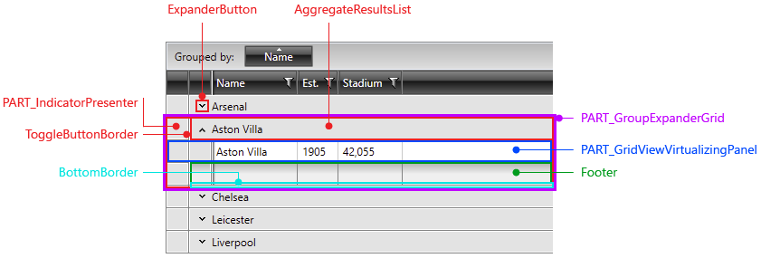

# Styling Group Row

>tipBefore reading this topic, you might find useful to get familiar with the [Template Structure of the GridViewGroupRow and GroupHeaderRow]().

>importantWith R3 2012, Telerik introduced __GroupRenderMode="Flat"__ which makes use of the **GroupHeaderRow** element as opposed to the **Nested** group render mode which uses the **GridViewGroupRow**. You should target the correct element in order for your styles to be applied. Please have a look at this [help article]() for details.

In this article we will discuss the following topics:

* [Targeting the GridViewGroupRow Element](#targeting-the-gridviewgrouprow-element)

* [Targeting the GroupHeaderRow Element](#targeting-the-groupheaderrow-element)

* [Setting RadGridView's GroupRowStyle](#setting-radgridviews-grouprowstyle)

## Targeting the GridViewGroupRow Element

In order to style all group rows of RadGridView instances with **GroupRenderMode="Nested"** in your application, you should create an appropriate style targeting the __GridViewGroupRow__ element.

#### __Figure 1: GridViewGroupRow template structure__

You have two options:

* To create an empty style and set it up on your own.

* To copy the default style of the control and modify it.

>To learn how to modify the default GridViewCell style, please refer to the [Modifying Default Styles]() article.

#### __[XAML] Example 1: Targetting GridViewGroupRow__

	{{region gridview-styling-group-row-1}}
	
	{{endregion}}

>If you're using [Implicit Styles](), you should base your style on the __GridViewGroupRowStyle__.

## Targeting the GroupHeaderRow Element

If you have set your **GroupRenderMode** to **Flat**, your style should target the __GroupHeaderRow__ element.

#### __Figure 2: GroupHeaderRow template structure__

#### __[XAML] Example 2: Targetting GroupHeaderRow__

	{{region gridview-styling-group-row-2}}
	
	{{endregion}}

>If you're using [Implicit Styles](), you should base your style on the __GroupHeaderRowStyle__.

## Setting RadGridView's GroupRowStyle

The __RadGridView__ exposes the __GroupRowStyle__ property of type __Style__. It is applied to the __GridViewGroupRow__/__GroupHeaderRow__ visual elements inside the __RadGridView__.

#### __[XAML] Example 2: Setting RadGridView's GroupRowStyle__

	{{region gridview-styling-cell_1}}
	<telerik:RadGridView GroupRowStyle="{StaticResource GroupRowStyle}" />
	{{endregion}}

#### __Figure 3: RadGridView with styled group rows__

>In order to fully style the grouping appearance you have to also modify the styles for [GridViewRow](),  GridViewGroupFooterRow and [indent cells]().

# See Also

 * [Styling Group Footers]()

 * [Grouping Modes]()

 * [Basic Grouping]()

 * [Group Aggregates]()

 * [Group Footers]()
