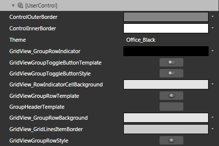
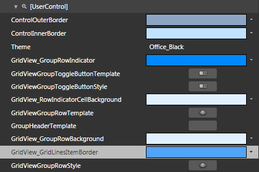
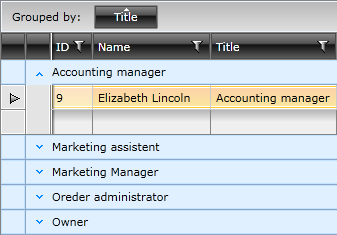

# Styling the Group Row

>Please note that we have introduced a new __GroupRenderMode="Flat"__. In that case the GroupRowStyle should target __GroupHeaderRow__(similar to GridViewGroupRow). Please check this [help article]() for details.
        

>tipBefore reading this topic, you might find useful to get familiar with the [Template Structure of the GridViewGroupRow/GroupHeaderRow control]().
        

The __RadGridView__ exposes the __GroupRowStyle__ property of type __Style__. It is applied to the __GridViewGroupRow__/__GroupHeaderRow__ visual elements inside the __RadGridView__.

You have two options:

* To create an empty style and set it up on your own.
* To copy the default styles of the control and modify it.
        

This topic will show you how to perform the second one.

## Modifying the Default Style

Using [Implicit Styles]() gives you the ability to easily extract and edit the default ControlTemplates of the controls. You can follow [this article]() on two different approaches on how to extract the ControlTemplates.
        

We have introduced a new __GroupRenderMode="Flat"__. In that case the GroupRowStyle should target __GroupHeaderRow__(similar to GridViewGroupRow). Please check this [help article]() for details.
        

>tipIf you choose to define the style in Application, it would be available for the entire application. This allows you to define a style only once and then reuse it where needed.
          

* __ControlOuterBorder__ - a brush that represents the color of the outer border of the __GridViewGroupRow__/__GroupHeaderRow__.
            

* __ControlInnerBorder__ - a brush that represents the color of the inner border of the __GridViewGroupRow__/__GroupHeaderRow__. 
            

* __GridView_GroupRowIndicator__ - a brush that represents the color of the expander icon.
              

* __GridViewGroupToggleButtonTemplate__ - the __ControlTemplate__, applied to the __TggleButton__ element of the __GridViewGroupRow__/__GroupHeaderRow__.
            

* __GridViewGroupToggleButtonStyle__ - the __Style__, applied to the __TggleButton__ element of the __GridViewGroupRow__/__GroupHeaderRow__.
            

* __GridView_RowIndicatorCellBackground__ - a brush that represents the background of the indicator cell.
            

* __GridViewGroupRowTemplate__ - the __ControlTemplate__, applied to the __GridViewGroupRow__/__GroupHeaderRow__.
            

* __GroupHeaderTemplate__ - a __DataTemplate__ applied to the Group Row's header.
              

* __GridView_GridRowBackground__ - a brush that represents the background color of the __GridViewGroupRow__/__GroupHeaderRow__.
            

* __GridViewGroupRowStyle/GroupHeaderRowStyle__ - the Style applied to the __GridViewGroupRow__/__GroupHeaderRow__.
            

Here is an example of these resources changed.

And here is a snapshot from the working application.

>In order to fully style the grouping appearance you have to also modify the styles for __GridViewRow__,  __GridViewGroupFooterRow__ and __IndentPresenter__ (__GridViewIndentCell__ too).

# See Also

 * [Styles and Templates Overview]()

 * [Grouping Modes]()

 * [Basic Grouping]()

 * [Programmatic Grouping]()

 * [Multiple-column Grouping]()

 * [Group Aggregates]()

 * [Group Footers]()
