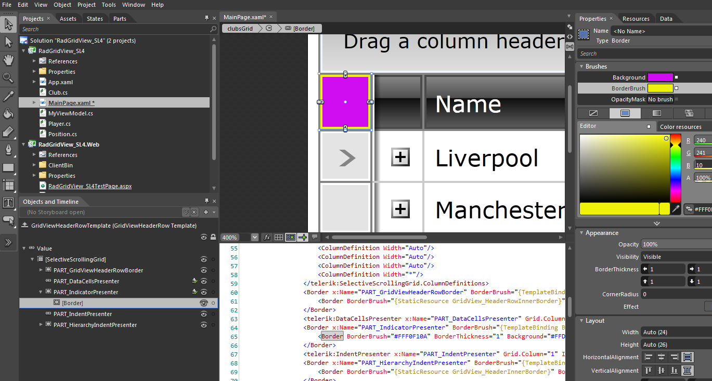

# Styling the Indent Cells in RadGridView

RadGridView does expose different indicators and indent cells depending on its current state - being grouped, in a hierarchy, or displaying the corresponding footers. Generally, the structure is as follows:

RadGridView exposes four different indent cells:

* GridViewIndentCell - it is a part of the GridViewRow;

* GridViewHeaderIndentCell - it is a part of the GridViewHeaderRow;

* GridViewFooterIndentCell - it is a part of the GridViewFooterRow;

* GridViewGroupFooterIndentCell - it is a part of the GridViewGroupFooterRow;

Similar to the rest of the PART elements, you may alter their appearance by creating a simple style or directly by editing their templates.

Furthermore, RadGridView exposes five indicator presenters each of them belonging to the corresponding row - GridViewRow, GridViewHeaderRow, GridViewGroupRow, GridViewGroupFooterRow and GridViewFooterRow. You may edit each of them by accessing the template of the row and modify the Border element named PART_IndicatorPresenter as illustrated below:

After editing each of the indent cells or indicator presenters, the RadGridView will be displayed as follows:

