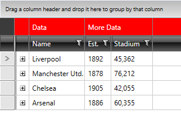

# Styling Column Groups

In order to style **Columng Groups** you will need to create two styles targeting the **CommonHeaderPresenter** and **CommonColumnHeader** elements. The __CommonHeaderPresenter__ hosts all common column headers and the __CommonColumnHeader__ is responsible for a single common column header. 

#### __[XAML] Example 1: Styling the CommonHeaderPresenter and CommonColumnHeader__

	{{region gridview-styling-column-groups-1}}
	
	
	{{endregion}}

This will result in a red background for the merged header cells.

#### __Figure 1: The styled Column Groups__

>importantAs of version Q2 2015, the __GridViewColumnGroupRow__ visual element was introduced. You need to also merge its XAML if using a Custom Theme.

>If you want to have your [**Row Indicator** visible](#hiding-the-row-indicator), you will also need to modify the **CommonHeaderIndent** element of the **GridViewHeaderRow**. You can look at the [Styling Header Row article]() for more information on how to achieve that.

# See Also

 * [Styles and Templates Overview]()
 
 * [Column Groups]().
