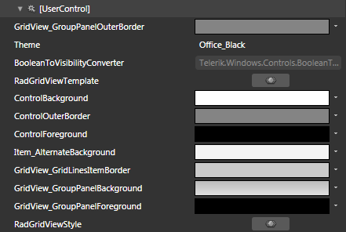
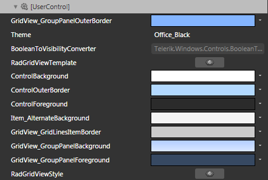
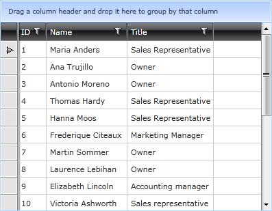

# Styling the RadGridView

>tipBefore reading this topic, you might find useful to get familiar with the 
      [Template Structure of the RadGridView control](2CD6EAA0-C735-4FA2-B921-A0D1A4452C10#RadGridView).

The __RadGridView__ exposes a Style property which allows you to apply a style to it and modify its appearance.

You have two options:

* To create an empty style and set it up on your own.

* To copy the default style of the control and modify it.

This topic will show you how to perform the second one.

## Modifying the Default Style

To copy the default styles, load your project in Expression Blend and open the User Control that holds the __RadGridView__. In the 'Objects and Timeline' pane select the __RadGridView__ you want to style. From the menu choose *Object -> Edit Style -> Edit a Copy*. You will be prompted for the name of the style and where to be placed.

>tipIf you choose to define the style in Application, it would be available for the entire application. This allows you to define a style only once and then reuse it where needed.

After clicking 'OK', Expression Blend will generate the default style of the __RadGridView__control in the __Resources__ section of your User Control. The properties available for the style will be loaded in the 'Properties' pane and you will be able to modify their default values. You can also edit the generated XAML in the XAML View or in Visual Studio.

If you go to the 'Resources' pane, you will see an editable list of resources generated together with the style and used by it. In this list you will find the brushes, styles and templates needed to change the visual appearance of the __RadGridView____.__ Their names indicate to which part of the __RadGridView__appearance they are assigned.

         
      

* __GridView_GroupPanelOuterBorder__ - a brush, that represents the outer border color of the__Group Panel__.

* __RadGridViewTemplate__ - the __ControlTemplate__, applied to the __RadGridView__.

* __ControlBackground__ - a brush that represents the background color of the __RadGridView__.

* __ControlOuterBorder__ - a brush that represents the outer border color of the __RadGridView__.

* __ControlForeground__ - a brush that represents the foreground color of the __RadGridView__.

* __Item_AlternateBackground__ - a brush that represents the background color of the alternating rows.

* __GridView_GroupPanelBackground__ - a brush that represents the background color of the __Group Panel__.

* __GridView_GroupPanelForeground__ - a brush that represents the foreground color of the __Group Panel__.

* __RadGridViewStyle__ - the __Style__, applied to the __RadGridView__ control.

Here is an example of the described resources modified.

         
      

And here is a snapshot of the result.

         
      
