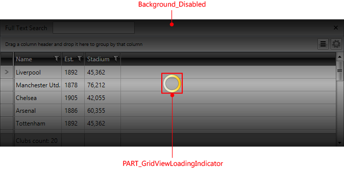
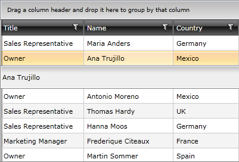

# Styling RadGridView

In this topic we will discuss:

* [Setting RadGridView Style](#setting-radgridviews-style)

* [Controlling RadGridView Appearance through Properties](#controlling-radgridview-appearance-through-properties)

#### __Figure 1: The default RadGridView control__

#### __Figure 2: RadGridView template structure__

>tipNote that when changing the __ControlTemplate__ you should include all required parts. Even if your code compiles, some of the functionality may be subject to impact due to the omission of the required parts. The required parts are usually marked with the prefix "__PART___".

## Setting RadGridView Style

__RadGridView__ exposes a **Style** property which allows you to apply a style to it and modify its appearance.

#### __[XAML] Example 1: Setting RadGridView Style__

	{{region gridview-styling-radgridview-0}}
	<telerik:RadGridView Style="{StaticResource RadGridViewStyle}" />
	{{endregion}}

To learn how to modify the default RadGridView style, please refer to the [Modifying Default Styles]() article.

## Controlling RadGridView Appearance through Properties

RadGridView also exposes a number of properties with which you can easily customize the control without the need of modifying its default style. They can be separated into the following categories:

* [General](#general)

* [Columns](#columns)

* [Rows](#rows)

* [Groups](#groups)

### General

This section covers the following properties:

* __GridLinesVisibility__ - control the way by which the grid lines are visualized. Choose one of the four possible values defined in the __GridLinesVisibility__ enumeration: __Both__, __Horizontal__, __Vertical__ and __None__. 

* __ShowColumnHeaders__ - show\hide the column headers. 

* __ShowColumnFooters__ - show\hide the column footers. 

* __ColumnBackground__ - define default background color for all columns. 

* __VerticalGridLinesBrush__- define default color for all vertical grid lines. 

* __HorizontalGridLinesBrush__- define default color for all horizontal grid lines.

Here is a small sample, demonstrating the usage of some of the above properties.

#### __[XAML] Example 2: Usage of General properties__

{{region gridview-styles-and-templates-controlling-appearance_0}}

	<telerik:RadGridView x:Name="radGridView" 
                         GridLinesVisibility="Vertical"
                         ShowColumnFooters="True"
                         ShowColumnHeaders="False"
                         ColumnBackground="Bisque"/>
{{endregion}}

The final result should be similar to this:

#### __Figure 3: The result of the modified General properties__

You can see that the columns headers are not visible, while the column footers are, moreover there are only vertical grid lines and the columns' __background__ of all columns is set to Bisque.

### Columns

This section covers the following properties:

* __MinColumnWidth__ - gets or sets the __minimum__ width constraint of a __GridViewColumn__. The minimum width of the object, in pixels. This value can be any value equal to or greater than 0. However, __System.Double.PositiveInfinity__ is __not__ valid. 

* __MaxColumnWidth__ - gets or sets the __maximum__ width constraint of a __GridViewColumn__. The maximum width of the object, in pixels. The default is __System.Double.PositiveInfinity__. This value can be any value equal to or greater than 0. __System.Double.PositiveInfinity__ is __also valid__.  

* __ColumnWidth__ - gets or sets the width of a __GridViewColumn__. 

Here is a small sample, demonstrating the usage of some of the above properties.

#### __[XAML] Example 3: Usage of Columns properties__

{{region gridview-styles-and-templates-controlling-appearance_1}}

	<telerik:RadGridView x:Name="radGridView" MinColumnWidth="20" MaxColumnWidth="100" ColumnWidth="80"/>
{{endregion}}

### Rows

This section covers the following properties:

* __RowIndicatorVisibility__ - show\hide the row indicators, located on left of each row. 

* __RowDetailsVisibilityMode__ - control the way by which row details are visualized. Choose one of the three possible values defined in the __GridViewRowDetailsVisibilityMode__ enumeration: __Collapsed__, __Visible__ and __VisibleWhenSelected__. 

* __AlternationCount__ - control the alternate rows. Usually you need to set it to 2, so every second row will have alternating style applied.

* __RowStyle__ - specify a style for the grid rows. [Read more]()

* __AlternateRowStyle__ - specify a style for the alternative grid rows. [Read more]()

* __RowDetailsStyle__ - specify a style for the row details. [Read more]()

* __HeaderRowStyle__ - specify a style for the grid's header row. [Read more]()

Here is a small sample, demonstrating the usage of some of the above properties.

#### __[XAML] Example 4: Usage of Rows properties__

{{region gridview-styles-and-templates-controlling-appearance_2}}

	<telerik:RadGridView x:Name="radGridView" 
                         RowIndicatorVisibility="Collapsed"
                         RowDetailsVisibilityMode="VisibleWhenSelected"
                         AlternationCount="2">
	    <telerik:RadGridView.RowDetailsTemplate>
	        <DataTemplate>
	            <Border BorderThickness="2" Height="35">
	                <TextBlock Text="{Binding Name}" VerticalAlignment="Center" HorizontalAlignment="Center"></TextBlock>
	            </Border>   
	        </DataTemplate>
	    </telerik:RadGridView.RowDetailsTemplate>
	</telerik:RadGridView>
{{endregion}}

#### __Figure 4: The result of the modified Rows properties__

You can see that the row indicators are missing and the row details are displayed only for the selected row. Moreover each even row has different styling because of the __AlternationCount__ property.

### Groups

This section covers the following properties:

* __ShowGroupFooters__ - show\hide the group footers, located at the bottom of each group. 

* __ShowGroupPanel__ - show\hide the group panel, located at the top of the __RadGridView__ control. 

* __GroupRowStyle__ - specify a style for the group row. [Read more]()

* __GroupFooterRowStyle__ - specify a style for the footer group row. [Read more]()

Here is a small sample, demonstrating the usage of some of the above properties.

#### __[XAML] Example 5: Usage of Groups properties__

{{region gridview-styles-and-templates-controlling-appearance_3}}

	<telerik:RadGridView x:Name="radGridView"
                         ShowGroupFooters="True"
                         ShowGroupPanel="False">
	    <telerik:RadGridView.GroupDescriptors>
					<telerik:GroupDescriptor Member="Country">
					</telerik:GroupDescriptor>
	    </telerik:RadGridView.GroupDescriptors>
	</telerik:RadGridView>
{{endregion}}

#### __Figure 5: The result of the modified Groups properties__

You can see that the group footers are shown, while the group panel (located at the top of the __RadGridView__) is no longer visible, thus making any changes in the grouping impossible.