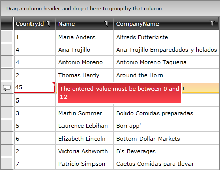

# Styling Validation ToolTips in RadGridView ##

> Before reading this topic, you might find it useful to get familiar with RadGridView’s [validation]() functionality.

__RadGridView__ has two validation layers: **UI** and **data**. An interface such as __IDataErrorInfo__ is used by the data layer validation and __RadGridView's__ role here is just to update the underlying value via binding at the right moment. 


Error validation template comes from __WPF__ framework. 



Especially for __Silverlight__ a special __ValidationToolTip__ element was developed for common input controls and native MS controls that are supported by __Telerik__ themes. 


#### __Figure 1: The default validation tooltip__

__RadGridView__ supports different validation modes and the validation tooltip depends on different factors. Visually all tooltips are the same, but they appear on different elements. In edit mode, a validation tooltip depends on the editor and __GridViewEditorPresenter__ element. __GridViewEditorPresenter__ is a generic container for all type of editors. In view mode, a validation tooltip depends on the cell and on the row.

> In order to customize __GridViewEditorPresenter__ you can check the [Styling the GridViewEditorPresenter]() article.


When data is being validated on the property level, the default error template for __WPF__ appears. This is a thin red line around the control. In the world of __WPF__ you can easily restyle the validation error template of any control.
 
An exception of this rule are the MS controls that could be styled in all Telerik themes. They inherit the same look and feel presented for each theme, as part of the Telerik theme suite.  


> To learn how to customize any Telerik theme, see the [Setting a Theme (Using Implicit Styles)]() article.

__RadGridView's__ validation tooltip styles are located in __Telerik.Windows.Controls.GridView.xaml__; those related to editors are in the respective theme XAML markup file.

 There are two approaches you can follow in order to extract the __ControlTemplates__ of the validation tooltip:

* Manually [Edit the ControlTemplates]() 

* Use [Microsoft Expression Blend]() 

>tip The recommended approach for editing __ControlTemplates__ is using [Implicit Styles]().

The default XAML markup for __GridViewCell’s__ validation tooltip uses the __Office\_Black theme__:

#### __[XAML] Example 1: GridViewCell validation tooltip in the Office\_Black theme__
{{region styling-validation-tooltip-in-gridview-0}}
	<ControlTemplate x:Key="GridViewCell_ValidationToolTipTemplate" TargetType="ToolTip">

    . . .
    
    <ItemsControl ItemsSource="{TemplateBinding Content}">
        <ItemsControl.ItemTemplate>
            <DataTemplate>
                <Border MinHeight="22"
                        Background="{StaticResource GridView_ValidationTooltipBackground}"
                        BorderBrush="{StaticResource GridView_ValidationTooltipOuterBorder}"
                        BorderThickness="1"
                        CornerRadius="{StaticResource GridView_ValidationTooltipCornerRadius}">
                                <Border BorderBrush="{StaticResource GridView_ValidationTooltipInnerBorder}"
                                        BorderThickness="1">
                        <TextBlock Margin="4 1" MaxWidth="250" 
                                   Foreground="{StaticResource GridView_ValidationTooltipForeground}" 
                                   Text="{Binding}" TextWrapping="Wrap"/>
                    </Border>
                </Border>
            </DataTemplate>
        </ItemsControl.ItemTemplate>
        <ItemsControl.ItemsPanel>
            <ItemsPanelTemplate>
                <StackPanel/>
            </ItemsPanelTemplate>
        </ItemsControl.ItemsPanel>
    </ItemsControl>

    . . .

	</ControlTemplate>
{{endregion}}

Default XAML markup for __GridViewEditorPresenter’s__ validation tooltip uses the __Office\_Black theme__:

#### __[XAML] Example 2: GridViewEditorPresenter validation tooltip in Office\_Black theme__
{{region styling-validation-tooltip-in-gridview-1}}
	<ControlTemplate x:Key="GridViewEditorPresenter_ValidationToolTipTemplate" TargetType="ToolTip">
   
    . . .

    <Border MinHeight="22"
            Background="{StaticResource GridView_ValidationTooltipBackground}"
            BorderBrush="{StaticResource GridView_ValidationTooltipOuterBorder}"
            BorderThickness="1"
            CornerRadius="{StaticResource GridView_ValidationTooltipCornerRadius}">
        <Border BorderBrush="{StaticResource GridView_ValidationTooltipInnerBorder}"   BorderThickness="1">
            <TextBlock Margin="4 1" MaxWidth="250" 
                       Foreground="{StaticResource   GridView_ValidationTooltipForeground}" 
                       Text="{TemplateBinding Content}" TextWrapping="Wrap"/>
        </Border>
    </Border>

    . . .

	</ControlTemplate>
{{endregion}}

Default XAML markup for __GridViewRow’s__ validation tooltip uses the __Office\_Black theme__:

#### __[XAML] Example 3: GridViewRow validation tooltip in Office\_Black theme__
{{region styling-validation-tooltip-in-gridview-2}}
	<ControlTemplate x:Key="GridViewRow_ValidationToolTipTemplate" TargetType="ToolTip">

	. . .
	
	<ItemsControl ItemsSource="{TemplateBinding Content}">
	    <ItemsControl.ItemTemplate>
	        <DataTemplate>
	            <Border
	                    MinHeight="22"
	                    Background="{StaticResource GridView_ValidationTooltipBackground}"
	                    BorderBrush="{StaticResource GridView_ValidationTooltipOuterBorder}"
	                    BorderThickness="1"
	                    CornerRadius="{StaticResource GridView_ValidationTooltipCornerRadius}">
	                	<Border BorderBrush="{StaticResource GridView_ValidationTooltipInnerBorder}" BorderThickness="1">
	                    <TextBlock Margin="4 1" MaxWidth="250" Foreground="{StaticResource GridView_ValidationTooltipForeground}" Text="{Binding}" TextWrapping="Wrap"/>
	                </Border>
	            </Border>
	        </DataTemplate>
	    </ItemsControl.ItemTemplate>
    <ItemsControl.ItemsPanel>
        <ItemsPanelTemplate>
            <StackPanel/>
        </ItemsPanelTemplate>
    </ItemsControl.ItemsPanel>
	</ItemsControl>

	. . .

	</ControlTemplate>
{{endregion}}

## See Also
* [Validation]()