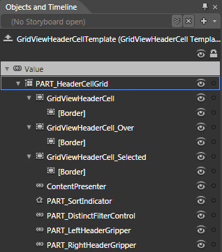
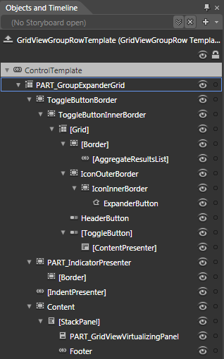
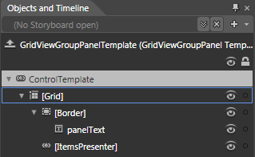
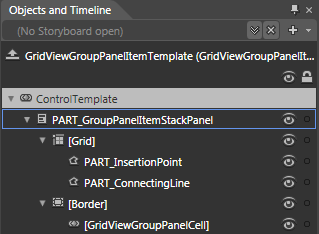
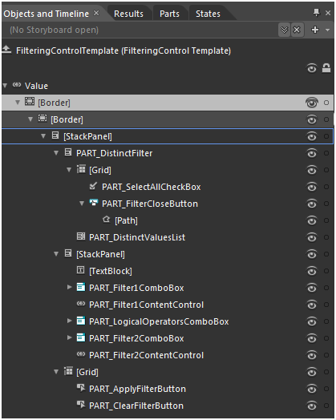

# Templates Structure

>tipTo learn how to style Telerik UI for SilverlightWPF read the common topics about
        [Setting a Theme (Using Implicit Styles)]()

Using [Implicit Styles]() gives you the ability to easily extract and edit the default ControlTemplates of the controls. You can follow [this article]() on two different approaches on how to extract the ControlTemplates.
      

Like most SilverlightWPF controls, the __RadGridView__ also allows you to template it in order to change the control from the inside. Except for templating the whole control, you can template parts of it or even independent controls related to it. This topic will make you familiar with the:

* [RadGridView Template Structure](2CD6EAA0-C735-4FA2-B921-A0D1A4452C10#-radgridview)

* [GridViewCell Template Structure](2CD6EAA0-C735-4FA2-B921-A0D1A4452C10#gridviewcell)

* [GridViewHeaderCell Template Structure](2CD6EAA0-C735-4FA2-B921-A0D1A4452C10#gridviewheadercell)

* [GridViewFooterCell Template Structure](2CD6EAA0-C735-4FA2-B921-A0D1A4452C10#gridviewfootercell)

* [GridViewRow Template Structure](2CD6EAA0-C735-4FA2-B921-A0D1A4452C10#gridviewrow-)

* [GridViewHeaderRow Template Structure](2CD6EAA0-C735-4FA2-B921-A0D1A4452C10#gridviewheaderrow)

* [GridViewGroupRow/GroupHeaderRow Template Structure](2CD6EAA0-C735-4FA2-B921-A0D1A4452C10#gridviewgrouprow/groupheaderrow)

* [GridViewGroupPanel Template Structure](2CD6EAA0-C735-4FA2-B921-A0D1A4452C10#gridviewgrouppanel)

* [GridViewGroupPanelItem Template Structure](2CD6EAA0-C735-4FA2-B921-A0D1A4452C10#gridviewgrouppanelitem)

* [GridViewGroupFooterCell Template Structure](2CD6EAA0-C735-4FA2-B921-A0D1A4452C10#gridviewgroupfootercell)

* [DetailsPresenter Template Structure](2CD6EAA0-C735-4FA2-B921-A0D1A4452C10#detailspresenter)

* [Filtering Control Template Structure](2CD6EAA0-C735-4FA2-B921-A0D1A4452C10#filteringcontrol)

* [New Row Template Structure](2CD6EAA0-C735-4FA2-B921-A0D1A4452C10#gridviewnewrow)

##  RadGridView

* __PART_MasterGridContainer__ - hosts the elements of the template, represents the border of the __RadGridView__ and is of type __Border__.

* 

* __HierarchyBackground__ - provides columns and rows for the template elements, represents the background of the __RadGridView__ and is of type __Grid__.

* 

* __PART_GroupPanel__ - represents the __Group Panel__ and is of type __GridViewGroupPanel__.

* __PART_ItemsScrollViewer__ - represents the control that handles the different types of rows (e.g. __Header Row, Footer Row, New Row__) and is of type __GridViewScrollViewer__.

* 

* __PART_GridViewVirtualizingPanel__ - displays the data items of the __RadGridView__ and is of type __GridViewVirtualizingPanel__.

* __PART_ScrollPositionIndicator__ - represents the scrolling indicator, that appears when using deferred scrolling in the __RadGridView__, and is of type __ScrollPositionIndicator__.

* __PART_FrozenColumnsPreview__ - represents the drag preview of the dragable element, that is used for freezing the __RadGridView__ columns.

* __PART_GridViewLoadingIndicator__ - represents the indicator that appears, when the __RadGridView__ is loading its data.

## GridViewCell

* __PART_CellBorder__ - hosts the elements of the template, represents the border and the background of the __GridViewCell__ and is of type __Border__.

* 

* __PART_ContentPresenter__ - displays the content of the cell and is of type __ContentPresenter__.

## GridViewHeaderCell

* __PART_HeaderCellGrid__ - hosts the elements of the template and is of type __Grid__.

* 

* __GridViewHeaderCell__ - represents the outer border of the header and is of type __Border__.

* 

* __[Border]__ - represents the inner border and the background of the header and is of type __Border__.

* __GridViewHeaderCell_Over__ - represents the outer border of the header, when the mouse is over it, and is of type __Border__.

* 

* __[Border]__ - represents the inner border and the background of the header, when the mouse is over it, and is of type __Border__.

* __GridViewHeaderCell_Selected__ - represents the outer border of the header, when it is selected, and is of type __Border__.

* 

* __[Border]__ - represents the inner border and the background of the header, when it is selected, and is of type __Border__.

* __ContentPresenter__ - displays the content of the header and is of type __ContentPresenter__.

* __PART_SortIndicator__ - represents the sort indicator icon of the header and is of type __Path__.

* __PART_DistinctFilterControl__ - represents the filtering control inside the header and is of type __FilteringDropDown__.

* __PART_LeftHeaderGripper__ - implements the resizing of the header and is of type __Thumb__.

* __PART_RightHeaderGripper__ - implements the resizing of the header and is of type __Thumb__.

## GridViewFooterCell

* __PART_FooterCellBorder__ - hosts the template elements, represents the border and the background of the footer and is of type __Border__.

* 

* __[ContentPresenter]__ - displays the content of the footer and is of type __ContentTemplate__.

## GridViewRow 

* __grid__ - hosts the elements of the __GridViewRow__ template and is of type __SelectiveScorllingGrid__.

* 

* __SelectionBackground__ - represents the default background of the row and is of type __Border__.

* __Background_Over__ - represents the outer border of the row, when the mouse is over it and is of type __Border__.

* 

* __[Border]__ - represents the inner border and the background of the row, when the mouse is over it and is of type __Border__.

* __Background_Selected__ - represents the outer border of the row, when it is selected and is of type __Border__.

* 

* __[Border]__ - represents the inner border and the background of the row, when it is selected and is of type __Border__.

* __Background_Invalid__ - represents the outer border of the row, when it is invalid and is of type __Border__.

* 

* __[Border]__ - represents the inner border and the background of the row, when it is invalid and is of type __Border__.

* __[GridViewToggleButton]__ - represents the button that expands the row and is of type __GridViewToggleButton__.

* __[Border]__

* __PART_DataCellsPresenter__ - displays the cells of the row and is of type __DataCellsPresenter__.

* __PART_RowBorder__ - represents the border at the bottom of the row and is of type __Border__.

* __[Border]__ - represents the border and the background of the hierarchy container and is of type __Border__.

* 

* __PART_HierarchyChildPresenter__ - displays the hierarchy children and is of type __ContentPresenter__.

* __PART_DetailsPresenter__ - represents the row's details and is of type __DetailsPresenter__.

* __PART_IndentPresenter__ - represents the indent of the row and is of type __IndentPresenter__.

* __PART_IndicatorPresenter__ - hosts the elements of the row's indicator and represents its outer border. It is of type __Border__.

* 

* __[Border]__ - represents the inner border and the background of the row's indicator and is of type __Border__.

* 

* __[Grid]__ - hosts the different indicators and is of type __Grid__.

* 

* __ErrorIndicator__ - hosts the __Paths__ for the indicator, when the row is invalid. It is of type __Grid__.

* 

* __[Path]__

* __[Path]__

* __[Path]__

* __NavigationIndicator__ - hosts the __Paths__ for the indicator, when the row is selected. It is of type __Grid__.

* 

* __[Path]__

* __[Path]__

* __[Path]__

* __EditIndicator__ - hosts the __Paths__ for the indicator, when the row is being edited. It is of type __Grid__.

* 

* __[Path]__

* __[Path]__

* __[Path]__

* __[Path]__

## GridViewHeaderRow

* __[SelectiveScrollingGrid]__ - hosts the elements of the __GridViewHeaderRow__ template and is of type __SelectiveScrollingGrid__.

* 

* __PART_GridViewHeaderRowBorder__ - represents the outer border of the __GridViewHeaderRow__ and is of type __Border__.

* 

* __[Border]__ - represents the inner border and the background of the __GridViewHeaderRow__ and is of type __Border__.

* __PART_DataCellsPresenter__ - displays the __GridViewHeaderCells__ and is of type __DataCellsPresenter__.

* __PART_IndicatorPresenter__ - represents the outer border of the __GridViewHeaderRow's__ indicator and is of type __Border__.

* 

* __[Border]__ - represents the inner border and the background of the __GridViewHeaderRow's__ indicator and is of type __Border__.

* __PART_IndentPresenter__ - displays the indent cells of the __GridViewHeaderRow__ and is of type __IndentPresenter__.

* __PART_HierarchyIndentPresenter__ - represents the outer border of the __GridViewHeaderRow's__ hierarchy indent cell and is of type __Border__.

* 

* __[Border]__ - represents the inner border and the background of the __GridViewHeaderRow's__ hierarchy indent cell and is of type __Border__.

## GridViewGroupRow/GroupHeaderRow

* __PART_GroupExpanderGrid__ - hosts the elements of the template and is of type __Grid__.

* 

* __ToggleButtonBorder__ - hosts the header element of the group, represents the background and the outer border of the group header and is of type __Border__.

* 

* __ToggleInnerButtonBorder__ - represents the inner border of the group header and is of type __Border__.

* 

* __[Grid]__ - provides a few columns for the visual elements to be arranged in and is of type __Grid__.

* 

* __[Border]__ - hosts the list with the results of the aggregate functions and is of type __Border__.

* 

* __[AggregateResultsList]__ - displays the results of the aggregate functions and is of type __AggregateResultsList__.

* __IconOuterBorder__ - represents the background and the outer border for the expander icon and is of type __Border__.

* 

* __IconInnerBorder__ - represents the inner border for the expander icon and is of type __Border__.

* 

* __ExpanderButton__ - a __Path__, that represents the expander icon.

* __HeaderButton__ - represents the clickable area for the whole group header and is of type __ToggleButton__.

* __[ToggleButton]__ - represents the clickable area for the group header's content and is of type __ToggleButton__.

* 

* __[ContentPresenter]__ - represents the content of the group header and is of type __ContentPresenter__.

* __PART_IndicatorPresenter__ - represents the outer border of the group row indicator and is of type __Border__.

* 

* [Border] - represents the inner border and the background of the group row indicator and is of type __Border__.

* __[IndentPresenter]__ - hosts the indent cells for the group row and is of type __IndentPresenter__.

* __Content__ - hosts the expandable content of the group and is of type __Border__.

* 

* __[StackPanel]__ - arranges the elements of the group's expandable content.

* 

* __PART_GridViewVirtualizingPanel__ - displays the items inside the group and is of type __GridViewVirtualizingPanel__.

* __Footer__ - represents the footer row of the group and is of type __GridViewGroupFooterRow__.

## GridViewGroupPanel

* __[Grid]__ - hosts the elements of the __GridViewGroupPanel__ and is of type __Grid__.

* 

* __[Border]__ - represents the borders and the background of the __GridViewGroupPanel__ and is of type __Border__.

* 

* __panelText__ - represents the default text displayed in the __GridViewGroupPanel__ and is of type TextBlock

* __[ItemsPresenter]__ - hosts the __GridViewGroupPanelItems__ and is of type __ItemsPresenter__.

## GridViewGroupPanelItem

* __PART_GroupPanelItemStackPanel__ - hosts the elements of the __GridViewGroupPanelItem's__ template and is of type __StackPanel__.

* 

* __[Grid]__ - hosts the indicators of the __GridViewGroupPanelItem__ and is of type __Grid__.

* 

* __PART_InsertionPoint__ - a __Path__, that represents the indicator displayed when rearranging __GridViewGroupPanelItems__ in the __GridViewGroupPanel__.

* __PART_ConnectingLine__ - a __Path__, that represents the line that connects this __GridViewGroupPanelItem__ with the previous one (if any).

* __[Border]__ - hosts the controls, that represent the item and is of type __Border__.

* 

* __GridViewGrouPanelCell__ - represents the visual for the __GridViewGroupPanelItem__ and is of type __GridViewGroupPanelCell__.

## GridViewGroupFooterCell

* __PART_FooterCellBorder__ - represents the background and the border of the __GridViewGroupFooterCell__ and is of type __Border__.

* 

* __[ContentPresenter]__ - hosts the content of the __GridViewGroupFooterCell__ and is of type __ContetntPresenter__.

## DetailsPresenter

* __DetailsBorder__ - hosts the elements of the template, represents the outer border of the __DetailsPresenter__ and is of type __Border__.

* 

* __[Border]__ - represents the inner border and the background of the __DetailsPresenter__ and is of type __Border__.

* 

* __PART_ContentPresenter__ - displays the content of the __DetailsPresenter__ and is of type __ContentPresenter__.

## FilteringControl

* __[Border]__ - represents the outer Border of the FilteringControl and it is of Type Border.

* 

* __[Border]__ - represents the inner Border of the FIlteringControl and it is of type Border.

* 

* __StackPanel__

* 

* __PART_DisctinctFilter__ - the stack panel that holds the SelectAll checkbox, the distinct values listbox and the close button

* 

* __Grid__

* 

* __PART_SelectAllCheckBox__ - the select all checkbox

* __PART_FilterCloseButton__ - represents the CloseButton of the FilteringControl.

* __PART_DistinctValuesList__ - the listbox that hosts the DisctinctValues for the FilteringControl.

* __StackPanel__ - contains the field filters

* 

* __TextBlock__

* __PART_Filter1ComboBox__ - the combobox containing the available operators

* __PART_Filter1ContentControl__ - the control where you type your filter value

* __PART_LogicalOperatorsComboBox__ - the logical operators combobox (contains AND & OR operators)

* __PART_Filter2ComboBox__ - the combobox containing the available operators

* __PART_Filter2ContentControl__ - the control where you type your filter value

* __Grid__

* 

* __PART_ApplyFilterButton__ - represents the button that you can use to apply Filtering.

* __PART_ClearFilterButton__ - represents the button that you can use to clear Filtering.

## GridViewNewRow

____

* __Grid -__ hosts the elements of the __GridViewNewRow__ template and is of type __SelectiveScorllingGrid__

* __SelectionBackground__ - represents the default background of the row and is of type __Border__. 

* __Background_Invalid__ - represents the outer border of the row, when it is invalid and is of type __Border__.

* __[Border]__ - represents the inner border and the background of the row, when it is invalid and is of type __Border__.

* __PART_AlwaysVisibleNewRow__- represents the default linear background of the GridViewNewRow which is always visible when __ShowInsertRow__ is set to true and it is of type __Border__.

* __TextBlock__- hosts the “Click here to add new item” text  and it is of type __TextBlock__.

* __PART_DataCellsPresenter__ - displays the cells of the row and is of type __DataCellsPresenter__.

* __PART_DetailsPresenter__ - represents the row's details and is of type __DetailsPresenter__.

* __PART_IndentPresenter__ - represents the indent of the row and is of type __IndentPresenter__.

* __PART_RowBorder__ - represents the border at the bottom of the row and is of type __Border__.

* __PART_IndicatorPresenter__ - hosts the elements of the row's indicator and represents its outer border. It is of type __Border__.

* __[Border]__ - represents the inner border and the background of the row's indicator and is of type __Border__.

* __[Grid]__ - hosts the different indicators and is of type __Grid__.

* __ErrorIndicator__ - hosts the Paths for the indicator, when the row is invalid. It is of type __Grid__.

* [Path]

* [Path]

* [Path]

* __NewRowIndicator__ - hosts the Paths for the default indicator. It is of type __Grid__.

* [Path]

* [Path]

* [Path]

# See Also

 * [
        Styles and Templates Overview
      ]()

 * [Setting a Theme (Using  Implicit Styles)]()

 * [Editing Control Templates]()
