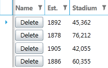

# Containers' Size is Increased

With __Q1 2013__ we have introduced __dynamic FontStyle, FontSize and Brushes for Windows8 and Windows8Touch Themes__.

For example with the __Windows8Theme and Windows8TouchTheme__ applied, the size of the GridView's containers (for example GridViewCell, GridViewHeaderCell, GridViewFooterCell etc.) will be adjusted based on the size of the content to be shown in them. If you set a CellTemplate for the column, having larger content occupying the entire cell, then the container showing it will be larger as well. 
    
You can compare:

The appearance __before__:

The appearance __now__:

In order to have a different (smaller) Size for the containers, you can define a Style targeting the element you are interested in. Then __set its Height property with the desired value__. In the example with the CellTemplate, you could define a __simple Style targeting the GridViewRow element__ and set a fixed Height.

You can check this [help article](859374BB-DAAA-4C15-B207-63086C7ECF7B) and this
[blog post](http://blogs.telerik.com/blogs/13-02-26/dynamic-fontsizes-with-windows8-and-windows8touch-themes) on explaining details about the new dynamic FontSizes.

More information on GridView's Styling could be found [here](). If you use the Implicit Themes, then this [article](f7b879d9-62ca-42c3-a919-983c7cbc79a2) might be helpful as well.

# See Also

 * [Styling a Row]()
 * [Styling the Header Row]()
 * [Styling the Group Row]()
