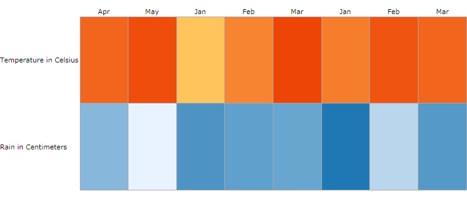

# Populating With Data

This article demonstrates how the RadHeatmap control can be populated with data.

## Categorical definition

#### __XAML__
{{region radheatmap-populating-with-data_2}}
	<telerik:RadHeatMap ShowToolTips="True" Height="300">
	    <telerik:RadHeatMap.Definition>
	        <telerik:CategoricalDefinition ItemsSource="{Binding}" 
	                                    RowGroupMemberPath="Year" 
	                                    ColumnGroupMemberPath="Month" 
	                                    ValuePath="Temperature" />
	    </telerik:RadHeatMap.Definition>
	</telerik:RadHeatMap>
{{endregion}}

The result is shown below:

## Vertical definition

We'll set the months as __HeaderPath__ of our HeatMap. Thus the months supplied by the Month property of our underlying source will be visualized as column headers. For each row we'll display the Temperature and Rain values of the corresponding month:		

#### __XAML__
{{region radheatmap-populating-with-data_3}}
	<telerik:RadHeatMap ShowToolTips="True" Height="300" CellBorderColor="DarkGray" CellBorderThickness="1"> 
	    <telerik:RadHeatMap.Definition>
	        <telerik:VerticalDefinition ItemsSource="{Binding}" HeaderPath="Month">
	            <telerik:VerticalDefinition.MemberMappings>
	                <telerik:MemberMapping Header="Temperature in Celsius" ValuePath="Temperature"/>
	                <telerik:MemberMapping Header="Rain in Centimeters" ValuePath="Rain"
	                                        Colorizer="{StaticResource myColorizer}"/>
	            </telerik:VerticalDefinition.MemberMappings>
	        </telerik:VerticalDefinition>
	    </telerik:RadHeatMap.Definition>
	</telerik:RadHeatMap>							
{{endregion}}

>You can use the same code to declare a HorizontalDefinition. The only difference will be the definition's type.

The result is shown below:

>tip You can find a runnable solution demonstrating population with data in our SDK Examples repository located on [GitHub](https://github.com/telerik/xaml-sdk), after navigating to __HeatMap/PopulatingWithData__
