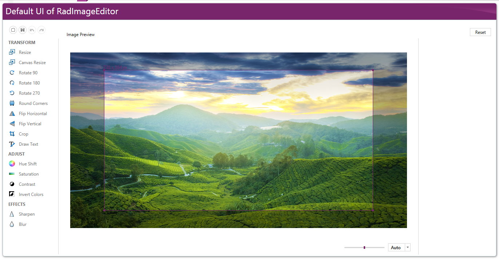

# Cropping

__CropTool__ is one of the tool that come out-of-the-box with __RadImageEditor__ and gives the opportunity to crop a given area from an image. The tool provides some customization options that are explained in detail in this topic.
      

* [InitialSize](#initialsize)

* [FixedSize](#fixedsize)

* [AspectRatio](#aspectratio)

When the tool is invoked a rectangle is shown over the image. It is called crop adorner and visualizes the part of the images that is going to be cropped when the tool is invoked.
      

Crop Adorner

The tool is located in the Telerik.Windows.Media.Imaging.Tools namespace and can be defined in XAML as follows.
      

#### __[XAML] Create Crop Tool__

{{region radimageeditor-howto-use-crop_0}}
	        <tools:CropTool />
	{{endregion}}

## InitialSize

The __InitialSize__ property is of type Size and determines the initial size of the crop adorner. Unless explicitly set, the rectangle has width and height equal to 80% of the width and height of the image that is shown in the control.
        

__Example 1__ and __Example 2__ demonstrate how to set the initial size of the tool in XAML and in code, respectively.
        

#### __[XAML] Example 1: Set Initial Size__

{{region radimageeditor-howto-use-crop_1}}
	        <tools:CropTool InitialSize="200,100" />
	{{endregion}}

#### __[C#] Example 2: Set Initial Size__

{{region radimageeditor-howto-use-crop_0}}
	            CropTool cropTool = new CropTool();
	            cropTool.InitialSize = new Size(150, 150);
	{{endregion}}

#### __[VB.NET] Example 2: Set Initial Size__

{{region radimageeditor-howto-use-crop_0}}
		Dim cropTool As New CropTool()
		cropTool.InitialSize = New Size(150, 150)
		#End Region
	End Sub
	Private Sub CreateToolFixedSize()
		#Region "radimageeditor-howto-use-crop_1"
		Dim tool As New CropTool()
		tool.FixedSize = New Size(200, 100)
		#End Region
	End Sub
	Private Sub CreateToolAspectRatio()
		#Region "radimageeditor-howto-use-crop_2"
		Dim tool As New CropTool()
		tool.AspectRatio = 0.5
		#End Region
	End Sub
	End Class

## FixedSize

The __FixedSize__ property is of type Size and specifies the only size that is allowed for the Crop tool. This means that the crop adorner is shown with those dimensions and resizing it is not possible.
        

__Example 3__ and __Example 4__ show how to set fixed size in XAML and code.
        

#### __[XAML] Example 2: Set Fixed Size__

{{region radimageeditor-howto-use-crop_2}}
	        <tools:CropTool FixedSize="200,100" />
	{{endregion}}

#### __[C#] Example 3: Set Fixed Size__

{{region radimageeditor-howto-use-crop_1}}
	            CropTool tool = new CropTool();
	            tool.FixedSize = new Size(200, 100);
	{{endregion}}

#### __[VB.NET] Example 3: Set Fixed Size__

{{region radimageeditor-howto-use-crop_1}}
		Dim tool As New CropTool()
		tool.FixedSize = New Size(200, 100)
		#End Region
	End Sub
	Private Sub CreateToolAspectRatio()
		#Region "radimageeditor-howto-use-crop_2"
		Dim tool As New CropTool()
		tool.AspectRatio = 0.5
		#End Region
	End Sub
	End Class

>If the image shown in RadImageEditor has smaller dimensions than the ones set for the tool's initial or fixed size, the crop adorner gets limited to the boundaries of the image. For example, if the image's size is (200,300) and you set fixed size to the crop tool (300,50), the crop rectangle will be shown with size (200,50).
          

## AspectRatio

The __AspectRatio__ property of the crop tool determines whether the width and height of the crop adorner are in linear dependence. The value can be a positive decimal number and specifying it "locks" the ratio between the width and height of the crop rectangle.
        

The calculated ratio value corresponds to the width of the adorner divided by its height. This means that if you want a crop rectangle that has a width 2 times smaller than its height, you should set value 0.5 to the AspectRatio. __Example 5__ and __Example 6__ show how this can be done in XAML and code behind.
        

#### __[XAML] Example 3: Set Fixed Aspect Ratio__

{{region radimageeditor-howto-use-crop_3}}
	        <tools:CropTool AspectRatio="0.5"/>
	{{endregion}}

#### __[C#] Example 4: Set Fixed Aspect Ratio__

{{region radimageeditor-howto-use-crop_2}}
	            CropTool tool = new CropTool();
	            tool.AspectRatio = 0.5;
	{{endregion}}

#### __[VB.NET] Example 4: Set Fixed Aspect Ratio__

{{region radimageeditor-howto-use-crop_2}}
		Dim tool As New CropTool()
		tool.AspectRatio = 0.5
		#End Region
	End Sub
	End Class

>tipYou can crop an image with fixed ration between the width and height without setting the FixedRation property. Just press and hold the __Shift__ key while dragging the crop adorner.
          

# See Also

 * [Commands and Tools]()
