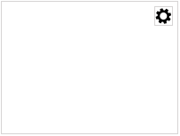
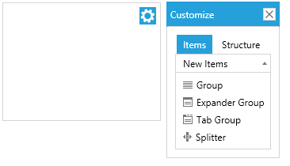
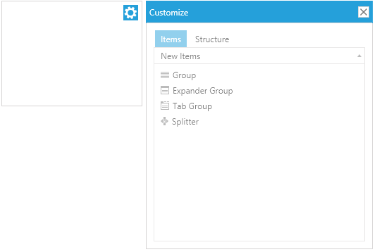

# LayoutControlToolBox

__LayoutControlToolBox__ can be used to embed the toolbox into the layout control. This article demonstrates how to set it up and associate it with RadLayoutControl.

* [Setting up the toolbox](#setting-up-the-toolbox)
* [Manually control the toolbox view visibility](#manually-control-the-toolbox-view-visibility)
* [Customize the toolbox view](#customize-the-toolbox-view)
* [Style the toolbox view host window](#style-the-toolbox-view-host-window)
* [Position the toolbox button](#position-the-toolbox-button)

## Setting up the toolbox 

This section shows a sample toolbox definition.

#### __[XAML] Example 1: Setting up the toolbox in XAML__  
{{region radlayoutcontrol-features-toolbox-layoutcontroltoolbox-0}}
	<telerik:RadLayoutControl x:Name="layout">
		<telerik:RadLayoutControl.AdditionalCanvasItems>
			<telerik:LayoutControlToolBox LayoutControl="{Binding ElementName=layout}" />
		</telerik:RadLayoutControl.AdditionalCanvasItems>
	</telerik:RadLayoutControl>
{{endregion}}

#### __[C#] Example 2: Setting up the toolbox in code__  
{{region radlayoutcontrol-features-toolbox-layoutcontroltoolbox-1}}
	RadLayoutControl layoutControl = new RadLayoutControl();
	var toolbox = new LayoutControlToolBox();
	toolbox.LayoutControl = layoutControl;
	layoutControl.AdditionalCanvasItems.Add(toolbox);
{{endregion}}

#### __[VB.NET] Example 2: Setting up the toolbox in code__  	
{{region radlayoutcontrol-features-toolbox-layoutcontroltoolbox-2}}
	Dim layoutControl As New RadLayoutControl()
	Dim toolbox = New LayoutControlToolBox()
	toolbox.LayoutControl = layoutControl
	layoutControl.AdditionalCanvasItems.Add(toolbox)
{{endregion}}

The toolbox can be associated with RadLayoutControl through its __LayoutControl__ property (see __Example 1__).

Initially, the __LayoutControlToolBox__ displays a single toggle button (see __Figure 1__).
	
#### __Figure 1: Closed toolbox__  

>important The toggle button will be displayed only if the layout control is in [edit mode]().

When the button is clicked the toolbox view will be opened in a popup.

#### __Figure 2: Toolbox view__  

## Manually control the toolbox view visibility

You can manually control the state of the toolbox through the __IsOpen__ property of __LayoutControlToolBox__.

#### __[XAML] Example 3: Setting the IsOpen property in XAML__  
{{region radlayoutcontrol-features-toolbox-layoutcontroltoolbox-3}}
	<telerik:LayoutControlToolBox IsOpen="True" />
{{endregion}}

#### __[C#] Example 4: Setting the IsOpen property in code__  
{{region radlayoutcontrol-features-toolbox-layoutcontroltoolbox-4}}
	layoutControlToolBox.IsOpen = true;
{{endregion}}
	
#### __[VB.NET] Example 4: Setting the IsOpen property in code__  
{{region radlayoutcontrol-features-toolbox-layoutcontroltoolbox-5}}
	layoutControlToolBox.IsOpen = True;
{{endregion}}

## Customize the toolbox view
	
The popup of the LayoutControlToolBox component contains a __LayoutControlToolBoxView__ element. You can use the __ToolBoxView__ property to get this element and modify it. Or to define a new toolbox view and assign it to the LayoutControlToolBox.

#### __[XAML] Example 5: Replacing the default toolbox view__  
{{region radlayoutcontrol-features-toolbox-layoutcontroltoolbox-6}}
	<telerik:RadLayoutControl x:Name="layout">
		<telerik:RadLayoutControl.AdditionalCanvasItems>
			<telerik:LayoutControlToolBox LayoutControl="{Binding ElementName=layout}">
				<telerik:LayoutControlToolBox.ToolBoxView>
					<telerik:LayoutControlToolBoxView Opacity="0.5" Width="300" Height="300" />
				</telerik:LayoutControlToolBox.ToolBoxView>
			</telerik:LayoutControlToolBox>
		</telerik:RadLayoutControl.AdditionalCanvasItems>
	</telerik:RadLayoutControl>
{{endregion}}
	
#### __Figure 3: Modified toolbox view__

	
## Style the toolbox view host window

The toolbox view is displayed in a __RadWindow__ element which can be customized through the __WindowStyle__ property of __LayoutControlToolBox__.

#### __[XAML] Example 6: Setting custom window style__
{{region radlayoutcontrol-features-toolbox-layoutcontroltoolbox-7}}
	<telerik:RadLayoutControl x:Name="layout">
		<telerik:RadLayoutControl.AdditionalCanvasItems>
			<telerik:LayoutControlToolBox LayoutControl="{Binding ElementName=layout}">	
				<telerik:LayoutControlToolBox.WindowStyle>
					
				</telerik:LayoutControlToolBox.WindowStyle>
			</telerik:LayoutControlToolBox>
		</telerik:RadLayoutControl.AdditionalCanvasItems>
	</telerik:RadLayoutControl>
{{endregion}}
	
> The __BasedOn__ setting is applicable only in a scenario with [implicit styles](). This attribute is set so that the custom style inherits the default toolbox window style. The __LayoutControlToolBoxWindowStyle__ is located in the __Telerik.Windows.Controls.Navigation.xaml__ ResourceDictionary.
	
#### __Figure 4: Custom window style__

## Position the toolbox button

The button that opens the toolbox can be re-positioned in the additional items canvas of RadLayoutControl. This can be done via the __Canvas.Left__, __Canvas.Top__, __Canvas.Right__ and __Canvas.Bottom__ properties.

#### __[XAML] Example 7: Positioning the toggle button at the bottom-left side of the layout control__   
{{region radlayoutcontrol-features-toolbox-layoutcontroltoolbox-8}}
	<telerik:RadLayoutControl>
		<telerik:RadLayoutControl.AdditionalCanvasItems>
			<telerik:LayoutControlToolBox Canvas.Left="0" Canvas.Bottom="0" 
										  LayoutControl="{Binding ElementName=layout}" />
		</telerik:RadLayoutControl.AdditionalCanvasItems>
	</telerik:RadLayoutControl>
{{endregion}}

#### __Figure 5: Bottom-right positioned button__

## See Also  
* [Getting Started]()
* [LayoutControlToolBoxView]()
* [Layout Groups Overview]()
* [Layout Panel]()
