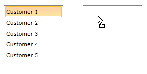
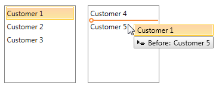
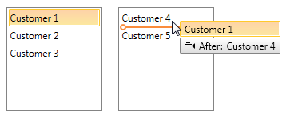
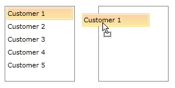
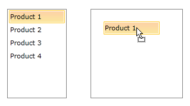
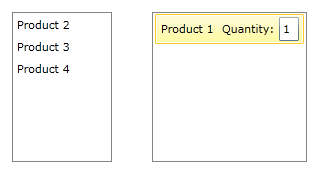

# Overview

Telerik __RadListBox__ control enhances further your application's capabilities through its rich drag-and-drop functionality. You can easily perform various drag-and-drop operations.      

This help topic will explain in details the drag-drop functionality in __RadListBox__ control. We will go through the following topics:      

* [Attaching the behavior](#attaching-the-behavior)

* [Features](#features)

* [Converting data](#converting-data)

We will go through each of them separately.

>The drag and drop functionality between ListBox controls with statically declared items is not supported but the reorder functionality is supported.        

## Attaching the behavior

The drag-drop functionality of __RadListBox__ can be enabled by setting its DragDropBehavior property. You should use the ListBoxDragDropBehavior class placed in Telerik.Windows.Controls.dll which is prepared to handle the drag and drop of the ListBox items.        

* Add a reference to Telerik.Windows.Controls.dll and add the following XML namespaces to your XAML:

#### __[XAML]  Reference Telerik.Windows.Controls.dll__

{{region xaml-radlistbox-features-dragdrop_0}}
	xmlns:telerik="http://schemas.telerik.com/2008/xaml/presentation"
{{endregion}}

* Create a RadListBoxItem Style that will enable the drag of the RadListBoxItem controls:

#### __[XAML]  RadListBoxItem Style__

{{region xaml-radlistbox-features-dragdrop_1}}
	
{{endregion}}

>If you're using [Implicit Styles]() note that the Style that targets RadListBoxItem should be based on the default __RadListBoxItemStyle__.

* Attach the ListBoxDragDropBehavior behavior:

#### __[XAML]  Attaching the ListBoxDragDropBehavior__

{{region xaml-radlistbox-features-dragdrop_2}}
	<telerik:RadListBox ItemContainerStyle="{StaticResource DraggableListBoxItem}">
	    <telerik:RadListBox.DragDropBehavior>
	        <telerik:ListBoxDragDropBehavior />
	    </telerik:RadListBox.DragDropBehavior>
	</telerik:RadListBox>
{{endregion}}

## Features

The DragVisualProvider enriches the drag-drop functionality of RadListBox control by providing a different visual DragCue to the dragged item.

In order to enable the visual DragCue the provider needs to be attached to the ListBox control:        

#### __[XAML]  Attaching the DragVisualProvider__

{{region xaml-radlistbox-features-dragdrop_3}}
	<telerik:RadListBox.DragVisualProvider>
	    <telerik:ScreenshotDragVisualProvider />
	</telerik:RadListBox.DragVisualProvider>
{{endregion}}

The DragVisualProvider can be set to:

* __EmptyDragVisualProvider__ - this is default DragVisualProvider. It doesn't provide any visual representation of the dragged item.

* __ListBoxDragVisualProvider__ - with the Q1 2014 release of UI for WPF Silverlight __ListBoxDragVisualProvider__ has been improved in order to provide additional information. Now its DragCue also indicates the drop position of the dragged item - whether it would be *before* or *after* the item below.

When the cursor is pointing the upper part of an item below, the DragCue indicates that the dragged item will be dropped *before* that item:

And when pointing the bottom part of an item, the DragCue indicates that the dragged item will be dropped *after* the same item:

>tipThe __ListBoxDragVisualProvider__ DragCue can be modified in order to have the old appearance. You can find a runnable project which demonstrates the exact approach to achieve that in our online SDK repository [here](https://github.com/telerik/xaml-sdk), the example is listed as __ListBox / ModifyListBoxDragVisualStyle__.              

* __ScreenshotDragVisualProvider__ - provides the exact visual representation of the dragged item.

* __DefaultDragVisualProvider__ - provides the string representation of the dragged item.

* __Custom DragVisualProvider__ - more detailed information on how to create a custom DragVisualProvider can be found [here]().            

## Converting data

In scenarios with drag-drop between controls containing different item types the dragged data should be converted using a DataConverter. The following example shows how to create a custom DataConverter when converting data between two RadListBox controls, one of them containing items of type Product and the other - of type Order.

* Create a new class, deriving from DataConverter and override the GetConvertToFormats() and ConvertTo(). The following method can convert data from Product to Order:

#### __[C#]  Overriding the GetConvertToFormats and ConvertTo__

{{region cs-radlistbox-features-dragdrop_0}}
	public class ProductToOrderConverter : DataConverter
	{
	    public override string[] GetConvertToFormats()
	    {
	        return new string[] { typeof(Product).FullName, typeof(Order).FullName };
	    }
	    public override object ConvertTo(object data, string format)
	    {
	        var payload = (IEnumerable)DataObjectHelper.GetData(data, typeof(Product), false);
	        if (payload != null)
	        {
	            return payload.OfType<Product>().Select(a => new Order
	            {
	                Name = a.Name,
	                Quantity = 1
	            });
	        }
	        return null;
	    }
	}
{{endregion}}

The final configuration of the RadListBox control in XAML should look like:

#### __[XAML]  Final configuration of RadListBox__

{{region xaml-radlistbox-features-dragdrop_6}}
	<telerik:RadListBox ItemsSource="{Binding Products}" ItemContainerStyle="{StaticResource DraggableListBoxItem}">
	    <telerik:RadListBox.DragVisualProvider>
	        <telerik:ScreenshotDragVisualProvider />
	    </telerik:RadListBox.DragVisualProvider>
	    <telerik:RadListBox.DragDropBehavior>
	        <telerik:ListBoxDragDropBehavior />
	    </telerik:RadListBox.DragDropBehavior>
	    <telerik:RadListBox.DataConverter>
	        <local:ProductToOrderConverter />
	    </telerik:RadListBox.DataConverter>
	</telerik:RadListBox>
	<telerik:RadListBox ItemsSource="{Binding Orders}" />
{{endregion}}

The end result:

# See Also

 * [Drag-Drop between RadListBox and RadScheduleView]()
