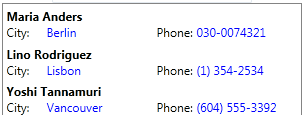
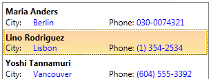

# AutoComplete

__RadListBox__ has full autocomplete support - while the control is focused, you can type certain keys and the listbox will select the relative match for the currently typed text.

The purpose of this tutorial is to show you how to configure the autocomplete feature. The following sections are included:

* [Using TextSearchMode property](#using-textsearchmode-property)

* [Using TypedText property](#using-typedtext-property)

* [Setting TextPath/TextBinding](#setting-textpathtextbinding)

* [Disable autocomplete](#disable-autocomplete)

## Using TextSearchMode property

This enumeration property specifies whether the text search will be StartsWith/Contains and/or case sensitive. It provides the following entries:

* Contains

* ContainsCaseSensitive

* StartsWith

* StartsWithCaseSensitive

## Using TypedText property

The TypedText property of RadListBox contains the currently typed text. It is updated as soon as the user types a new key for autocomplete.    	

## Setting TextPath/TextBinding

In most of the cases you will have a __RadListBox__ [populated with a collection of business objects](). If your data source is more complex and your data objects are not single values but rather more complicated classes that have multiple properties, you can specify which value you want to use for Autocomplete. To accomplish this you need to configure the __TextPath__/__TextBinding__ property.

Let's have the __RadListBox__ bound to "Customers" collection as explained in [Binding to Object]() article:

Setting __TextPath__ /__TextBinding__ property will allow to use "Name" property of the Customer object for AutoComplete:

#### __[XAML]  Setting TextPath__

{{region radlistbox-features-autocomplete_2}}
	<telerik:RadListBox  Width="300" x:Name="radListBox"
			ItemsSource="{Binding Customers, Source={StaticResource CustomerViewModel}}"				
			ItemTemplate="{StaticResource ListBoxCustomTemplate}"
			TextPath="Name" />
{{endregion}}

Typing, for example "L" will select the corresponding item:

>Note that if you have set __DisplayMemberPath__ to a certain property and you want to use the same property for __Autocomplete__, you don't need to set __TextPath__/__TextBinding__.

>tipAutocomplete always starts from the beginning, regardless of the selection.

>tipPressing __Esc__ clears the current text for autocomplete.

## Disable Autocomplete

By default the autocomplete feature of __RadListBox__ is always enabled. In order to disable it, you need to set the __RadListBox__'s __IsTextSearchEnabled__ property to __False__.

#### __[XAML]  Setting IsTextSearchEnabled__

{{region radlistbox-features-autocomplete_0}}
	<telerik:RadListBox x:Name="radListBox" IsTextSearchEnabled="False"/>
{{endregion}}

#### __[C#]  Setting IsTextSearchEnabled__

{{region radlistbox-features-autocomplete_1}}
	radListBox.IsTextSearchEnabled = false;
{{endregion}}