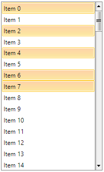

# SelectedItemsSource

With the Q1 2015 release version of UI for WPFSilverlight, the ability to manipulate the __SelectedItems__ collection of __RadListBox__ through the ViewModel is now available. This is now possible with the brand new __ListBoxSelectedItemsBehavior__ behavior and its __SelectedItemsSource__ attached property. The __SelectedItemsSource__ is a collection that synchronizes itself with the __SelectedItems__ collection of __RadListBox__ – thus if an item is added, removed or the collection is replaced/cleared those actions will be executed on the __SelectedItems__ collection as well.

## Using the SelectedItemsSource

The following example will demonstrate how to bind the __SelectedItemsSource__ property of the __ListBoxSelectedItemsBehavior__ to a collection of custom objects. In order the synchronization between the __SelectedItemSource__ and the __SelectedItems__ of __RadListBox__ control to be possible the bound collection should implement both the __IEnumerable__ and the __INotifyCollectionChanged__ interfaces.

>important Synchronization won’t be possible if __SelectedItemsSource__ is bound to a collection that does not implement __INotifyCollectionChanged__.

First, you need to create a new business object named for example Item. Its structure is shown in the code-snippet below:

#### __[C#]  Business object Item__

{{region cs-radlistbox-features-selecteditemssource-0}}
	public class Item
	{
		public Item(string name)
		{
			this.Name = name;
		}
		public string Name { get; set; }
	}
{{endregion}}

#### __[VB]  Business object Item__

{{region vb-radlistbox-features-selecteditemssource-0}}
	Public Class Item
	    Public Sub New(ByVal name As String)
	        Me.Name = name
	    End Sub
	    Public Property Name() As String
	End Class
{{endregion}}

Next thing you have to do is to create a new class named ViewModel that inherits the Telerik __ViewModelBase__ abstract class – inside it initialize two collections with sample data. The first one will be for the __ItemsSource__ of __RadListBox__ while the second one will be the data source for the __SelectedItemsSource__ property:

#### __[C#]  Creating the ViewModel__

{{region cs-radlistbox-features-selecteditemssource-1}}
	private ObservableCollection<Item> items;
	private ObservableCollection<Item> selectedItemsSource;
	public ViewModel()
	{
		this.Items = this.GetItems(100);
		this.SelectedItemsSource = new ObservableCollection<Item>() { this.Items[0], this.Items[2], this.Items[4], this.Items[6], this.Items[7] }; 
	}
	public ObservableCollection<Item> SelectedItemsSource
	{
		get
		{
			return this.selectedItemsSource;
		}
		set
		{
			if (this.selectedItemsSource != value)
			{
				this.selectedItemsSource = value;
				this.OnPropertyChanged(() => this.SelectedItemsSource);
			}
		}
	}
	public ObservableCollection<Item> Items
	{
		get
		{
			return this.items;
		}
		set
		{
			if (this.items != value)
			{
				this.items = value;
				this.OnPropertyChanged(() => this.Items);
			}
		}
	}
	private ObservableCollection<Item> GetItems(int size)
	{
		var result = new ObservableCollection<Item>();
		for (int i = 0; i < size; i++)
		{
			result.Add(new Item(string.Format("Item {0}", i)));
		}
		return result;
	}
{{endregion}}

#### __[VB]  Creating the ViewModel__

{{region vb-radlistbox-features-selecteditemssource-1}}
	Private items_Renamed As ObservableCollection(Of Item)
	Private selectedItemsSource_Renamed As ObservableCollection(Of Item)
	Public Sub New()
	    Me.Items = Me.GetItems(100)
	    Me.SelectedItemsSource = New ObservableCollection(Of Item)() From {Me.Items(0), Me.Items(2), Me.Items(4), Me.Items(6), Me.Items(7)}
	End Sub
	Public Property SelectedItemsSource() As ObservableCollection(Of Item)
	    Get
	        Return Me.selectedItemsSource_Renamed
	    End Get
	    Set(ByVal value As ObservableCollection(Of Item))
	        If Me.selectedItemsSource_Renamed IsNot value Then
	            Me.selectedItemsSource_Renamed = value
	            Me.OnPropertyChanged(Function() Me.SelectedItemsSource)
	        End If
	    End Set
	End Property
	Public Property Items() As ObservableCollection(Of Item)
	    Get
	        Return Me.items_Renamed
	    End Get
	    Set(ByVal value As ObservableCollection(Of Item))
	        If Me.items_Renamed IsNot value Then
	            Me.items_Renamed = value
	            Me.OnPropertyChanged(Function() Me.Items)
	        End If
	    End Set
	End Property
	Private Function GetItems(ByVal size As Integer) As ObservableCollection(Of Item)
	    Dim result = New ObservableCollection(Of Item)()
	    For i As Integer = 0 To size - 1
	        result.Add(New Item(String.Format("Item {0}", i)))
	    Next i
	    Return result
	End Function
{{endregion}}

>important The __SelectedItemsSource__ and the __ItemsSource__ should be bound to collections of the same type of items.

Next you should declare the ViewModel as DataContext in your XAML:

#### __[XAML]  Set the ViewModel as DataContext__

{{region xaml-radlistbox-features-selecteditemssource-0}}
	>
	<UserControl.DataContext>
	    <local:ViewModel/>
	</UserControl.DataContext>
{{endregion}}

Finally, all you need to do is to set both created collection of items to the __ItemsSource__ and __ListBoxSelectedItemsBehavior. SelectedItemsSource__:

#### __[XAML]  Set the ItemsSource and SelectedItemsSource__

{{region xaml-radlistbox-features-selecteditemssource-1}}
	<telerik:RadListBox x:Name="radListBox" ItemsSource="{Binding Items}"
	                    DisplayMemberPath="Name"
	                    SelectionMode="Multiple"
	                    telerik:ListBoxSelectedItemsBehavior.SelectedItemsSource="{Binding SelectedItemsSource}"/>
{{endregion}}

The final result is shown on the snapshot below:

>tipYou can download a runnable project of the previous example from our online SDK repository [here](https://github.com/telerik/xaml-sdk), the example is listed as RadListBox/SelectedItemsSource.

# See Also

* [Selection]()

* [Binding to Object] ()