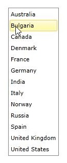
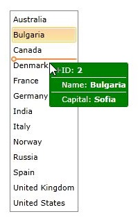

# How to customize the DragVisualProvider

In __RadListBox__ it is possible to enrich the drag-drop functionality of the control by creating a custom __DragVisualProvider__ or using one of the built-in DragVisualProviders. More information about the built-in DragVisualProviders could be found [here]().     

## Custom DragVisualProvider

The next example will demonstrate the how to create a custom DragVisualProvider in order to change its __Foreground__, __Background__, __BorderBrush__ and __Template__.

>Before proceeding with this example you should get familiar with [Drag and Drop: Overview](), [Implicit Styles]() and [Binding To Object]().          

1. First you will need to create a __Country__ class with the necessary properties:            

	#### __[C#]  Country class creation__

	{{region cs-radlistbox-styles-and-templates-customize-the-dragvisualprovider-0}}
		public class Country
		{
			public string Name { get; set; }
			public string Capital { get; set; }
			public int Id { get; set; }
		}
	{{endregion}}

2. Next you should create a __Countries__ collection in your ViewModel and populate it with some sample data:            

	#### __[C#]  ViewModel declaration___

	{{region cs-radlistbox-styles-and-templates-customize-the-dragvisualprovider-1}}
		public class ViewModel : ViewModelBase
		{
			public ViewModel()
			{
				this.Countries= new ObservableCollection<Country>()
				{
					new Country() { Name = "Australia", Capital = "Canberra", Id = 1 },
					new Country() { Name = "Bulgaria", Capital = "Sofia", Id = 2 },
					new Country() { Name = "Canada", Capital = "Ottawa", Id = 3 },
					new Country() { Name = "Denmark", Capital = "Copenhagen", Id = 4 },
					new Country() { Name = "France", Capital = "Paris", Id = 5 },
					new Country() { Name = "Germany", Capital = "Berlin", Id = 6 },
					new Country() { Name = "India", Capital = "New Delhi", Id = 7 },
					new Country() { Name = "Italy", Capital = "Rome", Id = 8 },
					new Country() { Name = "Norway", Capital = "Oslo", Id = 9 },
					new Country() { Name = "Russia", Capital = "Moscow", Id = 10 },
					new Country() { Name = "Spain ", Capital = "Madrid", Id = 11 },
					new Country() { Name = "United Kingdom", Capital = "London", Id = 12 },
					new Country() { Name = "United States", Capital = "Washington, D.C.", Id = 13 }
				};
			}
			public ObservableCollection<Country> Countries { get; set; }
		}
	{{endregion}}

3. In the App.xaml file merge the necessary __ResourceDictionary__ for the RadListBox control based on the theme you are using. This example uses the Office_Black theme:            

	#### __[XAML]  Merging the necessary ResourceDictionary__

	{{region xaml-radlistbox-styles-and-templates-customize-the-dragvisualprovider-0}}
		<Application.Resources>
		    <ResourceDictionary>
		        <ResourceDictionary.MergedDictionaries>
		            <ResourceDictionary Source="/Telerik.Windows.Themes.Office_Black;component/Themes/System.Windows.xaml"/>
		            <ResourceDictionary Source="/Telerik.Windows.Themes.Office_Black;component/Themes/Telerik.Windows.Controls.xaml"/>
		        </ResourceDictionary.MergedDictionaries>
		    </ResourceDictionary>
		</Application.Resources>
	{{endregion}}

4. Next you will need to create a Style in the same file that targets __ListBoxDragVisual__ and set its Foreground, Background, BorderBrush and Template properties:           

	#### __[XAML]  Style targeting ListBoxDragVisual__

	{{region xaml-radlistbox-styles-and-templates-customize-the-dragvisualprovider-1}}
		
	{{endregion}}

	You can find the entire ListBoxDragVisual Template code in each specific theme for the RadListBox control.            

	>The custom __DragVisualStyle__ must be created in the App.xaml file as the __DragVisualProvider__ is placed inside of another visual tree and cannot be targeted from the Page/Window where RadListBox is placed.              

5. Finally you will need to declare the __RadListBox__ control. The xaml of the control should look like this:            

	#### __[XAML]  RadListBox declaration__

	{{region xaml-radlistbox-styles-and-templates-customize-the-dragvisualprovider-2}}
		<telerik:RadListBox ItemsSource="{Binding Countries}" 
		DisplayMemberPath="Name">
		    <telerik:RadListBox.DragDropBehavior>
		        <telerik:ListBoxDragDropBehavior AllowReorder="True" />
		    </telerik:RadListBox.DragDropBehavior>
		    <telerik:RadListBox.DragVisualProvider>
		        <telerik:ListBoxDragVisualProvider/>
		    </telerik:RadListBox.DragVisualProvider>
		</telerik:RadListBox>
	{{endregion}}

	>tipYou can download a runnable project of the previous example from our online SDK repository [here](https://github.com/telerik/xaml-sdk), the example is listed as __ListBox / CustomDragVisualStyle__.          

	The next screenshots show the final result:

	

	

# See Also

 * [Overview]()

 * [Drag-Drop between RadListBox and RadScheduleView]()
