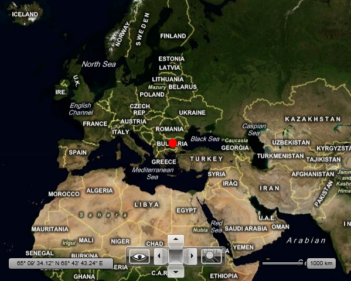
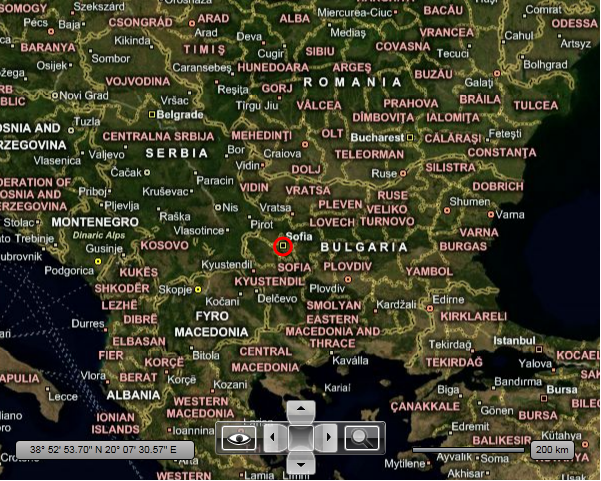

# Dynamic Layer

In contrast to __InformationLayer__ which processes all items in a collection,
        the __DynamicLayer__ requests items to process. It makes favour when thousands
        of items are available (pictures of POIs, for example). Your application can select what
        pictures are suitable for given location and zoom factor and return only these ones.
      

>tipThis allows you to implement items virtualization. It means that framework elements, pin
          points and map shapes are loaded when the region of the map they belong to is visible.
        

The __DynamicLayer__ uses a request to get items to show when zoom or center
        property is changed and refreshes items collection every time when response contains new data.
        It also supports asynchronous requests, so that new items can be downloaded from the server
        only when they come into view.
      

This topic will explain the following:

* [Map Division](#Map_Division)

* [Dynamic Source](#Dynamic_Source)

## Map Division

The __DynamicLayer__ requires a division of the map space in regions. The division of
          map space is defined using the __DynamicLayer.ZoomGridList__ collection.
          Each __ZoomGrid__ should define a minimum zoom level for its division.
          Of course the maximum zoom level for a grid is the minimum zoom layer of the next grid in
          the list. Also each zoom level is divided in a grid of latitude/longitude divisions.
        

Here is an example of a __DynamicLayer__ with a set of two __ZoomGrids__:
        

#### __XAML__

{{region radmap-features-dynamic-layer_0}}
	<telerik:RadMap x:Name="radMap"
	                Width="600"
	                Height="480">
	    <telerik:DynamicLayer x:Name="dynamicLayer">
	        <telerik:DynamicLayer.ZoomGridList>
	            <telerik:ZoomGrid LatitudesCount="2"
	                                LongitudesCount="2"
	                                MinZoom="3" />
	            <telerik:ZoomGrid LatitudesCount="4"
	                                LongitudesCount="4"
	                                MinZoom="6" />
	        </telerik:DynamicLayer.ZoomGridList>
	    </telerik:DynamicLayer>
	</telerik:RadMap>
	{{endregion}}

There are two grid lists - the one goes from zoom 3 to 6, and the other from zoom 6 to the maximum zoom.
          Also, the first grid has a 2 by 2 latitude/longitude division. This means that map is divided
          in 4 regions, and the layer only requests data for the current visible regions.
          The second slice is divided into 16 regions - higher zoom values require more divisions to perform well.
        

## Dynamic Source

The data provided to the __DynamicLayer__ should be wrapped in a class that
          implements the __IMapDynamicSource__ interface. This interface contains
          the __ItemsRequest()__ method, which is used by the
          __DynamicLayer__ to make request for new data, whenever
          the zoom level or the region changes.
        

>When there are no __ZoomGrids__ that satisfy the current zoom level, no
            request would be made. Also when the changed value of the zoom level or the region
            stays in the range of a __ZoomGrid__ or one of it cells,
            no request is made neither. In the current case, for example, when the zoom
            level is 1 or 2, no requests would be made, because there is no grid which
            represent this range. When the value is bigger than 6, requests would be
            made only when the grid cell changes, because the gird is defined for
            the range from 6 to the maximal zoom level.
          

The following properties are used in the __ItemsRequest()__ method from the __DynamicLayer__:
        

* __minZoom__ - represents the minimum zoom level of the currently active __ZoomGrid__.
            

* __upperLeft__ - represents the upper left corner of the currently visible region.
            

* __lowerRight__ - represents the lower right corner of the currently visible region.
            

* __CompleteItemsRequest__ - represents an __Action__, which
              is responsible to pass the desired item back to the __DynamicLayer__.
            

In this method you have to implement your logic for getting the desired items. The items can be represented
          by static and dynamic data as well. Here is an example of how to implement simple static functionality
          in the __ItemsRequest()__ method.
        

>If you want to deliver your data via a WebService you can follow our [demo](http://demos.telerik.com/silverlight/#Map/DynamicLayer) with full source code.
          

#### __C#__

{{region radmap-features-dynamic-layer_1}}
	public class MapDynamicSource : IMapDynamicSource
	        {
	            public void ItemsRequest(object sender, ItemsRequestEventArgs e)
	            {
	                List<object> items = new List<object>();
	                double minZoom = e.MinZoom;
	                Location upperLeft = e.UpperLeft;
	                Location lowerRight = e.LowerRight;
	                   HotSpot centerSpot = new HotSpot();
	                centerSpot.X = 0.5;
	                centerSpot.Y = 0.5;
	                Location bulgariaLocation = new Location(42.7669999748468, 25.2819999307394);
	                LocationRect currentRegion = new LocationRect(upperLeft, lowerRight);
	
	                if (currentRegion.Contains(bulgariaLocation))
	                {
	                    if (minZoom == 3)
	                    {
	                        Ellipse ellipse = new Ellipse();
	                        ellipse.Width = 15;
	                        ellipse.Height = 15;
	                        ellipse.Fill = new SolidColorBrush(Colors.Red);
	                        ellipse.SetValue(MapLayer.LocationProperty, bulgariaLocation);
	                        MapLayer.SetHotSpot(ellipse, centerSpot);
	                        ToolTipService.SetToolTip(ellipse, "Bulgaria");
	                        items.Add(ellipse);
	                    }
	                    else if (minZoom == 6)
	                    {
	                        Ellipse sofiaEllipse = new Ellipse();
	                        sofiaEllipse.Width = 20;
	                        sofiaEllipse.Height = 20;
	                        sofiaEllipse.Stroke = new SolidColorBrush(Colors.Red);
	                        sofiaEllipse.Fill = new SolidColorBrush(Colors.Transparent);
	                        sofiaEllipse.StrokeThickness = 3;
	                        sofiaEllipse.SetValue(MapLayer.LocationProperty, new Location(42.6957539183824, 23.3327663758679));
	                        MapLayer.SetHotSpot(sofiaEllipse, centerSpot);
	                        ToolTipService.SetToolTip(sofiaEllipse, "Sofia");
	                        items.Add(sofiaEllipse);
	                    }
	                }
	                e.CompleteItemsRequest(items);
	            }
	        }
	{{endregion}}

#### __VB.NET__

{{region radmap-features-dynamic-layer_2}}
	Public Class MapDynamicSource
	      Implements IMapDynamicSource
	                  Public Sub ItemsRequest(ByVal sender As Object, ByVal e As ItemsRequestEventArgs)
	                        Dim items As New List(Of Object)()
	                        Dim minZoom As Double = e.MinZoom
	                        Dim upperLeft As Location = e.UpperLeft
	                        Dim lowerRight As Location = e.LowerRight
	                           Dim centerSpot As New HotSpot()
	                        centerSpot.X = 0.5
	                        centerSpot.Y = 0.5
	                        Dim bulgariaLocation As New Location(42.7669999748468, 25.2819999307394)
	                        Dim currentRegion As New LocationRect(upperLeft, lowerRight)
	
	                        If currentRegion.Contains(bulgariaLocation) Then
	                              If minZoom = 3 Then
	                                    Dim ellipse As New Ellipse()
	                                    ellipse.Width = 15
	                                    ellipse.Height = 15
	                                    ellipse.Fill = New SolidColorBrush(Colors.Red)
	                                    ellipse.SetValue(MapLayer.LocationProperty, bulgariaLocation)
	                                    MapLayer.SetHotSpot(ellipse, centerSpot)
	                                    ToolTipService.SetToolTip(ellipse, "Bulgaria")
	                                    items.Add(ellipse)
	                              ElseIf minZoom = 6 Then
	                                    Dim sofiaEllipse As New Ellipse()
	                                    sofiaEllipse.Width = 20
	                                    sofiaEllipse.Height = 20
	                                    sofiaEllipse.Stroke = New SolidColorBrush(Colors.Red)
	                                    sofiaEllipse.Fill = New SolidColorBrush(Colors.Transparent)
	                                    sofiaEllipse.StrokeThickness = 3
	                                    sofiaEllipse.SetValue(MapLayer.LocationProperty, New Location(42.6957539183824, 23.3327663758679))
	                                    MapLayer.SetHotSpot(sofiaEllipse, centerSpot)
	                                    ToolTipService.SetToolTip(sofiaEllipse, "Sofia")
	                                    items.Add(sofiaEllipse)
	                              End If
	                        End If
	                        e.CompleteItemsRequest(items)
	                  End Sub
	End Class
	{{endregion}}

You can set the dynamic source to a new instance of the *MapDynamicSource*
          and create a new definition for the __BingMaps__ provider:
        

#### __C#__

{{region radmap-features-dynamic-layer_3}}
	public MainPage()
	{
	  InitializeComponent();
	  this.radMap.Provider = new BingMapProvider(MapMode.Aerial, true, "--Your Key here--"); 
	  this.dynamicLayer.DynamicSource = new MapDynamicSource();
	}
	{{endregion}}

#### __VB.NET__

{{region radmap-features-dynamic-layer_4}}
	Public Sub New()
	InitializeComponent()
	Me.radMap.Provider = New BingMapProvider(MapMode.Aerial, True, "--Your Key here--")
	Me.dynamicLayer.DynamicSource = New MapDynamicSource()
	End Sub
	{{endregion}}

The result:

ZoomLevel = 3:

ZoomLevel = 6:

# See Also

 * [Information Layer]()

 * [Data Binding]()

 * [KML Data Import]()
