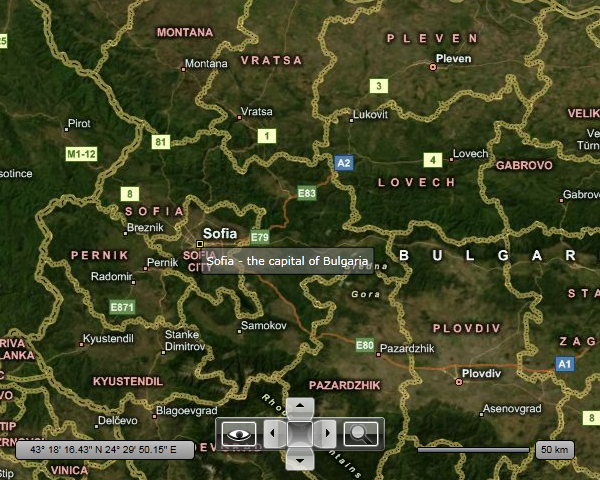

# Framework Elements

One of the objects that can be displayed inside the InformationLayer is the __FrameworkElement__. This means that you can actually display anything inside the __InformationLayer__, as the controls in SilverlightWPF inherit directly or indirectly the __FrameworkElement__ class. If you want to compose more than one control for your element, you just have to wrap them inside one of the layout controls.

This gives you the possibility to add Images, Charts, Gauges, etc. to your __RadMap__.

Since *Q2 2011* two new attachable properties were added that allow you to configure the Min and Max scale factor for the framework elements that change their size depends on the zoom level:

* __MaxScale__ - affects all FrameworkElements (except those based on the MapShape). It specifies the maximum scale factor which will be applied to the framework element when it has *BaseZoomLevel* property set and you zoom in the map control.

* __MinScale__ - affects FrameworkElements (except MapShape based ones). It specifies the maximum scale factor which will be applied to the framework element when it has BaseZoomLevel property set and you zoom out the map control.

>tip You can arrange the position of the __FrameworkElement__ either by using its __HorizontalAlignment__ or __VerticalAlignment__ properties or by using the __HotSpot__ feature of the __RadMap__. To learn more about the latter one, read [this topic]().

>tip For a detailed information on how to add and position items inside the __InformationLayer__, please read this [topic]().

Here is an example of a __Border__ that holds a __TextBlock__ with some information about the location:

#### __XAML__
{{region radmap-features-information-layer-framework-elements_0}}
	<telerik:RadMap x:Name="radMap"
	                Width="600"
	                Height="480">
	    <telerik:InformationLayer x:Name="informationLayer">
	        <Border x:Name="SofiaBorder"
	                telerik:MapLayer.BaseZoomLevel="5"
	                telerik:MapLayer.Location="42.6957539183824, 23.3327663758679"
	                telerik:MapLayer.ZoomRange="5,12"
	                HorizontalAlignment="Right"
	                VerticalAlignment="Bottom"
	                Background="#80808080"
	                BorderBrush="Black"
	                BorderThickness="1"
	                CornerRadius="2"
	                Padding="5">
	            <TextBlock Text="Sofia - the capital of Bulgaria"
	                        Foreground="#FFFFFFFF" />
	        </Border>
	    </telerik:InformationLayer>
	</telerik:RadMap>
{{endregion}}

Here is a snapshot of the result: 

# See Also
 * [Information Layer]()
 * [Map Shapes]()
 * [Pin Points]()
 * [Hot Spots]()