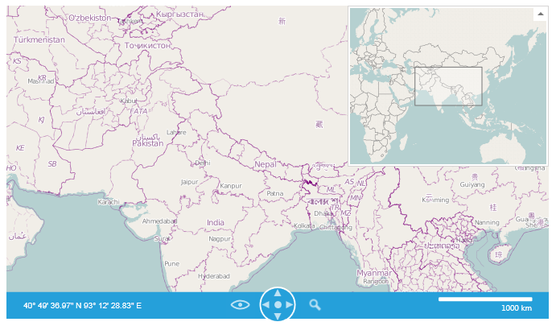

# Mini Map

## 

With the __Q2 2012__ release we have introduced the Mini Map feature to the RadMap control. In this help topic you can learn the following:
        

* Set the Mini Map provider for specific RadMap control.

* Customize the Mini Map control.

* Specify the provider of the Mini Map according to the RadMap Providers list.

* Change the with and height of the Mini Map relative to the size of the RadMap.

The Mini Map control is enabled by default. To see it just click on the expander button at the top right corner of the Map:

You can control the visibility of Mini Map together with its expander button via the *MiniMapExpanderVisibility* property.To collapse / expand the Mini Map you can use __IsMiniMapExpanded__.
        

The __MiniMapWidth__ and __MiniMapHeight__ are used to control the Mini Map width and height respectively.
        

The Mini Map viewport is rectangle which indicates what portion the map image is currently shown. You can use the following properties to customize it:
        

* __IsViewportAreaVisible__ - indicates whether the rectangle area which represents viewport of map in minimap is visible.
            

* __ViewportAreaZoomReduction__ - specifies a reduction for zoom level of minimap. When it is 0 then the rectangle which represents viewport of map in minimap is set to [best view](). When it is 1 then the rectangle should be smaller than best view by 1 zoom level.
            

* __ViewPortAreaFill__ - as its name implies gets or sets the Fill for the viewport.
            

* __ViewportAreaStroke__ - should be used together with ViewPortAreaStrokeThickness property, to provide stroke for the viewport area.
            

*When specifying the provider for the Mini Map control:*

The Mini Map control can also be used as a separate control like other map controls such as map navigation, scale and mouse location control. In fact the Mini Map inherits the RadMap. So, you can use the features of RadMap control. For more information - please check all supported features in the Features section of the content tree on your right. Please have in mind that you should not bind the same collection of providers to the Mini Map. You should bind separate collection of providers with separate instances (not the same objects which are presented in the collection of RadMap providers).
        

>The Mini Map can use the first provider in provider list of parent RadMap control only. Also if you use a custom provider, then you should implement the *IClonable* interface for using it with Mini Map.
          

Below you'll find a sample that demonstrates how to use the *MiniMap* with *RadExpander* as its wrapper and change the size of the Mini Map by respecting the size of the RadMap:
        

#### __XAML__

{{region radmap-features-mini-map_0}}
	<telerik:RadMap x:Name="radMap1"
	                MiniMapExpanderVisibility="Collapsed"
	                SizeChanged="MapSizeChanged">
	    <telerik:RadMap.Providers>
	        <telerik:OpenStreetMapProvider/>
	    </telerik:RadMap.Providers>
	
	    <telerik:RadExpander VerticalAlignment="Top"
	                        HorizontalAlignment="Left">
	        <telerik:MiniMap x:Name="MiniMap1"
	                        UseParentMapProvider="False"
	                        MapControl="{Binding ElementName=radMap1}"
	                        UseSpringAnimations="True"
	                        IsViewportAreaVisible="True"
	                        ViewportAreaZoomReduction="1" ViewportAreaFill="Red"
	                        Width="256" Height="200">
	            <telerik:RadMap.Provider>
	                <telerik:OpenStreetMapProvider />
	            </telerik:RadMap.Provider>
	        </telerik:MiniMap>
	    </telerik:RadExpander>
	</telerik:RadMap>
	{{endregion}}

#### __C#__

{{region radmap-features-mini-map_1}}
	private const double MiniMapWidthScaleFactor = 0.15;
	private const double MiniMapHeightScaleFactor = 0.2;
	
	private void MapSizeChanged(object sender, SizeChangedEventArgs e)
	{
	    this.MiniMap1.Width = e.NewSize.Width * MiniMapWidthScaleFactor;
	    this.MiniMap1.Height = e.NewSize.Height * MiniMapHeightScaleFactor;
	}
	{{endregion}}

#### __VB.NET__

{{region radmap-features-mini-map_2}}
	Private Const MiniMapWidthScaleFactor As Double = 0.15
	Private Const MiniMapHeightScaleFactor As Double = 0.2
	
	Private Sub MapSizeChanged(ByVal sender As Object, ByVal e As SizeChangedEventArgs)
		Me.MiniMap1.Width = e.NewSize.Width * MiniMapWidthScaleFactor
		Me.MiniMap1.Height = e.NewSize.Height * MiniMapHeightScaleFactor
	End Sub
	{{endregion}}

By wiring to __MapSizeChanged__ event we are setting our Height and Width for the Mini Map so that it is always scaled by our own custom factor. This way the size of the MiniMap will respect the size of its parent Map.
        

Furthermore we turned off the visibility of the *MiniMapExpander* and wrapped the MiniMap in our own container - *RadExpander*. We added several properties to customize the ViewportArea and set the parent to which our Mini Map control belongs to. You may see the result below:

