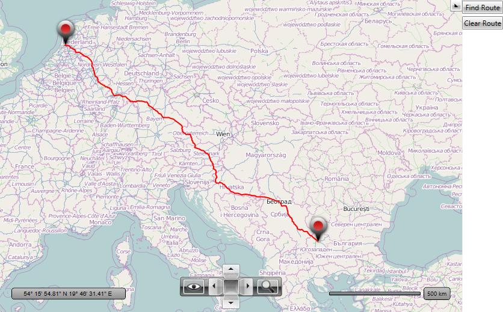

# Routing

The __RadMap__ provides unified route search architecture which uses functionality of the different routing services. This allows you to calculate route between different locations on the map.      

>important The __BingRouteProvider__ is marked as __obsolete in R1 2017__ and will be __removed in R2 2017__. It uses Bing SOAP Routing service that will be stopped in June 2017. Please use __BingRestMapProvider__ and its IBingRestRouteProvider implementation based on Bing REST services.

This topic will focus on the following:

* [Routing Providers](#routing-providers)

* [Using BingRouteProvider](#using-bingrouteprovider)

* [Executing Routing](#executing-routing)

* [Routing Result](#routing-result)

## Routing Providers

The __Routing Providers__ are very similar to the __Map Providers__. They make calls to the respective routing services in order to provide a route between two or more locations points.        

Here is a list of the currently available routing providers:

* __BingRouteProvider__ - allows you to perform route calculations via the __Bing Maps__.          

## Using BingRouteProvider 

In order to use the __BingRouteProvider__ you have to create an instance of it and handle its __RoutingCompleted__ event. Also you have to set the following properties:        

* __ApplicationId__ - this represents a key, which allows you to use the __Bing Maps__ services. It should be the same key as the one you use with the __BingMapProvider__ class.            

	>Without supplying a valid key you won't be able to visualize the map inside the __RadMap__ control. In order to learn how to obtain one, please read [this article](http://msdn.microsoft.com/en-us/library/ee681900.aspx).

* __MapControl__ - represents the instance of the __RadMap__, which should be associated with the routing provider.          

Here is an example:

#### __XAML__
{{region radmap-features-routing_0}}
	<telerik:RadMap Name="radMap">
		<telerik:RadMap.Provider>
			<telerik:OpenStreetMapProvider />
		</telerik:RadMap.Provider>
		<telerik:VisualizationLayer Name="wayPointsLayer" />
		<telerik:VisualizationLayer Name="routeLayer"
									UseBitmapCache="False"/>
	</telerik:RadMap>
{{endregion}}

#### __C#__
{{region radmap-features-routing_1}}
	LocationCollection wayPoints = new LocationCollection();
	BingRouteProvider routeProvider;
	public RouteSample()
	{
	    InitializeComponent();
	    this.routeProvider = new BingRouteProvider();
	    this.routeProvider.ApplicationId = "key";
	    this.routeProvider.MapControl = this.radMap;
	    this.routeProvider.RoutingCompleted += this.routeProvider_RoutingCompleted;
	
	    this.wayPointsLayer.ItemsSource = this.wayPoints;
	}
	private void routeProvider_RoutingCompleted( object sender, RoutingCompletedEventArgs e )
	{
	}
{{endregion}}

#### __VB.NET__
{{region radmap-features-routing_2}}
	Private wayPoints As New LocationCollection()
	Private routeProvider As BingRouteProvider
	Public Sub New()
		InitializeComponent()
		Me.routeProvider = New BingRouteProvider()
		Me.routeProvider.ApplicationId = "key"
		Me.routeProvider.MapControl = Me.radMap
		AddHandler Me.routeProvider.RoutingCompleted, AddressOf Me.routeProvider_RoutingCompleted

		Me.wayPointsLayer.ItemsSource = Me.wayPoints
	End Sub
	Private Sub routeProvider_RoutingCompleted(sender As Object, e As RoutingCompletedEventArgs)
	End Sub
{{endregion}}
	
## Executing Routing

In order to execute a routing action you have to call the __CalculateRouteAsync()__ method of the __BingRouteProvider__ and pass a __RouteRequest__ as its argument. The __RouteRequest__ should contain the points which should take part in the desired order. To pass the location points to the request argument just use its __Waypoints__ property.        

>tip You are able to specify different options for the route calculation via the __Options__ property of the request, which is of type __RouteOptions__. To learn more about the __RouteOptions__ class and its members read [this](http://www.telerik.com/help/silverlight/allmembers_t_telerik_windows_controls_map_routeoptions.html)[this](http://www.telerik.com/help/wpf/allmembers_t_telerik_windows_controls_map_routeoptions.html) topic.          

Here is an example:

#### __XAML__
{{region radmap-features-routing_1}}
	 <telerik:RadMap Name="radMap"
					Center="47,15"
					ZoomLevel="5" 
					MapMouseClick="MapMouseClick">
		<telerik:RadMap.Provider>
			<telerik:OpenStreetMapProvider />
		</telerik:RadMap.Provider>
		<telerik:VisualizationLayer Name="wayPointsLayer" />
		<telerik:VisualizationLayer Name="routeLayer"
									UseBitmapCache="False"/>
	</telerik:RadMap>
	
	<StackPanel Grid.Column="1">
		<telerik:RadButton Name="findRouteButton" 
						   Content="Find Route" 
						   Click="FindRouteClicked" 
						   Margin="0,2" />
	
		<telerik:RadButton Name="clearButton" 
						   Content="Clear Route" 
						   Click="ClearRouteClicked" 
						   Margin="0,2" />
	</StackPanel>
{{endregion}}

#### __C#__
{{region radmap-features-routing_3b}}
	private void MapMouseClick(object sender, MapMouseRoutedEventArgs eventArgs)
	{
	    this.wayPoints.Add(eventArgs.Location);
	}
	
	private void ClearRouteClicked(object sender, RoutedEventArgs e)
	{
	    this.findRouteButton.IsEnabled = true;
	
	    this.wayPoints.Clear();
	    this.routeLayer.Items.Clear();
	}
	
	private void FindRouteClicked(object sender, RoutedEventArgs e)
	{
	    this.routeLayer.Items.Clear();
	
	    RouteRequest routeRequest = new RouteRequest();
	    routeRequest.Culture = new System.Globalization.CultureInfo("en-US");
	    routeRequest.Options.RoutePathType = RoutePathType.Points;
	
	    if (this.wayPoints.Count > 1)
	    {
	        this.findRouteButton.IsEnabled = false;
	
	        foreach (Location location in this.wayPoints)
	        {
	            routeRequest.Waypoints.Add(location);
	        }
	        this.routeProvider.CalculateRouteAsync(routeRequest);
	    }
	}
{{endregion}}

#### __VB.NET__
{{region radmap-features-routing_4}}
	Private Sub MapMouseClick(sender As Object, eventArgs As MapMouseRoutedEventArgs)
		Me.wayPoints.Add(eventArgs.Location)
	End Sub

	Private Sub ClearRouteClicked(sender As Object, e As RoutedEventArgs)
		Me.findRouteButton.IsEnabled = True

		Me.wayPoints.Clear()
		Me.routeLayer.Items.Clear()
	End Sub

	Private Sub FindRouteClicked(sender As Object, e As RoutedEventArgs)
		Me.routeLayer.Items.Clear()

		Dim routeRequest As New RouteRequest()
		routeRequest.Culture = New System.Globalization.CultureInfo("en-US")
		routeRequest.Options.RoutePathType = RoutePathType.Points

		If Me.wayPoints.Count > 1 Then
			Me.findRouteButton.IsEnabled = False

			For Each location As Location In Me.wayPoints
				routeRequest.Waypoints.Add(location)
			Next
			Me.routeProvider.CalculateRouteAsync(routeRequest)
		End If
	End Sub
{{endregion}}

## Routing Result 

The result from the routing services is held by the __RouteResponse__ object inside the __RoutingCompletedEventArgs__ of the handler for the __RoutingCompleted__ event.        

>tip If you need more information you can take a look at the [GeocodeResponse](http://www.telerik.com/help/silverlight/allmembers_t_telerik_windows_controls_map_geocoderesponse.html)[GeocodeResponse](http://www.telerik.com/help/wpf/allmembers_t_telerik_windows_controls_map_geocoderesponse.html) and [GeocodeResult](http://www.telerik.com/help/silverlight/allmembers_t_telerik_windows_controls_map_geocoderesult.html)[GeocodeResult](http://www.telerik.com/help/wpf/allmembers_t_telerik_windows_controls_map_geocoderesult.html) classes in the API Reference.          

To get the result you have to access the __Points__ collection of the __Result.RoutePath__ object. Here is an example where the result is displayed by a __MapPolyline__ via the __RadMap__'s visualization layer.        

#### __C#__
{{region radmap-features-routing_5}}
	private void RouteProvider_RoutingCompleted(object sender, RoutingCompletedEventArgs e)
	{
	    this.findRouteButton.IsEnabled = true;
	
	    RouteResponse routeResponse = e.Response as RouteResponse;
	    if (routeResponse != null
	        && routeResponse.Error == null)
	    {
	        if (routeResponse.Result != null 
	            && routeResponse.Result.RoutePath != null)
	        {
	            PolylineData routeLine = new PolylineData()
	            {
	                Points = routeResponse.Result.RoutePath.Points,
	                ShapeFill = new MapShapeFill()
	                {
	                    Stroke = new SolidColorBrush(Colors.Red),
	                    StrokeThickness = 2
	                }
	            };
	
	            this.routeLayer.Items.Add(routeLine);
	        }
	    }
	}
{{endregion}}

#### __VB.NET__
{{region radmap-features-routing_6}}
    Private Sub RouteProvider_RoutingCompleted(sender As Object, e As RoutingCompletedEventArgs)
        Me.findRouteButton.IsEnabled = True

        Dim routeResponse As RouteResponse = TryCast(e.Response, RouteResponse)
        If routeResponse IsNot Nothing AndAlso routeResponse.[Error] Is Nothing Then
            If routeResponse.Result IsNot Nothing AndAlso routeResponse.Result.RoutePath IsNot Nothing Then
                Dim routeLine As New PolylineData() With { 
                    .Points = routeResponse.Result.RoutePath.Points, 
                    .ShapeFill = New MapShapeFill() With { 
                        .Stroke = New SolidColorBrush(Colors.Red), 
                        .StrokeThickness = 2 
                    } 
                }

                Me.routeLayer.Items.Add(routeLine)
            End If
        End If
    End Sub
{{endregion}}

Here is a snapshot of the result: 

# See Also
 * [Providers Overview]()
 * [Empty provider]()
 * [Search]()
 * [Geocode]()