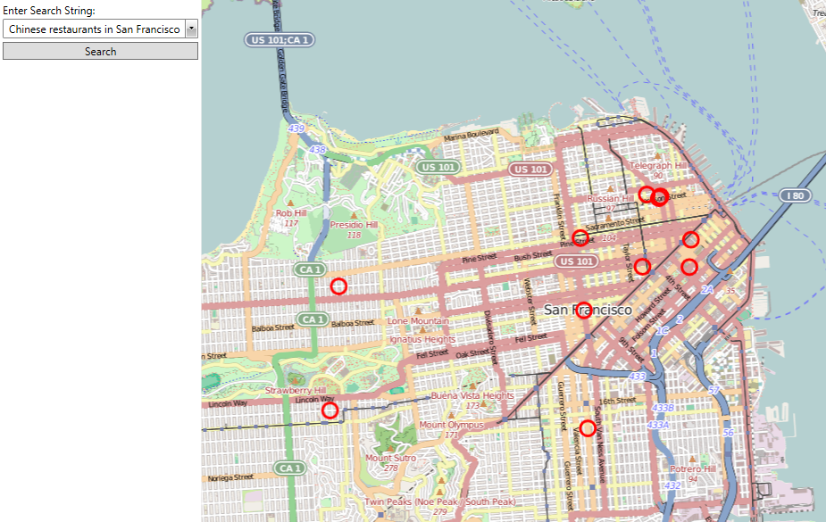
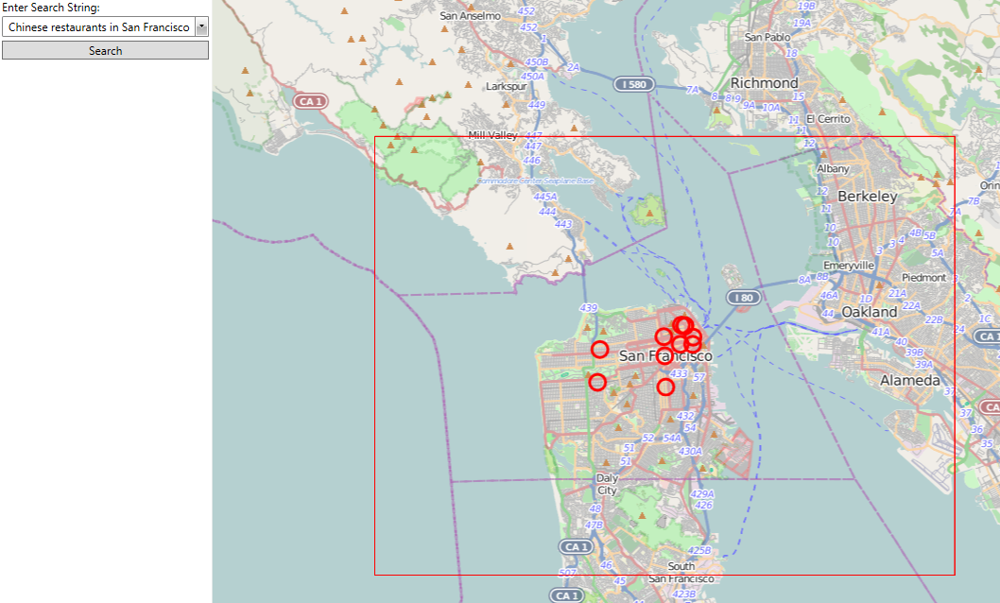
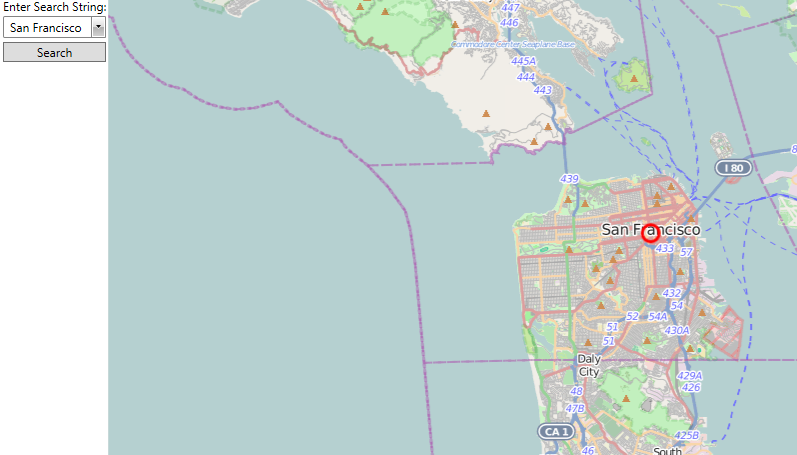

# Search

The __RadMap__ control allows you to implement search functionality, that will allow the user to search for a specific location on the map. The search is performed by using __Search Providers__, which communicate with the respective __Map Provider's__ services. With this feature available you are able to build an UI that allows the user to input search criteria and execute a search.      

>important The __BingSearchProvider__ is marked as __obsolete in R1 2017__ and will be __removed in R2 2017__. It uses Bing SOAP Search service that will be stopped in June 2017. For searching Locations / Addresses (but not POIs) please use __BingRestMapProvider__ and its IBingRestSearchLocationProvider implementation based on Bing REST services.

This topic will focus on the following:

* [Search Providers](#search-providers)

* [Using the BingSearchProvider](#using-the-bingsearchprovider)

* [Search Results](#search-results)

* [Search Region](#search-region)

* [Alternate Search Regions](#alternate-search-regions)

## Search Providers

The __Search Providers__ are very similar to the __Map Providers__. They make calls to the respective services in order to provide a certain functionality.        

Here is a list of the currently available search providers:

* __BingSearchProvider__ - allows you to perform search via the __Bing Maps__.            

## Using the BingSearchProvider

In order to use the __BingSearchProvider__ you have to create an instance of it and handle its __SearchCompleted__ event. You also have to set the following properties:        

* __ApplicationId__ - this represents a key, which allows you to use the __Bing Maps__ services. It should be the same key as the one you use with the __BingMapProvider__ class.            

	>Without supplying a valid key you won't be able to visualize the map inside the __RadMap__ control. In order to learn how to obtain one, please read [this article](http://msdn.microsoft.com/en-us/library/ee681900.aspx)
	
* __MapControl__ - represents the instance of the __RadMap__, which should be associated with the search provider.            

Here is an example:

#### __C#__
{{region radmap-features-search_0}}
	BingSearchProvider searchProvider;
	MapItemsCollection itemCollection = new MapItemsCollection();
	public Sample()
	{
	    InitializeComponent();
	    this.searchProvider = new BingSearchProvider();
	    searchProvider.ApplicationId = "key";
	    searchProvider.MapControl = this.radMap;
	    searchProvider.SearchCompleted += this.searchProvider_SearchCompleted;
	
	    this.itemsLayer.ItemsSource = this.itemCollection;
	}
{{endregion}}

#### __VB.NET__
{{region radmap-features-search_1}}
	Private searchProvider As BingSearchProvider
	Private itemCollection As New MapItemsCollection()
	Public Sub New()
		InitializeComponent()
		Me.searchProvider = New BingSearchProvider()
		searchProvider.ApplicationId = "key"
		searchProvider.MapControl = Me.radMap
		searchProvider.SearchCompleted += Me.searchProvider_SearchCompleted

		Me.itemsLayer.ItemsSource = Me.itemCollection
	End Sub
{{endregion}}

In order to execute search you have to call the __SearchAsync()__ method of the __BingSearchProvider__ and pass a __SearchRequest__ object to it. For example, if you have UI that consists of a __TextBox__ named "__SearchBox__" and a button, upon which click a search should be executed, here is how the code for the button's __Click__ event handler should look.        

>tip To learn more about the __SearchRequest__ class, please read [here](http://www.telerik.com/help/silverlight/allmembers_t_telerik_windows_controls_map_bingsearchservice_searchresponse.html)[here](http://www.telerik.com/help/wpf/allmembers_t_telerik_windows_controls_map_wpfbingsearchservice_searchresponse.html).          

#### __XAML__
{{region radmap-features-search_0}}
	<Grid>
		<Grid.RowDefinitions>
			<RowDefinition Height="Auto" />
			<RowDefinition Height="*" />
		</Grid.RowDefinitions>
		<Grid.ColumnDefinitions>
			<ColumnDefinition Width="Auto" />
			<ColumnDefinition Width="*" />
		</Grid.ColumnDefinitions>

		<StackPanel Margin="3" 
					Grid.Column="0" Grid.Row="1">
			<TextBlock Text="Enter Search String:" />
			<telerik:RadComboBox Name="SearchCondition" 
								 IsEditable="True" 
								 Margin="0,2" 
								 Foreground="Black">
				<telerik:RadComboBoxItem Content="Restaurants in Honolulu" />
				<telerik:RadComboBoxItem Content="Chinese restaurants in San Francisco" />
				<telerik:RadComboBoxItem Content="Eiffel Tower, Paris" />
				<telerik:RadComboBoxItem Content="Kremlin, Moscow" />
			</telerik:RadComboBox>
			<Button Content="Search" 
					Click="SearchHandler" 
					Margin="0,2" />
		</StackPanel>

		<telerik:RadMap x:Name="radMap"
						Grid.Row="1" Grid.Column="1"
						ZoomLevel="7"
						Center="42.358431,-71.059773">
			<telerik:RadMap.Provider>
				<telerik:OpenStreetMapProvider />
			</telerik:RadMap.Provider>
			<telerik:VisualizationLayer Name="itemsLayer">
				<telerik:VisualizationLayer.ItemTemplate>
					<DataTemplate>
						<Grid telerik:MapLayer.Location="{Binding Location}">
							<telerik:MapLayer.HotSpot>
								<telerik:HotSpot X="0.5"
									 Y="0.5"
									 ElementName="PART_Ellipse" />
							</telerik:MapLayer.HotSpot>
							<Ellipse x:Name="PART_Ellipse"
						 Width="20"
						 Height="20"
						 Stroke="Red"
						 StrokeThickness="3"
						 Fill="Transparent">
								<ToolTipService.ToolTip>
									<ToolTip Content="{Binding Title}" />
								</ToolTipService.ToolTip>
							</Ellipse>
						</Grid>
					</DataTemplate>
				</telerik:VisualizationLayer.ItemTemplate>
			</telerik:VisualizationLayer>
			<telerik:VisualizationLayer Name="regionLayer"
										UseBitmapCache="False"/>
		</telerik:RadMap>
	</Grid>
{{endregion}}

#### __C#__
{{region radmap-features-search_2}}
	private void SearchHandler(object sender, RoutedEventArgs e)
	{
	    string query = this.SearchCondition.Text;
	
	    if (!string.IsNullOrEmpty(query))
	    {
	        SearchRequest request = new SearchRequest();
	        request.Culture = new System.Globalization.CultureInfo("en-US");
	        request.Query = query;
	
	        this.searchProvider.SearchAsync(request);
	    }
	}
{{endregion}}

#### __VB.NET__
{{region radmap-features-search_3}}
	Private Sub SearchHandler(sender As Object, e As RoutedEventArgs)
		Dim query As String = Me.SearchCondition.Text

		If Not String.IsNullOrEmpty(query) Then
			Dim request As New SearchRequest()
			request.Culture = New System.Globalization.CultureInfo("en-US")
			request.Query = query

			Me.searchProvider.SearchAsync(request)
		End If
	End Sub
{{endregion}}

## Search Results

The results of the executed search are held by the __SearchResponse__ object inside the __SearchCompletedEventArgs__ of the handler for the __SearchCompleted__ event. You can easily iterate the collection and wrap each result in a custom class, which to be  later displayed in the __VisualizationLayer__ of the __RadMap__ via __DataBinding__.        

>To learn more about __Data Binding__, you can read the respective [topic](). In it you can also find the __DataTemplate__ and the custom __MapItem__ class used in the examples below.          

<!-- -->
>Note that the items in the __SearchResultCollection__ collection represent map location smaller than a region, e.g. restaurants, theaters, etc. In case the search query represents a region this collection will be empty and the __SearchRegion__ will represent the search result, e.g. Paris, Amsterdam, etc. Also note that even when the __SearchResultCollection__ has items, the __SearchRegion__ will still be available and will represent the region to which the results belong. In the next section, you can see how to make use of the __SearchRegion__ in both cases.

Here is an example on how to access the __SearchResults__ collection, iterate its items and pass them to the __VisualizationLayer__:  

#### __C#__
{{region radmap-features-search_4}}
	private void Provider_SearchCompleted(object sender, SearchCompletedEventArgs args)
	{
	    this.itemCollection.Clear();
	    SearchResultCollection results = args.Response.ResultSets.First().Results;
	    if (results.Count > 0)
	    {
	        foreach (SearchResultBase result in results)
	        {
	            MapItem item = new MapItem()
	            {
	                Title = result.Name,
	                Location = result.LocationData.Locations[0]
	            };
	            this.itemCollection.Add(item);
	        }
	        this.radMap.SetView(args.Response.ResultSets[0].SearchRegion.GeocodeLocation.BestView);
	    }
	}
{{endregion}}

#### __VB.NET__
{{region radmap-features-search_5}}
	Private Sub Provider_SearchCompleted(sender As Object, args As SearchCompletedEventArgs)
		Me.itemCollection.Clear()
		Dim results As SearchResultCollection = args.Response.ResultSets.First().Results
		If results.Count > 0 Then
			For Each result As SearchResultBase In results
				Dim item As New MapItem() With { _
					.Title = result.Name, _
					.Location = result.LocationData.Locations(0) _
				}
				Me.itemCollection.Add(item)
			Next
			Me.radMap.SetView(args.Response.ResultSets(0).SearchRegion.GeocodeLocation.BestView)
		End If
	End Sub
{{endregion}}

Here is a snapshot of the result.

## Search Region

The __Search Region__ represents the region in which the results are located. If the __SearchResultCollection__ is empty, the __SearchRegion__ itself might be counted as a result. For example, a search query of "Chinese restaurants in San Francisco" would return several __SearchResults__ and a __SearchRegion__ representing San Francisco. If you search for "San Francisco", the search would return empty __SearchResultsCollection__, but the __SearchRegion__ will be equal to San Francisco.        

One of the most important features of the __Search Region__ is the __BoundingArea__. It allows you to get a shape representing the region. By using a __MapShapeData__ object you can easily display it on the map via the __VisualizationLayer__. Here is an example for such a shape, which appears when the __SearchResultCollection__ is not empty. The MapShape will surround the results. The following code snippet is an extension of the one in the previous section.        

>tip By using the __GeocodeLocation.BestView__ property of the __SearchRegion__ you are able to set the view of the map at the most suitable location and zoom level.          

#### __C#__
{{region radmap-features-search_6}}
	private void Provider_SearchCompleted(object sender, SearchCompletedEventArgs args)
	{
		this.itemCollection.Clear();
		SearchResultCollection results = args.Response.ResultSets.First().Results;
	    SearchRegion region = args.Response.ResultSets.First().SearchRegion;
		if (results.Count > 0)
		{
			this.radMap.SetView(region.GeocodeLocation.BestView);
	        foreach (SearchResultBase result in args.Response.ResultSets[0].Results)
	        {
	            MapItem item = new MapItem()
	            {
	                Title = result.Name,
	                Location = result.LocationData.Locations[0]
	            };
	            this.itemCollection.Add(item);
	        }
		}
		else
		{
			if (region != null)
			{
				this.radMap.SetView(region.GeocodeLocation.BestView);
				if (region.GeocodeLocation.Address != null && region.GeocodeLocation.Locations.Count > 0)
				{
					foreach (Location location in region.GeocodeLocation.Locations)
					{
						MapItem item = new MapItem();
						
						item.Location = location;
						this.itemCollection.Add(item);
					}
	
					// Set the bounding area
					if (args.Response.ResultSets[0].SearchRegion.BoundingArea != null)
					{
						MapShapeData boundingArea = args.Response.ResultSets[0].SearchRegion.BoundingAreaData;
						boundingArea.ShapeFill = new MapShapeFill()
						{
							Stroke = new SolidColorBrush(Colors.Red),
							StrokeThickness = 1
						};
						this.regionLayer.Items.Add(boundingArea);
					}
				}
			}
		}
	}
{{endregion}}

#### __VB.NET__
{{region radmap-features-search_7}}
    Private Sub Provider_SearchCompleted(sender As Object, args As SearchCompletedEventArgs)

        Me.itemCollection.Clear()
        Dim results As SearchResultCollection = args.Response.ResultSets.First().Results
        Dim region As SearchRegion = args.Response.ResultSets.First().SearchRegion
        If results.Count > 0 Then
            Me.radMap.SetView(region.GeocodeLocation.BestView)
            For Each result As SearchResultBase In args.Response.ResultSets(0).Results
                Dim item As New MapItem() With { _
                    .Title = result.Name, _
                    .Location = result.LocationData.Locations(0) _
                }
                Me.itemCollection.Add(item)
            Next
        Else
            If region IsNot Nothing Then
                Me.radMap.SetView(region.GeocodeLocation.BestView)
                If region.GeocodeLocation.Address IsNot Nothing AndAlso region.GeocodeLocation.Locations.Count > 0 Then
                    For Each location As Location In region.GeocodeLocation.Locations
                        Dim item As New MapItem()

                        item.Location = location
                        Me.itemCollection.Add(item)
                    Next

                    ' Set the bounding area'
                    If args.Response.ResultSets(0).SearchRegion.BoundingArea IsNot Nothing Then
                        Dim boundingArea As MapShapeData = args.Response.ResultSets(0).SearchRegion.BoundingAreaData
                        boundingArea.ShapeFill = New MapShapeFill() With { _
                            .Stroke = New SolidColorBrush(Colors.Red), _
                            .StrokeThickness = 1 _
                        }
                        Me.regionLayer.Items.Add(boundingArea)
                    End If
                End If
            End If
        End If
    End Sub
{{endregion}}

Here is a snapshot of the result:

If the __SearchResultCollection__ is empty and the __SearchRegion__ is different than null, you might want to display it as a result. In this case, you have to use its __GeocodeLocation.Locations__ collection.

Here is an example: 

#### __C#__
{{region radmap-features-search_8}}
	private void searchProvider_SearchCompleted( object sender, SearchCompletedEventArgs e )
	{
	    this.itemCollection.Clear();
	    SearchResultCollection results = args.Response.ResultSets.First().Results;
	    SearchRegion region = args.Response.ResultSets.First().SearchRegion;
	    if (results.Count > 0)
	    {
	        //code that runs when there are available results.
	    }
	    else
	    {  
	        if (region != null)
	        {
	            this.radMap.SetView(region.GeocodeLocation.BestView);
	            if (region.GeocodeLocation.Address != null && region.GeocodeLocation.Locations.Count > 0)
	            {
	                foreach (Location location in region.GeocodeLocation.Locations)
	                {
	                    MapItem item = new MapItem();                            
	                    item.Location = location;
	                    this.itemCollection.Add(item);
	                }
	            }
	        }
	    }
	}
{{endregion}}

#### __VB.NET__
{{region radmap-features-search_9}}
	Private Sub searchProvider_SearchCompleted(sender As Object, e As SearchCompletedEventArgs)
        Me.itemCollection.Clear()
        Dim results As SearchResultCollection = args.Response.ResultSets.First().Results
        Dim region As SearchRegion = args.Response.ResultSets.First().SearchRegion
        'code that runs when there are available results.'
        If results.Count > 0 Then
        Else
            If region IsNot Nothing Then
                Me.radMap.SetView(region.GeocodeLocation.BestView)
                If region.GeocodeLocation.Address IsNot Nothing AndAlso region.GeocodeLocation.Locations.Count > 0 Then
                    For Each location As Location In region.GeocodeLocation.Locations
                        Dim item As New MapItem()
                        item.Location = location
                        Me.itemCollection.Add(item)
                    Next
                End If
            End If
        End If
    End Sub
{{endregion}}

## Alternate Search Regions

The search response might also contain a set of additional __SearchRegion__ objects that might be potential results. You can easily iterate them and add them either to a separate __VisualizationLayer__ or to a __ListBox__, which will list them as "Did you mean ..." options, for example.       

#### __C#__
{{region radmap-features-search_10}}
	private void searchProvider_SearchCompleted( object sender, SearchCompletedEventArgs e )
	{
	    SearchRegionCollection alternateRegions = e.Response.ResultSets.First().AlternateSearchRegions;
	    if ( alternateRegions.Count > 0 )
	    {
	        foreach ( SearchRegion region in alternateRegions )
	        {
	           // implement AlternateSearchRegions logic here.
	        }
	    }
	}
{{endregion}}

#### __VB.NET__
{{region radmap-features-search_11}}
	Private Sub searchProvider_SearchCompleted(sender As Object, e As SearchCompletedEventArgs)
	 Dim alternateRegions As SearchRegionCollection = e.Response.ResultSets.First().AlternateSearchRegions
	 If alternateRegions.Count > 0 Then
	    ' implement AlternateSearchRegions logic here.'
	  For Each region As SearchRegion In alternateRegions
	  Next
	 End If
	End Sub
{{endregion}}

# See Also
 * [Providers Overview]()
 * [Empty provider]()
 * [Geocode]()
 * [Routing]()