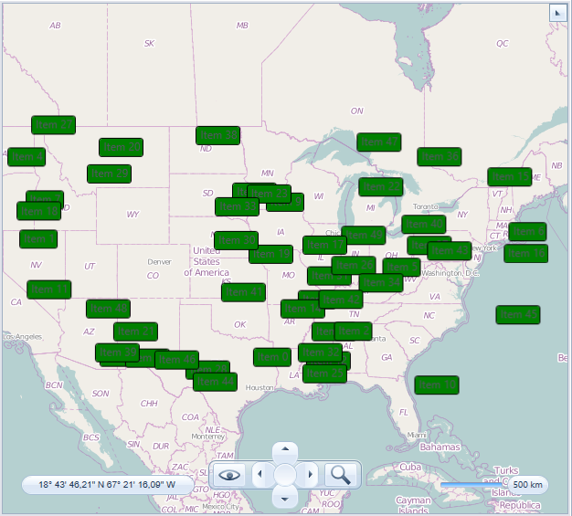
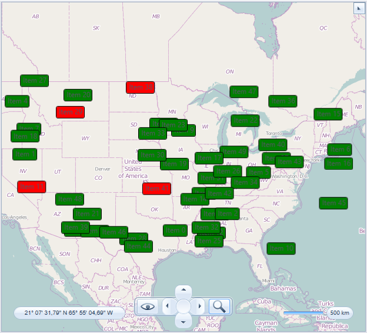
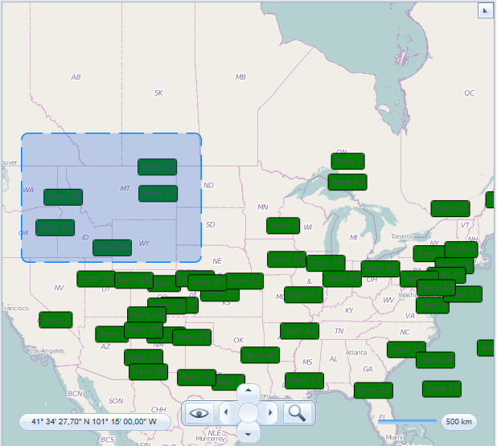
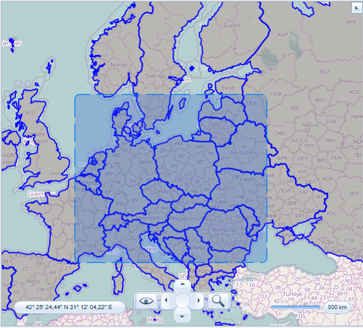
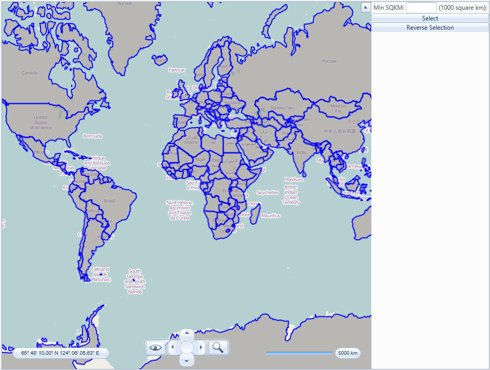
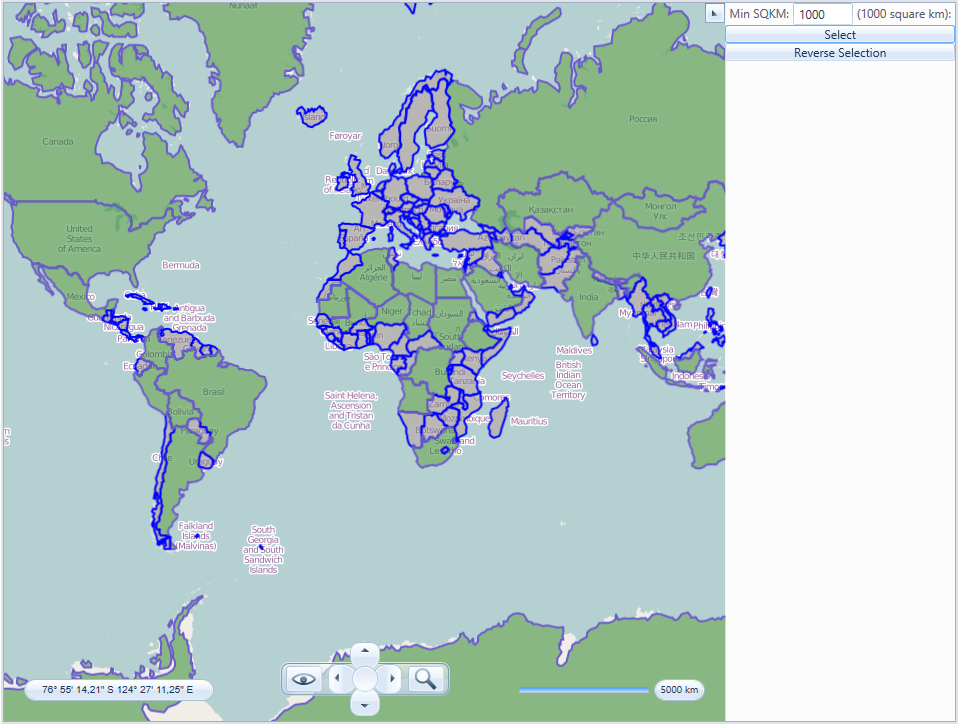

# Items Selection

Many applications require the ability to select items shown over the map. The __VisualizationLayer__ object has built-in functionality which supports items selection, both point-type and map shapes. This article explains the usage of the items selection feature in the following main scenarios:
      

1. Items selection.

1. Map shape selection.

1. Using the selection API from the code.

By default items selection feature is disabled in favor of the panning by mouse click and zooming using rectangle selection operations. To enable it you should set values of the __MouseClickMode__ and __MouseSelectionMode__ properties of the __RadMap__ control:
      

{{region radmap-visualization-layer-items-selection_0}}
	        <telerik:RadMap x:Name="radMap"
	                        Center="40,-95"
	                        MouseClickMode="SelectItem"
	                        MouseSelectionMode="RaiseEvent"
	                        ZoomLevel="4">
	            <telerik:RadMap.Provider>
	                <telerik:OpenStreetMapProvider />
	            </telerik:RadMap.Provider>
	            <telerik:VisualizationLayer x:Name="visualizationLayer" />
	        </telerik:RadMap>
	
	{{endregion}}

## Items selection

In this section we demonstrate how the items selection can be implemented for the point-type objects (i.e. objects which represent single location on the map). In order to provide the needed data to the visualization layer, you have to create a collection of business __MapItem__ objects. For example:
        

{{region radmap-visualization-layer-items-selection_1}}
	public class MapItem : INotifyPropertyChanged
	{
		private static SolidColorBrush RegularBrush = new SolidColorBrush(Colors.Green);
		private static SolidColorBrush SelectedBrush = new SolidColorBrush(Colors.Red);
	
		private string caption = string.Empty;
		private Location location = Location.Empty;
		private bool isSelected = false;
		private SolidColorBrush background = RegularBrush;
	
		public MapItem(
			string caption,
			Location location)
		{
			this.Caption = caption;
			this.Location = location;
		}
	
		public event PropertyChangedEventHandler PropertyChanged;
	
		public SolidColorBrush Background
		{
			get
			{
				return this.background;
			}
	
			set
			{
				this.background = value;
				this.OnPropertyChanged("Background");
			}
		}
	
		public string Caption
		{
			get
			{
				return this.caption;
			}
	
			set
			{
				this.caption = value;
				this.OnPropertyChanged("Caption");
			}
		}
	
		public bool IsSelected
		{
			get
			{
				return this.isSelected;
			}
	
			set
			{
				this.isSelected = value;
				this.Background = this.isSelected ? SelectedBrush : RegularBrush;
				this.OnPropertyChanged("IsSelected");
			}
		}
	
		public Location Location
		{
			get
			{
				return this.location;
			}
	
			set
			{
				this.location = value;
				this.OnPropertyChanged("Location");
			}
		}
	
		private void OnPropertyChanged(string propertyName)
		{
			if (this.PropertyChanged != null)
			{
				this.PropertyChanged(
					this,
					new PropertyChangedEventArgs(propertyName));
			}
		}
	}
	{{endregion}}

{{region radmap-visualization-layer-items-selection_2}}
	    Public Class MapItem
	        Implements INotifyPropertyChanged
	        Private Shared RegularBrush As New SolidColorBrush(Colors.Green)
	        Private Shared SelectedBrush As New SolidColorBrush(Colors.Red)
	
	        Private m_caption As String = String.Empty
	        Private m_location As Location = Location.Empty
	        Private m_isSelected As Boolean = False
	        Private m_background As SolidColorBrush = RegularBrush
	
	        Public Sub New(caption As String, _
	                       location As Location)
	            Me.Caption = caption
	            Me.Location = location
	        End Sub
	
	        Public Event PropertyChanged As PropertyChangedEventHandler _
	            Implements INotifyPropertyChanged.PropertyChanged
	
	        Public Property Background() As SolidColorBrush
	            Get
	                Return Me.m_background
	            End Get
	
	            Set(value As SolidColorBrush)
	                Me.m_background = value
	                Me.OnPropertyChanged("Background")
	            End Set
	        End Property
	
	        Public Property Caption() As String
	            Get
	                Return Me.m_caption
	            End Get
	
	            Set(value As String)
	                Me.m_caption = value
	                Me.OnPropertyChanged("Caption")
	            End Set
	        End Property
	
	        Public Property IsSelected() As Boolean
	            Get
	                Return Me.m_isSelected
	            End Get
	
	            Set(value As Boolean)
	                Me.m_isSelected = value
	                Me.Background = If(Me.m_isSelected, SelectedBrush, RegularBrush)
	                Me.OnPropertyChanged("IsSelected")
	            End Set
	        End Property
	
	        Public Property Location() As Location
	            Get
	                Return Me.m_location
	            End Get
	
	            Set(value As Location)
	                Me.m_location = value
	                Me.OnPropertyChanged("Location")
	            End Set
	        End Property
	
	        Private Sub OnPropertyChanged(propertyName As String)
	            RaiseEvent PropertyChanged(Me, New PropertyChangedEventArgs(propertyName))
	        End Sub
	    End Class
	
	{{endregion}}

The next step is to define the __ItemTemplate__ for the information layer and set the desired bindings in it. In the current example, the marker will be represented by a __MapPinPoint__ object:
        

{{region radmap-visualization-layer-items-selection_3}}
	        <DataTemplate x:Key="PinPointTemplate">
	            <telerik:MapPinPoint Background="{Binding Background}"
	                                 BorderBrush="Black"
	                                 BorderThickness="1"
	                                 Text="{Binding Path=Caption}"
	                                 telerik:MapLayer.Location="{Binding Path=Location}">
	                <ToolTipService.ToolTip>
	                    <ToolTip Content="{Binding Path=Caption}" />
	                </ToolTipService.ToolTip>
	            </telerik:MapPinPoint>
	        </DataTemplate>
	
	        <telerik:RadMap x:Name="radMap"
	                        Center="40,-95"
	                        MouseClickMode="SelectItem"
	                        MouseSelectionMode="RaiseEvent"
	                        ZoomLevel="4">
	            <telerik:RadMap.Provider>
	                <telerik:OpenStreetMapProvider />
	            </telerik:RadMap.Provider>
	            <telerik:VisualizationLayer x:Name="visualizationLayer"
	                                        ItemTemplate="{StaticResource PinPointTemplate}"
	                                        SelectionChanged="LayerSelectionChanged" />
	        </telerik:RadMap>
	{{endregion}}

We will subscribe to the __VisualizationLayer.SelectionChanged__ event in order to change selection state of the business data objects.
        

{{region radmap-visualization-layer-items-selection_4}}
	public partial class SelectLocations : UserControl
	{
	    private Random rnd = new Random();
	
	    public SelectLocations()
	    {
	        InitializeComponent();
	
	        LocationRect usa = new LocationRect(
	            new Location(50, -120),
	            new Location(30, -70));
	        this.visualizationLayer.ItemsSource = this.GeneratePoiCollection(50, usa);
	    }
	
	    private void GenerateMapItem(
	        ObservableCollection<MapItem> data,
	        Location location,
	        int index)
	    {
	        MapItem poi = new MapItem(
	            string.Format("Item {0}", index),
	            location);
	
	        data.Add(poi);
	    }
	
	    private ObservableCollection<MapItem> GeneratePoiCollection(int count, LocationRect region)
	    {
	        ObservableCollection<MapItem> data = new ObservableCollection<MapItem>();
	
	        for (int i = 0; i < count; i++)
	        {
	            Location baseLocation = new Location(
	                    region.North - rnd.NextDouble() * egion.GeoSize.Height,
	                    region.West + rnd.NextDouble() * region.GeoSize.Width);
	            this.GenerateMapItem(data, baseLocation, i);
	        }
	
	        return data;
	    }
	
	    private void LayerSelectionChanged(object sender, SelectionChangedEventArgs e)
	    {
	        if (e.RemovedItems != null)
	        {
	            foreach (MapItem item in e.RemovedItems)
	            {
	                item.IsSelected = false;
	            }
	        }
	
	        if (e.AddedItems != null)
	        {
	            foreach (MapItem item in e.AddedItems)
	            {
	                item.IsSelected = true;
	            }
	        }
	    }
	}
	{{endregion}}

{{region radmap-visualization-layer-items-selection_5}}
	    Partial Public Class SelectLocations
	        Inherits UserControl
	        Private rnd As New Random()
	
	        Public Sub New()
	            InitializeComponent()
	
	            Dim usa As New LocationRect(New Location(50, -120), New Location(30, -70))
	            Me.visualizationLayer.ItemsSource = Me.GeneratePoiCollection(50, usa)
	        End Sub
	
	        Private Sub GenerateMapItem(data As ObservableCollection(Of MapItem), location As Location, index As Integer)
	            Dim poi As New MapItem(String.Format("Item {0}", index), location)
	
	            data.Add(poi)
	        End Sub
	
	        Private Function GeneratePoiCollection(count As Integer, region As LocationRect) As ObservableCollection(Of MapItem)
	            Dim data As New ObservableCollection(Of MapItem)()
	
	            For i As Integer = 0 To count - 1
	                Dim baseLocation As New Location(region.North - rnd.NextDouble() * region.GeoSize.Height, region.West + rnd.NextDouble() * region.GeoSize.Width)
	                Me.GenerateMapItem(data, baseLocation, i)
	            Next
	
	            Return data
	        End Function
	
	        Private Sub LayerSelectionChanged(sender As Object, e As SelectionChangedEventArgs)
	            If e.RemovedItems IsNot Nothing Then
	                For Each item As MapItem In e.RemovedItems
	                    item.IsSelected = False
	                Next
	            End If
	
	            If e.AddedItems IsNot Nothing Then
	                For Each item As MapItem In e.AddedItems
	                    item.IsSelected = True
	                Next
	            End If
	        End Sub
	    End Class
	
	{{endregion}}

If you run the application you will see the items are not selected by default:

There are two ways to select items:

1. By clicking any individual item.

1. Using rectangle selection.

When you click individual item it changes its state and background:

Here are the steps that you need to take in order to select items using rectangle selection:

1. Press and hold the left Shift key.

1. Press and hold left mouse button to start group selection.

1. Move mouse to the desired location.

1. Release mouse button and Shift key. The items inside the rectangle will be selected.

## Map shape selection

In this section we demonstrate how the items selection feature can be implemented for the map shape objects. The __VisualizationLayer__ handles selection state of the map shape objects automatically so we do not need to do anything specific. You just have to set filling for the different states of the shape objects: __ShapeFill__, __HighlightFill__ and __SelectedFill__:
        

{{region radmap-visualization-layer-items-selection_6}}
	        <telerik:RadMap x:Name="radMap"
	                        Center="52, 20"
	                        MouseClickMode="SelectItem"
	                        MouseSelectionMode="RaiseEvent"
	                        ZoomLevel="4">
	            <telerik:RadMap.Provider>
	                <telerik:OpenStreetMapProvider />
	            </telerik:RadMap.Provider>
	            <telerik:VisualizationLayer x:Name="visualizationLayer">
	                <telerik:VisualizationLayer.ShapeFill>
	                    <telerik:MapShapeFill Fill="#80808080"
	                                          Stroke="Blue"
	                                          StrokeThickness="2" />
	                </telerik:VisualizationLayer.ShapeFill>
	                <telerik:VisualizationLayer.HighlightFill>
	                    <telerik:MapShapeFill Fill="#80FFA500"
	                                          Stroke="Coral"
	                                          StrokeThickness="2" />
	                </telerik:VisualizationLayer.HighlightFill>
	                <telerik:VisualizationLayer.SelectedFill>
	                    <telerik:MapShapeFill Fill="#80208020"
	                                          Stroke="SlateBlue"
	                                          StrokeThickness="2" />
	                </telerik:VisualizationLayer.SelectedFill>
	                <telerik:VisualizationLayer.Reader>
	                    <telerik:AsyncShapeFileReader x:Name="mapShapeDataReader" Source="/TestMapFeatures;component/Resources/GeoData/europe.shp" />
	                </telerik:VisualizationLayer.Reader>
	            </telerik:VisualizationLayer>
	        </telerik:RadMap>
	{{endregion}}

If you run the application you will see the map shapes colored using __ShapeFill__:
        

There are two ways you can use to select shapes:

1. By clicking the individual shape.

1. Using rectangle selection.

When you click individual map shape it changes its state and appearance: 

Here are the steps that you need to take in order to select items using rectangle selection:

1. Press and hold the left Shift key.

1. Press and hold left mouse button to start group selection.

1. Move mouse to the desired location.

1. Release mouse button and Shift key. The items inside the rectangle will be selected

>Only shapes which are completely inside the selection rectangle are selected.

## Using the selection API from the code

The __VisualizationLayer__ class provides several methods which can be used to select or unselect items programmatically. In this section we demonstrate how the items selection can be used to select map shapes using extended data. For demonstration purposes the __world.shp__ and __world.dbf__ files are used. Both files are available in our QSF demo application. The world.shp file contains shapes which represents countries around the world. The world.dbf file contains extended data for these shapes. The extended property with *SQKM* name represents area of the country in the square kilometers. We will use this property to select countries with area which is greater than a given value.
        

{{region radmap-visualization-layer-items-selection_7}}
	        <UserControl x:Class="TestMapFeatures.Views.VisualizationLayer.Selection.SelectItems"
	                     xmlns="http://schemas.microsoft.com/winfx/2006/xaml/presentation"
	                     xmlns:x="http://schemas.microsoft.com/winfx/2006/xaml"
	                     xmlns:d="http://schemas.microsoft.com/expression/blend/2008"
	                     xmlns:mc="http://schemas.openxmlformats.org/markup-compatibility/2006"
	                     xmlns:telerik="http://schemas.telerik.com/2008/xaml/presentation"
	                     d:DesignHeight="600"
	                     d:DesignWidth="600"
	                     mc:Ignorable="d">
	            <Grid>
	                <Grid.ColumnDefinitions>
	                    <ColumnDefinition Width="*" />
	                    <ColumnDefinition Width="Auto" />
	                </Grid.ColumnDefinitions>
	                <telerik:RadMap x:Name="radMap"
	                                Center="0, 0"
	                                MouseClickMode="SelectItem"
	                                MouseSelectionMode="RaiseEvent"
	                                ZoomLevel="2">
	                    <telerik:RadMap.Provider>
	                        <telerik:OpenStreetMapProvider />
	                    </telerik:RadMap.Provider>
	                    <telerik:VisualizationLayer x:Name="visualizationLayer">
	                        <telerik:VisualizationLayer.ShapeFill>
	                            <telerik:MapShapeFill Fill="#80808080"
	                                                  Stroke="Blue"
	                                                  StrokeThickness="2" />
	                        </telerik:VisualizationLayer.ShapeFill>
	                        <telerik:VisualizationLayer.HighlightFill>
	                            <telerik:MapShapeFill Fill="Orange"
	                                                  Stroke="Coral"
	                                                  StrokeThickness="2" />
	                        </telerik:VisualizationLayer.HighlightFill>
	                        <telerik:VisualizationLayer.SelectedFill>
	                            <telerik:MapShapeFill Fill="#80208020"
	                                                  Stroke="SlateBlue"
	                                                  StrokeThickness="2" />
	                        </telerik:VisualizationLayer.SelectedFill>
	                        <telerik:VisualizationLayer.Reader>
	                            <telerik:AsyncShapeFileReader x:Name="mapShapeDataReader" Source="/TestMapFeatures;component/Resources/GeoData/world.shp" />
	                        </telerik:VisualizationLayer.Reader>
	                    </telerik:VisualizationLayer>
	                </telerik:RadMap>
	
	                <StackPanel Grid.Column="1" Orientation="Vertical">
	                    <StackPanel Orientation="Horizontal">
	                        <TextBlock Margin="4,2,4,2" Text="Min SQKM:" />
	                        <TextBox Name="filter" Width="60" />
	                        <TextBlock Margin="4,2,4,2" Text="(1000 square km):" />
	                    </StackPanel>
	                    <Button Click="ShowSelectedItems">
	                        <TextBlock Text="Select" />
	                    </Button>
	                    <Button Click="ReverseSelection">
	                        <TextBlock Text="Reverse Selection" />
	                    </Button>
	                </StackPanel>
	            </Grid>
	        </UserControl>
	
	{{endregion}}

{{region radmap-visualization-layer-items-selection_8}}
	    private void ShowSelectedItems(object sender, RoutedEventArgs e)
	{
		string condition = this.filter.Text.Trim();
	double minSqkm;
	if (double.TryParse(condition, out minSqkm))
	{
	IEnumerable<object> itemsToSelect = from MapShapeData item in this.visualizationLayer.Items
	where ((double)item.ExtendedData.GetValue("SQKM")) > minSqkm * 1000d
	select item;
	this.visualizationLayer.Select(itemsToSelect, true);
	}
	}
	
	private void ReverseSelection(object sender, RoutedEventArgs e)
	{
	this.visualizationLayer.ReverseSelection(this.visualizationLayer.Items);
	}
	{{endregion}}

{{region radmap-visualization-layer-items-selection_9}}
	    Private Sub ShowSelectedItems(sender As Object, e As RoutedEventArgs)
	        Dim condition As String = Me.filter.Text.Trim()
	        Dim minSqkm As Double
	        If Double.TryParse(condition, minSqkm) Then
	            Dim itemsToSelect As IEnumerable(Of Object) = From item In Me.visualizationLayer.Items Where CDbl(item.ExtendedData.GetValue("SQKM")) > minSqkm * 1000.0 Select item
	            Me.visualizationLayer.Select(itemsToSelect, True)
	        End If
	    End Sub
	
	    Private Sub ReverseSelection(sender As Object, e As RoutedEventArgs)
	        Me.visualizationLayer.ReverseSelection(Me.visualizationLayer.Items)
	    End Sub
	{{endregion}}

When you run your application you see the map shapes colored using regular filling:

Enter desired value in the text box. For example, 1000, which means you’d like to select countries with area larger than 1 billion (1000 * 1000) square miles. Click select button. The shapes which meet the condition will be selected:

Click “Reverse Selection” button. The selection will be reversed (i.e. selected items will be unselected and vice versa):

# See Also

 * [Colorizer]()

 * [Graph Colorizer]()
