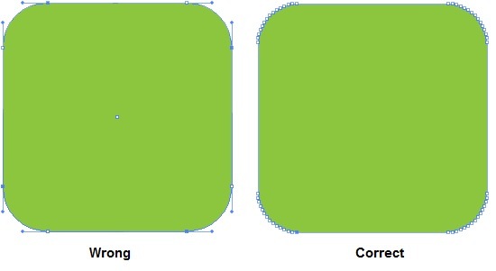
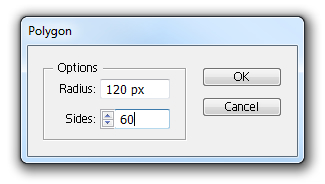
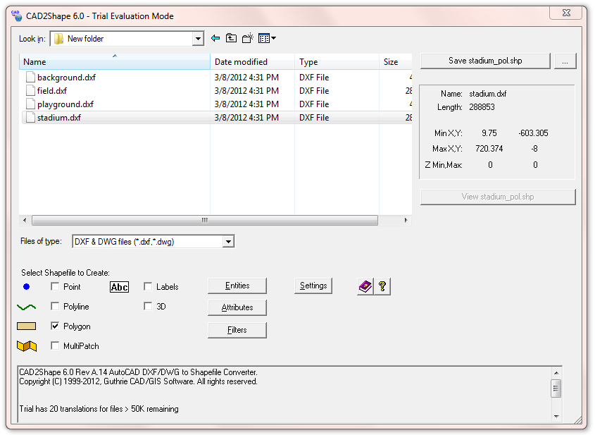
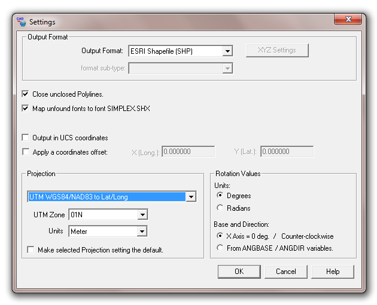
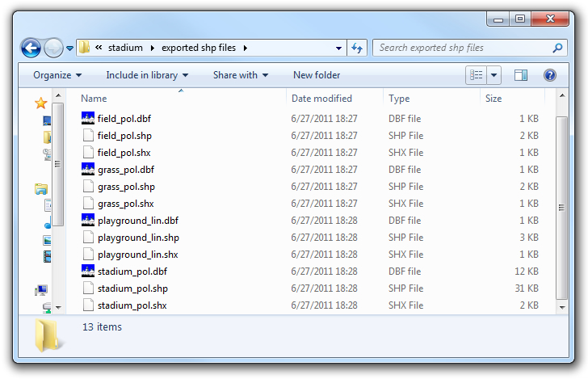

# Custom Shapefile

The ESRI Shapefiles or simply the shapefiles are popular format for storing geographical data. The files spatially describe geometries like lines, polylines and polygons. These geometries may represent different geographical objects such as countries, roads, rivers, lakes etc.
Via a software that supports the format, the geometries can be translated properly on a map.

>To learn more about the shapefiles, read this [article](http://en.wikipedia.org/wiki/Shapefile).

This help topic will walk you through the steps you should take to create your own shapefile like the [Stadium](https://demos.telerik.com/silverlight/#Map/Stadium) we demonstrated with our online examples.

1. __Drawing the shapes.__  
	We'll get started with the playground and then with the seats.        

	>There are several tools that you may choose from to create your drawings. For this topic we used [Adobe Illustrator](http://www.adobe.com/products/illustrator.html).There is something significant you need to know when drawing the shapes. Shapefiles are incapable of storing true curves.

	To create curves you will need to use polygons with many sides as shown on the playground's drawing below:
	
	
	The more sides you have the better your shape will be interpreted. In our case we'll add 60:
	
	
	You can use a series of polygons, even resized ones. The image below shows how you can achieve a rounded rectangle by simply dragging a group of points:
	
	
	The complete design of the playground is shown below
	
	Creating the seats of the stadium is more complex but the approach is the same - using many-sided polygons.
	

1. __Exporting to .shp format.__  
	It's good to have the design work separated in layers. This will help you export each layer independently and exclude some if needed. Furthermore some of the layers will be converted as polygons while others - as lines (this is shown in step 3 - Converting to .shp files)  
	
	
	Select the layer/layers that are to be exported and go to File -> Export. From the Save as type drop-down, choose __AutoCAD Interchange file (*.DXF)__ as shown on the image:  
	
	
	Leave the settings in the DXF/DWG Options window as they are by default and click OK to finish the exporting process.

1. __Converting to .shp files__  
	Up to now you should have a ready .dxf files. You'll need to convert them to .shp format. There are several converting tools that you may use. We use Guthrie's [CAD2Shape](http://www.guthcad.com.au/cad2shape.htm) for the purpose and the following screenshots are based on this tool. 
	
	
	Click on the Settings button and make sure that your selected output format is __ESRI Shapefile (SHP)__.Also change the Projection to the one shown on the image below:  
	
	
	By default the exported files will be placed in the same folder where your .dxf files were. Each .shp file has an associated .dbf and .shx file. For more information about these files please read point 3 - reading the shapefile.  
	

1. __Reading the shapefile.__ 
	The shapefile in most cases is accompanied by additional files containing information which is related to the shapes. Example for such file is the .dbf, which holds attribute related to the shapes in the main file. __RadMap__ requires these types of files to read the shapefile. Since this is beyond our topic's scope you may refer to our [Shapefiles support]() article where you will find more details and code samples.