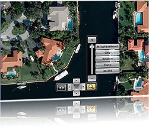

# Overview

## 

Thank you for choosing Telerik __RadMap__!
        

Visualize rich geographical information with Telerik __RadMap__, zoom and pan smoothly to any corner of the earth. 
          If you want to give geographical context to your data – that’s easy. __RadMap__ allows adding any elements or shapes to it. 
          The control supports items virtualization through web services to guarantee blazing fast performance.
        

__RadMap's__ key features include:
        

* __Map Sources__ - with Telerik __RadMap__ you can visualize rich geographical 
            information from external geo imagery sources. Currently the __RadMap__ supports Bing Map Source, 
            empty provider, OpenStreetMap provider and also offers custom provider extensibility options.
          

* __Pan and Zoom__ - Telerik __RadMap__ supports panning and zooming 
            through the mouse, the keyboard and the navigational controls.
          

* __Map Views__ - Telerik __RadMap__ provides 3 different views: 
            Road View, Aerial View and Bird’s Eye View.
          

* __Navigation Controls__ - __RadMap__ has 3 navigation controls which 
            give your users more flexibility when using the control: navigation control, command bar for switching between 
            the three views of the map and zoom bar control for switching the zoom level. Also, __RadMap__ 
            provides out-of-the-box scale control so you can easily track the distance on the currently selected zoom level.
          

* __Information Layer__ - the information layer allows you to add any 
            __FrameworkElements__ and __MapShape__ objects 
            on the map, setting their geographical coordinates. For example you can use pie charts 
            that visualize a city’s demographics in terms of age groups and show the charts on 
            the map, linking the charts to the respective cities.
          

* __Dynamic Layer__- the dynamic layer takes the information layer one 
            step further allowing items virtualization using web services. This means that items are 
            only loaded when the region of the map they belong to is visible. The result 
            is a blazing fast __RadMap__.
          

* __KML Data Import__- __RadMap__ provides support 
            for stunning map overlays through its KML-import feature.  Once you have the desired set 
            of features (place marks, images, polygons, textual descriptions, etc.) encoded in KML, 
            you can easily import the data and visualize it through the __RadMap__ control.
          

* __Search__ - searching for a particular location takes just a few seconds 
            thanks to the integrated search functionality in __RadMap__.
          

* __Routing__ - the control provides integrated Bing Maps routing support.
          

* __Geocode__ - __RadMap__ has integrated geocoding support.
          

Do not miss the online demos at: [http://demos.telerik.com/silverlight/#Map/SalesDashboard](http://demos.telerik.com/silverlight/#Map/SalesDashboard)[http://demos.telerik.com/wpf/#Map/SalesDashboard](http://demos.telerik.com/wpf/#Map/SalesDashboard)

# See Also

 * [Visual Structure]()

 * [Getting Started]()

 * [Styles and Templates]()

 * [Events]()
