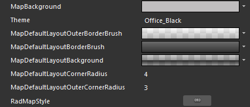
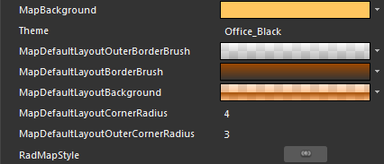
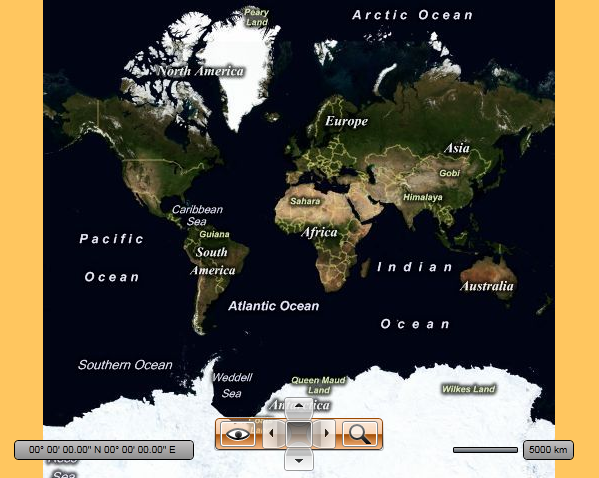

# Styling the RadMap

The __RadMap__ exposes a __Style__ property which allows you to apply a style to it and modify its appearance.

You have two options:

* To create an empty style and set it up on your own. 

* To copy the default style of the control and modify it.

This topic will show you how to perform the second one.

## Modifying the Default Style

To copy the default styles, load your project in Expression Blend and open the User Control that holds the __RadMap__. In the 'Objects and Timeline' pane, select the __RadMap__ you want to style. From the menu choose *Object -> Edit Style -> Edit a Copy*. You will be prompted for the name of the style and where to be placed.

>tip If you choose to define the style in Application, it would be available for the entire application. This allows you to define a style only once and then reuse it where needed.

After clicking 'OK', Expression Blend will generate the default style of the __RadMap__ control in the __Resources__ section of your User Control. The properties available for the style will be loaded in the 'Properties' pane and you will be able to modify their default values. You can also edit the generated XAML in the XAML View or in Visual Studio.


If you go to the 'Resources' pane, you will see an editable list of resources generated together with the style and used by it. In this list, you will find the brushes, styles and templates needed to change the visual appearance of the __RadMap__. Their names indicate to which part of the __RadMap__ appearance they are assigned.



* __MapBackground__ - a brush that represents the background color of the __RadMap__ control.

* __MapDefaultLayoutOuterBorderBrush__ - a brush that represents the outer border color of the default layouts panel.

* __MapDefaultLayoutBorderBrush__ - a brush that represents the inner border color of the default layout panel.

* __MapDefaultLayoutBackground__ - a brush that represents the background color of the default layout panel.

* __MapDefaultLayoutCornerRadius__ - represents the corner radius of the inner border of the default layout panel.

* __MapDefaultLayoutOuterCornerRadius__ - represents the corner radius of the outer border of the default layout panel.

* __RadMapStyle__ - represents the __Style__, applied to the __RadMap__.


Here is an example of these resource modified:

And here is a snapshot of the final result:



# See Also
 * [Template Structure]()
 * [Styling the MapCommandBar]()
 * [Styling the MapNavigation]()
 * [Styling the MapZoomBar]()
 * [Styling the MapScale]()
 * [Styling the MapMouseLocationIndicator]()