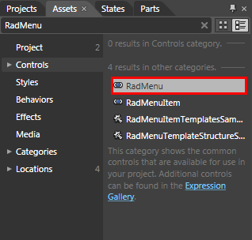
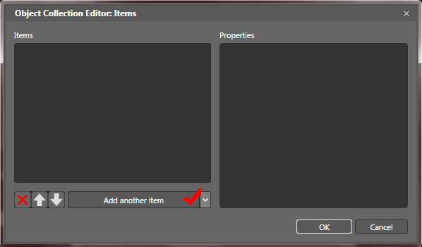
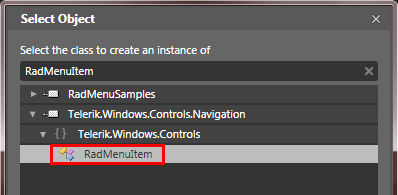
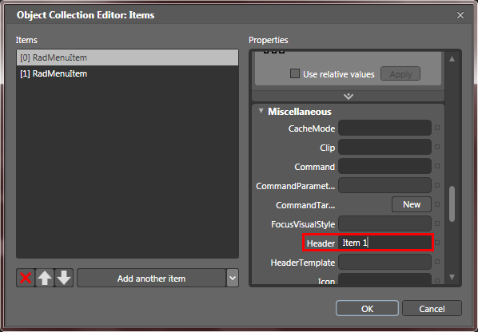
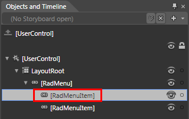

# Getting Started

__RadMenu__ is an advanced control providing full Expression Blend support. From within the visual environment of Expression Blend, you can easily perform various tasks such as editing control properties, modifying themes, creating and modifying templates and more.

This tutorial will walk you through the creation of a __RadMenu__ and will show you how to:

* [Add RadMenu](#add-radmenu)

* [Add Menu Items](#add-menu-items)

* [Populating the RadMenu with Data](#populating-the-radmenu-with-data)

* [Styles and Templates](#styles-and-templates)

* [Working with the RadMenu](#work-with-the-radmenu)

>Before reading this tutorial you should get familiar with the [Visual Structure]() of the standard __RadMenu__ control.

For the purpose of this tutorial, you will need to create an empty SilverlightWPF Application project and open it in Expression Blend.

>In order to use __RadMenu__ control in your projects you have to add references to the following assemblies:

1. __Telerik.Windows.Controls.Navigation.dll__

1. __Telerik.Windows.Controls.dll__

## Add RadMenu

Open the __Asset Library__ (*Window->Assets*) in Expression Blend and start writing the name of the __RadMenu__ in the search box.

Drag a __RadMenu__ on the artboard.

#### __XAML__

{{region radmenu-getting-started_0}}
	<UserControl ...
	             xmlns:telerik="http://schemas.telerik.com/2008/xaml/presentation"> 
	    <Grid x:Name="LayoutRoot">
	        <telerik:RadMenu VerticalAlignment="Top" />
	    </Grid>
	</UserControl>
	{{endregion}}

There are two things you should pay attention to in the above code snipped. The first is the declaration of the __Telerik.Windows.Controls__ namespace from __Telerik.Windows.Controls.Navigation__ assembly and the second is the declaration of the __RadMenu__ control itself. If you run your application now you will see an empty __RadMenu__ that contains no items.

## Add Menu Items

>The class that represents the menu item is __Telerik.Windows.Controls.RadMenuItem__.

Select your control in Expression Blend. In the __Properties Pane__, find and edit the __Items__ property.

The "Object Collection Editor" dialog will open.

Add two items of type __RadMenuItem__.

Set their __Header__ properties respective to Item 1 and Item 2.

These items can have child items on their own. To add items to one of them, select it in the 'Objects and Timeline' pane.

Repeat the same steps as by the __RadMenu__.

Here is a snapshot of the result and the respective XAML code, generated by Expression Blend.

#### __XAML__

{{region radmenu-getting-started_1}}
	<telerik:RadMenu VerticalAlignment="Top">
	    <telerik:RadMenuItem Header="Item 1">
	        <telerik:RadMenuItem Header="SubItem 1" />
	        <telerik:RadMenuItem Header="SubItem 2" />
	    </telerik:RadMenuItem>
	    <telerik:RadMenuItem Header="Item 2" />
	</telerik:RadMenu>
	{{endregion}}

## Populating the RadMenu with Data

The scenario described in the previous sections shows the usage of static items. To learn more about these type of scenarios read [here]().

However, in most of the cases you have to bind your __RadMenu__ to a collection of business objects. Check out the following topics which describe in details how to work with dynamic data.

* [Data Binding Support Overview]() - describes the various data sources for the __RadMenu__ and shows you many tips and tricks. Read this topics in order to achieve basic knowledge about how the binding mechanism works at the __RadMenu__. 

* [Binding to Dynamic Data]() - shows you how to bind the __RadMenu__ to a collection of business objects. 

* [Template and Styles Selectors]() - describes the possibilities to adjust the appearance of the __RadMenu's__ items depending on the data they hold. 

## Styles and Templates

Take a look at the [Styles and Templates]() section which is entirely dedicated to styling and templating the __RadMenu__ control.

## Work with the RadMenu

In order to learn how to use the __RadMenu__ and what capabilities it holds, read the various topics that describe its features.

* [Opening Modes]()

* [Opening and Closing Delays]()

* [Orientation]()

* [Animation]()

* [Commands]()

* [Checkable Items]()

* [Separator Items]()

* [Click Modes]()

* [Boundaries Detection]()

* [Keyboard Navigation]()

# See Also

 * [Overview]()

 * [Visual Structure]()

 * [Populating with Data - Overview]()

 * [Styles and Templates - Overview]()

 * [Events - Overview]()
