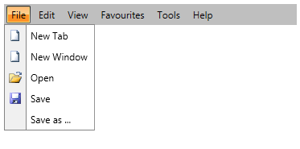

# Using Static Items

## 

This tutorial will walk you through the common task of populating __RadMenu__with __RadMenuItems__declaratively. 

Here is a regular __RadMenu__declaration without items:

#### __XAML__

{{region radmenu-populating-with-data-using-static-items_0}}
	<telerik:RadMenu VerticalAlignment="Top">
	{{endregion}}

In order to add items you need to use the __RadMenu's____Items__ property. The __Items__ property is an __ItemCollection__ which contains your __RadMenuItems__. For example, the following lines will add the top-level items of the menu.

#### __XAML__

{{region radmenu-populating-with-data-using-static-items_1}}
	<telerik:RadMenu VerticalAlignment="Top">
	    <telerik:RadMenuItem Header="File" />
	    <telerik:RadMenuItem Header="Edit" />
	    <telerik:RadMenuItem Header="View" />
	    <telerik:RadMenuItem Header="Favourites" />
	    <telerik:RadMenuItem Header="Tools" />
	    <telerik:RadMenuItem Header="Help" />
	</telerik:RadMenu>
	{{endregion}}

Each of the __RadMenuItems__ can have child items that are defined in the same way. Here is an example of how to add submenu items to one of the top-level items.

#### __XAML__

{{region radmenu-populating-with-data-using-static-items_2}}
	<telerik:RadMenu VerticalAlignment="Top">
	    <telerik:RadMenuItem Header="File">
	        <telerik:RadMenuItem Header="New Tab">
	            <telerik:RadMenuItem.Icon>
	                <Image Source="/Images/newFile.png"
	                       Stretch="None" />
	            </telerik:RadMenuItem.Icon>
	        </telerik:RadMenuItem>
	        <telerik:RadMenuItem Header="New Window">
	            <telerik:RadMenuItem.Icon>
	                <Image Source="/Images/newFile.png"
	                       Stretch="None" />
	            </telerik:RadMenuItem.Icon>
	        </telerik:RadMenuItem>
	        <telerik:RadMenuItem Header="Open">
	            <telerik:RadMenuItem.Icon>
	                <Image Source="/Images/open.png"
	                       Stretch="None" />
	            </telerik:RadMenuItem.Icon>
	        </telerik:RadMenuItem>
	        <telerik:RadMenuItem Header="Save">
	            <telerik:RadMenuItem.Icon>
	                <Image Source="/Images/save.png"
	                       Stretch="None" />
	            </telerik:RadMenuItem.Icon>
	        </telerik:RadMenuItem>
	        <telerik:RadMenuItem Header="Save as ..." />
	    </telerik:RadMenuItem>
	    <telerik:RadMenuItem Header="Edit" />
	    <telerik:RadMenuItem Header="View" />
	    <telerik:RadMenuItem Header="Favourites" />
	    <telerik:RadMenuItem Header="Tools" />
	    <telerik:RadMenuItem Header="Help" />
	</telerik:RadMenu>
	{{endregion}}

The submenu items can also have children on their own.

>tipConsider declaring menu items in XAML instead of adding them by code whenever it's possible. This includes situations when you know what items you need at design time.

# See Also

 * [Populating with Data - Overview]()

 * [Data Binding Support Overview]()

 * [Binding to Dynamic Data]()
