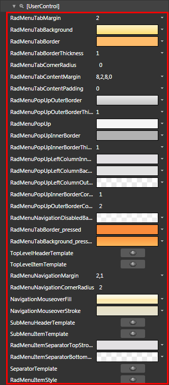
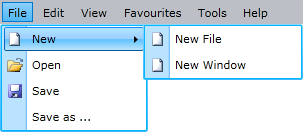

# Styling the RadMenuItem

The __RadMenuItem__can be styled by creating an appropriate __Style__ and setting it to the __Style__ property of the control.
      

You have two options:

* To create an empty style and set it up on your own.

* To copy the default style of the control and modify it.

This topic will show you how to perform the second one.

## Modifying the Default Style

Load your project in Expression Blend and open the User Control that holds the __RadMenu__. There are two ways to copy the default style for the __RadMenuItem__:
        

* 
            If you have static __RadMenuItems__, you can select one of them in the 'Objects and Timeline' pane and choose *Object -> Edit Style -> Edit a Copy *from the menu. After that you have to apply the generated style to the other __RadMenuItems__.
          

* 
            You can also use the __ItemContainerStyle__ property of the __RadMenu__, when you have dynamic items. In this way you have to set the style only once and it will be applied to all of the __RadMenuItems__. To copy the default style via the __ItemContainerStyle__ property select the __RadMenu__ holding the items and choose *Object -> Edit Additional Styles -> Edit Generated Item Container (ItemContainerStyle) -> Edit a Copy *from the menu.
            

>When using __ItemContainerStyle__ with static items, it will get applied only to the direct children of the __RadMenu__ - the top-level items. If you want their child items to have the same style you have to manually set the __ItemContainerStyle__ property of their parents.
                When using the __ItemContainerStyle__ with dynamic items, its value gets inherited through the hierarchy thanks to the __HierarchicalDataTemplate__. You are free to break the inheritance, when needed, by using multiple nested __HierarchicalDataTemplates__ and by setting the __ItemContainerStyle__ property of each of them. To learn more about using __RadMenu__ with dynamic data read [here]().
                Choosing the style for an item depending on its position in the hierarchy can be done by using the __ItemContainerStyleSelector__ property. Read more about selectors [here]().
                

You will be prompted for the name of the style and where to be placed. 

>tipIf you choose to define the style in Application, it would be available for the entire application. This allows you to define a style only once and then reuse it where needed.

After clicking 'OK', Expression Blend will generate the default style of the __RadMenuItem__control in the __Resources__ section of your User Control. The properties available for the style will be loaded in the 'Properties' pane and you will be able to modify their default values. You can also edit the generated XAML in the XAML View or in Visual Studio.
        

If you go to the 'Resources' pane, you will see an editable list of resources generated together with the style and used by it. In this list you will find the brushes, styles and templates needed to change the visual appearance of the __RadMenuItem.__Their names indicate to which part of the __RadMenuItem's__appearance they are assigned.
          



>tip
          Before to continue, you might find useful to read about the [different templates of the RadMenuItem](#RadMenuItem_Template_Structures).
        

* __RadMenuTabMargin__ - a thickness that represents the margin of the top-level items of the __RadMenu__.
          

* __RadMenuTabBackground__ - a brush that represents the background color of the top-level items, when the mouse is over them (used when the __ClickToOpen__ is set to __False__).
          

* __RadMenuTabBorder__ - a brush that represents the border color of the top-level items.
          

* __RadMenuTabBorderThickness__ - a thickness that represents the width of the top-level item's borders.
          

* __RadMenuTabCornerRadius__ - a __CornerRadius__ that represents the radius of the top-level item's corners.
          

* __RadMenuTabContentMargin__ - a thickness that specifies the margin of the top-level item's content to the edges of the item.
          

* __RadMenuTabContentPadding__ - a thickness that specifies the margin of the top-level item's content to its own edges.
          

* __RadMenuPopUpOuterBorder__ - a brush that represents the color of the outer border of the __Popup__.
          

* __RadMenuPopUpOuterBorderThickness__ - a thickness that represents the width of the Popup's outer border.
          

* __RadMenuPopUp__ - a brush that represents the background color of the __Popup__.
          

* __RadMenuPopUpInnerBorder__ - a brush that represents the color of the inner border of the __Popup__.
          

* __RadMenuPopUpInnerBorderThickness__  - a thickness that represents the width of the __Popup's__ inner border.
          

* __RadMenuPopUpLeftColumnInnerBorder__ - a brush that specifies the outer border color of the column on the left side of the __Popup__.
          

* __RadMenuPopUpLeftColumnBackground__ - a brush that specifies the background color of the column on the left side of the __Popup__.
          

* __RadMenuPopUpLeftColumnOuterBorder__ - a brush that specifies the inner border color of the column on the left side of the __Popup__.
          

* __RadMenuPopUpInnerBorderCornerRadius__ - a __CornerRadius__ that represents the radius of the Popup inner border's corners.
          

* __RadMenuPopUpOuterBorderCornerRadius__ - a __CornerRadius__ that represents the radius of the Popup outer border's corners.
          

* __RadMenuNavigationDisabledBackground__ - a brush that represents the color of the disabled overlay of the item.
          

* __RadMenuTabBorder_pressed__ - a brush that represents the border color of the top-level items, when they are selected.
          

* __RadMenuTabBackground_pressed__ - a brush that represents the background color of the top-level items, when they are selected.
          

* __TopLevelHeaderTemplate__ - the template applied to the item, when it is of type __Top-Level Header__.
          

* __TopLevelItemTemplate__ - the template applied to the item, when it is of type __Top-Level Item__.
          

* __RadMenuNavigationMargin__ - a thickness that specifies the margin of the submenu items to the __Popup__.
          

* __RadMenuNavigationCornerRadius__ - a __CornerRadius__ that represents the radius of the submenu item's corners.
          

* __NavigationMouseoverFill__ - a brush that represents the background color of the submenu items, when they are highlighted or selected.
          

* __NavigationMouseoverStroke__ - a brush that represents the border color of the submenu items, when they are highlighted or selected.
          

* __SubMenuHeaderTemplate__ - the template applied to the item when it is of type __Submenu Header__.
          

* __SubMenuItemTemplate__ - the template applied to the item, when it is of type__Submenu Item__.
          

* __RadMenuItemSeparatorTopStroke__ - a brush that represents the color of the top separator part.
          

* __RadMenuItemSeparatorBottomStroke__ - a brush that represents the color of the bottom separator part.
          

* __SeparatorTemplate__ - the template applied to the item, when it is of type __Separator Item__.
          

* __RadMenuItemStyle__ - the __Style__ generated for the __RadMenuItem__.
          

>tipChanging the value of the resources can be done by clicking on the color indicator or the icon next to them.

Modify the resource to bring the desired appearance of the __RadMenuItem__.
          



Here is a snapshot of the result.



# See Also

 * [Styles and Templates - Overview]()

 * [Templates Structure]()

 * [Visual States]()

 * [Styling the RadMenu]()

 * [Template and Style Selectors]()
