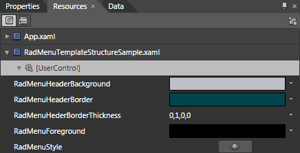
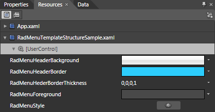

# Styling the RadMenu

The __RadMenu__ can be styled by creating an appropriate __Style__ and setting it to the __Style__ property of the control. 

You have two options:

* To create an empty style and set it up on your own.

* To copy the default style of the control and modify it.

This topic will show you how to perform the second one.

## Modifying the Default Style

To copy the default style, load your project in Expression Blend and open the User Control that holds the __RadMenu__. In the 'Objects and Timeline' pane select the __RadMenu__ you want to style. From the menu choose *Object -> Edit Style -> Edit a Copy*. You will be prompted for the name of the style and where to be placed.

>tipIf you choose to define the style in Application, it would be available for the entire application. This allows you to define a style only once and then reuse it where needed.

After clicking 'OK', Expression Blend will generate the default style of the __RadMenu__ control in the __Resources__ section of your User Control. The properties available for the style will be loaded in the 'Properties' pane and you will be able to modify their default values. You can also edit the generated XAML in the XAML View or in Visual Studio.

If you go to the 'Resources' pane, you will see an editable list of resources generated together with the style and used by it. In this list you will find the brushes, styles and templates needed to change the visual appearance of the __RadMenu__. Their names indicate to which part of the __RadMenu__ appearance they are assigned.

* __RadMenuHeaderBackground__ - a brush that represents the background color of the __RadMenu__.

* __RadMenuHeaderBorder__ - a brush that represents the border color of the __RadMenu__.

* __RadMenuHeaderBorderThickness__ - a thickness that specifies the values for the __RadMenu's__ borders.

* __RadMenuForeground__ - a brush that represents the foreground color of the __RadMenu__.

* __RadMenuStyle__ - the __Style__ generated for the __RadMenu__.

>tipChanging the value of the resources can be done by clicking on the color indicator or the icon next to them.

Modify the resource to bring the desired appearance of the __RadMenu__. 

Here is a snapshot of the result.

## See Also

 * [Styles and Templates - Overview]()

 * [Templates Structure]()

 * [Visual States]()

 * [Styling the RadMenuItem]()

 * [Template and Style Selectors]()
