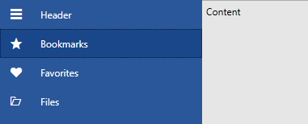
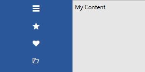

# Getting Started

This tutorial will walk you through the creation of a sample application that contains __RadNavigationView__ control.
			
## Assembly References

In order to use __RadNavigationView__, you will need to add references to the following assemblies:
* __Telerik.Windows.Controls__
* __Telerik.Windows.Controls.Navigation__
* __Telerik.Windows.Data__

You can find the required assemblies for each control from the suite in the [Controls Dependencies]() help article.

## Defining RadNavigationView

__Example 1__ demonstrates how you can define a RadNavigationView in xaml.

#### __[XAML] Example 1: Defining RadNavigationView__
{{region xaml-radnavigationview-getting-started-0}}
    <telerik:RadNavigationView x:Name="navigationView"  />
{{endregion}}

## Populating with Items

The control can either be populated by adding RadNavigationViewItems to its Items collection, or by its data binding support.

#### __[XAML] Example 2: Populating with Items in xaml__
{{region xaml-radnavigationview-getting-started-1}}
    <telerik:RadNavigationView x:Name="navigationView" PaneHeader="Header">
        <telerik:RadNavigationView.Items>
            <telerik:RadNavigationViewItem Content="Bookmarks">
                <telerik:RadNavigationViewItem.Icon>
                    <telerik:RadGlyph Glyph="&#xe303;" FontSize="16"/>
                </telerik:RadNavigationViewItem.Icon>
            </telerik:RadNavigationViewItem>
            <telerik:RadNavigationViewItem Content="Favorites">
                <telerik:RadNavigationViewItem.Icon>
                    <telerik:RadGlyph Glyph="&#xe301;" FontSize="16"/>
                </telerik:RadNavigationViewItem.Icon>
            </telerik:RadNavigationViewItem>
            <telerik:RadNavigationViewItem Content="Files">
                <telerik:RadNavigationViewItem.Icon>
                    <telerik:RadGlyph Glyph="&#xe901;" FontSize="16"/>
                </telerik:RadNavigationViewItem.Icon>
            </telerik:RadNavigationViewItem>
        </telerik:RadNavigationView.Items>
        <telerik:RadNavigationView.Content>
            <TextBlock Text="Content" Foreground="Black" Margin="5"/>
        </telerik:RadNavigationView.Content>
    </telerik:RadNavigationView>
{{endregion}}

#### __Figure 1: Result from Example 1 in the Office 2016 theme__

>Check out the [Icon and IconTemplate]() article for more information on those properties. 

<!-- -->

>To learn how to set up the control in a data binding scenario, read the [DataBinding]() article.

## DisplayMode

The __RadNavigationView__ dynamically changes its layout based on its size. It has three display modes: __Minimal__, __Compact__ and __Expanded__. You can read more about them in the [Display Mode]() article.

## PaneHeader and PaneFooter

The __RadNavigationView__ allows you to customize its header and footer. You can set them to simple strings or add a custom control. Check out the [Header and Footer]() article for more information.

## Navigation

__RadNavigationView__ doesn't perform any navigation automatically. When a certain __RadNavigationViewItem__ is clicked, the __ItemClick__ event is raised. If the click results in a new item being selected, a __SelectionChanged__ event is also raised.

Either of the above events can be handled to perform navigation related tasks or change the Content of the RadNavigationView. Alternatively, the SelectedItem property can be used in order to change the content. This is demonstrated in the [DataBinding]() article.  

## Opening/Closing the NavigationPane in code

The NavigationPane which hosts the RadNavigationViewItems is normally opened/closed by clicking the RadToggleButton. However, this can also be in code by setting the __IsPaneOpen__ property of the __RadNavigationView__ as demonstrated in ___Examples 3 and 4__.

#### __[XAML] Example 3: Setting the IsPaneOpen property in xaml__
{{region cs-radnavigationview-getting-started-2}}
     <telerik:RadNavigationView x:Name="navigationView" IsPaneOpen="True" />
{{endregion}}

#### __[C#] Example 4: Setting the IsPaneOpen property in code__
{{region cs-radnavigationview-getting-started-3}}
    this.navigationView.IsPaneOpen = true;
{{endregion}}

#### __[VB.NET] Example 4: Setting the IsPaneOpen property in code__
{{region cs-radnavigationview-getting-started-4}}
    Me.navigationView.IsPaneOpen = True
{{endregion}}

The width of the NavigationPane when it is opened/closed can be controlled through the __CompactPaneWidth__ and __ExpandedPaneWidth__ properties. __Example 5__ demonstrates how you can set the __CompactPaneWidth__ property in order to increase the default width when the navigation pane is closed.

#### __[XAML] Example 5: Setting the CompactPaneWidth property__
{{region xaml-radnavigationview-getting-started-5}}
     <telerik:RadNavigationView x:Name="navigationView" PaneHeader="Header" CompactPaneWidth="150">
        <telerik:RadNavigationView.Items>
            <telerik:RadNavigationViewItem Content="Bookmarks">
                <telerik:RadNavigationViewItem.Icon>
                    <telerik:RadGlyph Glyph="&#xe303;" FontSize="16"/>
                </telerik:RadNavigationViewItem.Icon>
            </telerik:RadNavigationViewItem>
            <telerik:RadNavigationViewItem Content="Favorites">
                <telerik:RadNavigationViewItem.Icon>
                    <telerik:RadGlyph Glyph="&#xe301;" FontSize="16"/>
                </telerik:RadNavigationViewItem.Icon>
            </telerik:RadNavigationViewItem>
            <telerik:RadNavigationViewItem Content="Files">
                <telerik:RadNavigationViewItem.Icon>
                    <telerik:RadGlyph Glyph="&#xe901;" FontSize="16"/>
                </telerik:RadNavigationViewItem.Icon>
            </telerik:RadNavigationViewItem>
        </telerik:RadNavigationView.Items>
        <telerik:RadNavigationView.Content>
            <TextBlock Text="My Content" Foreground="Black" Margin="5"/>
        </telerik:RadNavigationView.Content>
    </telerik:RadNavigationView>
{{endregion}}

#### __Figure 2: Result from Example 5 in the Office 2016 theme__

## See Also 

* [DataBinding]()
* [Display Mode]()
* [Icon and IconTemplate]()